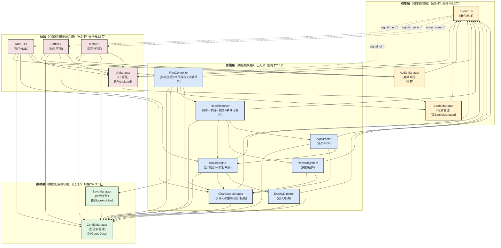

# 模块拆分与系统架构设计

> **文档版本**: Phase 1 MVP（已对齐规格书v1.0）[已对齐: 规格书全文]
> **适用范围**: "赛马娘版Q宠大乐斗" Roguelike回合制养成游戏
> **设计约束**: 代码模块15个对应规格书13个游戏系统，严格单向依赖，AutoLoad单例以规格书2.2节为准

---

## 1. 架构总览

系统采用**四层单向依赖架构**（原设计拆分）映射至规格书**三层架构**（规格书2.3节）：

```
UI层（界面显示）        ← 调用功能层，通过EventBus接收数据变更
    ↑                      [映射至规格书"引擎模块层"的UI系统]
功能层（游戏逻辑）      ← 调用数据层+引擎层，通过EventBus驱动UI
    ↑                      [映射至规格书"功能模块层"]
引擎层（基础设施）      ← 调用数据层，提供全局服务
    ↑                      [映射至规格书"引擎模块层"的场景/动画/音频/输入/渲染等]
数据层（静态数据+存档） ← 最底层，无上游依赖
                           [映射至规格书"数据配置模块层"]
```

**与规格书三层架构的映射关系** [已对齐: 规格书2.3节]：

| 原设计层级 | 规格书层级 | 说明 |
|-----------|-----------|------|
| 数据层 | 数据配置模块层 | 一一对应，管理配置表、存档、序列化 |
| 引擎层 | 引擎模块层 | 引擎层的EventBus+SceneManager对应引擎模块层的场景管理+输入处理；原设计缺音频系统（AudioManager）已补齐 |
| 功能层 | 功能模块层 | 一一对应，13个游戏系统全部覆盖 |
| UI层 | 引擎模块层（UI系统子集） | 原设计将UI系统独立为第四层便于职责划分，实际归属于规格书引擎模块层的UI系统 |

跨层通信统一通过 `EventBus` 以信号（snake_case命名）方式解耦，禁止功能层直接引用UI层节点。

**核心原则** [已对齐: 规格书2.3节]：上层模块可调用下层模块，下层模块不可反向依赖。模块间通过 EventBus 发送事件解耦。

---

## 2. 模块拆分表

### 2.1 数据层 (Data Layer) → 规格书"数据配置模块层"

| # | 模块名 | 职责边界 | 所属层级 | 依赖模块 | 被哪些模块依赖 |
|---|--------|----------|----------|----------|----------------|
| 1 | `ConfigManager` | 管理所有静态配置数据的加载与查询，包括主角属性（HeroConfig）、伙伴配置（PartnerConfig×12名）、技能表（SkillConfig×约30/SkillLevelConfig×约150）、节点配置（NodeConfig/NodePoolConfig）、敌人模板（EnemyConfig×约15）、PVP配置（PvPRewardConfig/ScoringConfig/UnlockCostConfig）、事件配置（EventConfig×约20）、特殊效果（SpecialEffectConfig×约15）、解锁条件（UnlockConditionConfig×约20）、商店配置（ShopConfig）、战斗公式（BattleFormulaConfig×约10）。数据源为JSON配置，由策划用Google Sheets维护导出 [已对齐: 规格书2.1节、3.1节] | 数据层 | 无 | `SaveManager`, `RunController`, `NodeResolver`, `BattleEngine`, `CharacterManager`, `RewardSystem`, `PvpDirector`, `EnemyDirector`, `MenuUI`, `RunHUD`, `BattleUI` |
| 2 | `SaveManager` | 本地存档的读写、斗士档案的生成与持久化。存档格式为本地JSON文件（Phase 1-2纯本地，Phase 3增加云端备份）。斗士档案包含：主角数据（五维属性/等级/技能等级/必杀技等级）、伙伴数据（5名伙伴ID/等级/支援援助配置）、技能快照、养成统计、通关评价（S/A/B/C/D） [已对齐: 规格书2.1节、3.1节、4.6节] | 数据层 | `ConfigManager`（引用数据结构的序列化定义） | `RunController`, `MenuUI` |

**命名对齐说明** [已对齐: 规格书2.2节]：
- 原设计`GameData` → 对齐为`ConfigManager`（规格书autoload名），职责不变
- 原设计`SaveArchive` → 对齐为`SaveManager`（规格书autoload名），职责不变

### 2.2 引擎层 (Engine Layer) → 规格书"引擎模块层"

| # | 模块名 | 职责边界 | 所属层级 | 依赖模块 | 被哪些模块依赖 |
|---|--------|----------|----------|----------|----------------|
| 3 | `EventBus` | 全局事件总线，承载所有跨模块信号声明与发射，是唯一的解耦通道；自身不持有游戏状态 | 引擎层 | 无 | **所有模块**（数据层通过EventBus通知存档事件） |
| 4 | `GameManager` | 管理游戏主场景状态机（主菜单 → 主角选择 → 酒馆 → 局内养成 → 战斗 → 结算 → 局外PVP），负责场景切换与过渡动画 [已对齐: 规格书2.2节] | 引擎层 | `EventBus`（发射场景切换信号） | `UIManager`, `RunController` |
| 5 | `AudioManager` | 音效/BGM管理，负责全局音频播放、音量控制、音频资源预加载与释放 [已对齐: 规格书2.2节]。**本模块在原设计中遗漏，现补齐。** | 引擎层 | `EventBus` | `MenuUI`, `RunHUD`, `BattleUI`, `BattleEngine`（播放战斗音效） |

**命名对齐说明** [已对齐: 规格书2.2节]：
- 原设计`SceneManager` → 对齐为`GameManager`（规格书autoload名），职责扩展为"游戏状态机+场景切换"
- `AudioManager`为原设计遗漏，现按规格书补齐

### 2.3 功能层 (Gameplay Layer) → 规格书"功能模块层"

功能层7个代码模块对应规格书13个游戏系统 [已对齐: 规格书4.1节]：

| # | 模块名 | 对应规格书系统 | 职责边界 | 所属层级 | 依赖模块 | 被哪些模块依赖 |
|---|--------|-------------|----------|----------|----------|----------------|
| 6 | `RunController` | 单局养成循环 + 终局保存 + 分数与评价 | 单局养成循环的主控制器，管理30回合推进（0回合选主角+酒馆选2伙伴→1-29回合节点→30回合终局战+结算）、节点选择状态机、局内玩家状态，判定终局条件，生成斗士档案与评分（S/A/B/C/D评级） [已对齐: 规格书4.2节、4.6节] | 功能层 | `EventBus`, `ConfigManager`, `SaveManager`, `NodeResolver`, `CharacterManager` | `RunHUD`, `UIManager` |
| 7 | `NodeResolver` | 锻炼系统 + 商店系统 + 救援系统 + 事件可视化 | 节点解析执行器，根据当前节点类型分发处理：锻炼节点→属性成长+伙伴站位+熟练度计算（四阶段：生疏/熟悉/精通/专精）；商店节点→主角/伙伴升级+价格递增；救援节点→3选1半随机候选生成；普通/精英/PVP/终局节点→BattleEngine；管理节点结算与流转 [已对齐: 规格书4.2节、4.4节、4.5节] | 功能层 | `EventBus`, `ConfigManager`, `BattleEngine`, `RewardSystem`, `PvpDirector` | `RunController` |
| 8 | `BattleEngine` | 自动战斗引擎 + 技能系统（部分） | 回合制战斗引擎核心，20回合自动战斗（行动顺序判定→主角普攻/技能→伙伴援助触发→连锁触发检查（最多4段）→状态结算→必杀技检查→回合结束）。所有战斗类型共用一套逻辑，通过播放模式区分：普通战斗简化快进（2-3秒）、精英战/PVP检定/终局战标准播放（15-25秒）。伤害公式配置驱动 [已对齐: 规格书4.3节、5.1节、5.2节] | 功能层 | `EventBus`, `ConfigManager`, `CharacterManager`, `EnemyDirector` | `NodeResolver`, `PvpDirector`, `BattleUI` |
| 9 | `CharacterManager` | 伙伴系统 + 属性熟练度 + 技能系统（部分） | 角色与伙伴的属性管理器，负责：主角和伙伴的属性计算（五维属性：体魄/力量/敏捷/技巧/精神）、等级提升、伙伴Lv3质变触发（12名伙伴各质变已定稿）、技能解锁与移除、Buff/Debuff挂卸。队伍结构1+2+3（1主角+2同行+3救援） [已对齐: 规格书3.3节、4.4节、4.5节、4.8节] | 功能层 | `EventBus`, `ConfigManager` | `RunController`, `BattleEngine`, `RewardSystem`, `PvpDirector`, `EnemyDirector`, `RunHUD` |
| 10 | `RewardSystem` | 商店系统 + 救援系统 + 锻炼系统（结算部分） | 奖励与成长结算系统，处理战斗掉落、锻炼收益、救援奖励、商品购买后的属性/物品/伙伴发放，所有"获得X"的入口统一经此模块 [已对齐: 规格书4.2节] | 功能层 | `EventBus`, `ConfigManager`, `CharacterManager` | `NodeResolver` |
| 11 | `PvpDirector` | 局外PVP | PVP导演系统，按规格书渐进方案：Phase 1不做PVP→Phase 2本地AI对手池→Phase 3 BaaS（Firebase）。维护对手池、模拟异步匹配、构建PVP对局、通过BattleEngine执行PVP战斗并返回检定结果 [已对齐: 规格书1.3节、4.1节] | 功能层 | `EventBus`, `ConfigManager`, `CharacterManager`, `BattleEngine` | `NodeResolver` |
| 12 | `EnemyDirector` | 自动战斗引擎（敌人部分） | 敌人导演系统，根据当前回合数和节点类型生成敌人配置（普通敌人动态生成/5种精英模板/终局Boss），管理敌人AI行为决策逻辑 [已对齐: 规格书5.1节、5.2节] | 功能层 | `EventBus`, `ConfigManager` | `BattleEngine` |

**功能层 → 规格书13系统对照表** [已对齐: 规格书4.1节]：

| 规格书13系统 | 对应代码模块 | 说明 |
|------------|------------|------|
| 单局养成循环 | `RunController` | 一对一 |
| 五属性锻炼 | `NodeResolver` + `RewardSystem` | 锻炼节点解析+收益结算 |
| 伙伴系统 | `CharacterManager` | 一对一 |
| 自动战斗引擎 | `BattleEngine` + `EnemyDirector` | 战斗核心+敌人配置 |
| 商店系统 | `NodeResolver` + `RewardSystem` | 商店节点解析+交易结算 |
| 救援系统 | `NodeResolver` + `RewardSystem` | 救援节点解析+伙伴发放 |
| 终局保存 | `RunController` → `SaveManager` | RunController调用SaveManager生成档案 |
| 属性熟练度 | `NodeResolver` + `CharacterManager` | 锻炼时计算熟练度阶段 |
| 技能系统 | `CharacterManager` + `BattleEngine` | 技能管理+战斗触发 |
| 局外PVP | `PvpDirector` | 一对一 |
| 解锁系统 | `CharacterManager`（Phase 3） | 伙伴/主角解锁条件与消耗 |
| 分数与评价 | `RunController` | 终局评分计算 |
| 事件可视化 | `NodeResolver` | PVP失败后节点预览（Phase 4） |

### 2.4 UI层 (UI Layer) → 规格书"引擎模块层/UI系统"

| # | 模块名 | 职责边界 | 所属层级 | 依赖模块 | 被哪些模块依赖 |
|---|--------|----------|----------|----------|----------------|
| 13 | `UIManager` | UI面板生命周期管理，负责面板的打开/关闭/切换/堆栈维护，协调场景切换时的UI状态清理。注意：本模块**不是**AutoLoad单例（规格书autoload清单中无UIManager），作为普通节点由GameManager管理 [已对齐: 规格书2.2节] | UI层 | `EventBus`, `GameManager` | `MenuUI`, `RunHUD`, `BattleUI` |
| 14 | `MenuUI` | 主菜单界面与斗士档案界面，处理开始新局、继续游戏、查看档案等交互，读取SaveManager展示历史记录。对应规格书场景：`scenes/main_menu/`、`scenes/hero_select/` [已对齐: 规格书2.2节] | UI层 | `EventBus`, `UIManager`, `SaveManager`, `ConfigManager` | 无（顶层入口UI） |
| 15 | `RunHUD` | 局内养成主界面，显示当前回合数、主角五维属性概览、伙伴列表与状态（1+2+3队伍）、节点地图/节点选择面板、事件文本日志。对应规格书场景：`scenes/tavern/`（开局）、`scenes/training/`（养成节点） [已对齐: 规格书2.2节、4.2节] | UI层 | `EventBus`, `UIManager`, `ConfigManager`, `CharacterManager`, `RunController` | 无（顶层局内UI） |
| 16 | `BattleUI` | 战斗界面，展示双方单位HP/状态、行动条、战斗动画占位、伤害数字、战斗日志滚动区。普通战斗简化快进（2-3秒，双方立绘+血条+每回合伤害数字+最终胜负），精英战/PVP/终局战标准播放（完整动画+伙伴援助+必杀技+连锁展示）。对应规格书场景：`scenes/battle/` [已对齐: 规格书2.2节、4.3节] | UI层 | `EventBus`, `UIManager`, `ConfigManager`, `BattleEngine` | 无（顶层战斗UI） |

**模块数量说明**：原设计15个代码模块+补齐AudioManager后共16个代码模块，对应规格书13个游戏系统。13个游戏系统通过7个功能层模块+2个数据层模块+3个引擎层模块（含AudioManager补齐）+4个UI层模块实现，无冗余拆分。

---

## 3. 系统架构图

### 3.1 模块依赖DAG



### 3.2 数据流向说明

| 流向 | 路径 | 说明 |
|------|------|------|
| **配置数据流** | `ConfigManager` → 功能层各模块 | 静态数据只读下发，功能模块运行期不修改配置 [已对齐: 规格书3.1节] |
| **状态变更流** | 功能层 → `EventBus` → UI层 | 游戏状态变更通过信号通知UI刷新，功能层不持有UI引用 |
| **操作指令流** | UI层 → 功能层 | 玩家点击等交互由UI层直接调用功能层API发起 |
| **存档数据流** | `RunController` → `SaveManager` → 本地文件 | 养成循环关键节点触发存档持久化 [已对齐: 规格书2.1节] |
| **战斗数据流** | `BattleEngine` ↔ 功能层模块 | 战斗引擎内部状态通过信号输出，外部通过API传入配置 |
| **音频播放流** | 功能层/UI层 → `AudioManager` | 音效/BGM统一由AudioManager管理（原设计遗漏，已补齐）[已对齐: 规格书2.2节] |

---

## 4. AutoLoad单例清单

Phase 1 MVP共需 **5个** AutoLoad单例，**严格对齐规格书2.2节**：

| 顺序 | 单例名 | 对应模块 | 职责 | 生命周期 | 原设计映射 |
|------|--------|----------|------|----------|-----------|
| 1 | `EventBus` | `EventBus` | 全局信号注册与发射中枢，所有模块通过它实现跨层通信；提供 `connect_signal()` / `emit_signal()` 统一接口 | **全局持久**（游戏启动至退出，永不释放） | 一致（原名保留） |
| 2 | `ConfigManager` | `ConfigManager` | 加载并缓存所有静态配置（从JSON/Resource资源文件），提供类型化的数据查询接口如 `get_hero_data(hero_id)`, `get_partner_base(partner_id)`。数据源格式：JSON配置+Godot Resource自定义类 [已对齐: 规格书2.1节、3.1节] | **全局持久**（游戏启动时加载，退出时释放） | 原`GameData` → `ConfigManager` |
| 3 | `GameManager` | `GameManager` | 维护游戏状态机（主菜单→主角选择→酒馆→局内养成→战斗→结算→局外PVP），处理 `change_scene(to_state, transition_type)` 请求，管理场景过渡动画与资源预加载 [已对齐: 规格书2.2节] | **全局持久**（始终驻留，控制场景切换） | 原`SceneManager` → `GameManager` |
| 4 | `SaveManager` | `SaveManager` | 管理存档目录（`user://saves/`），提供 `save_run(run_data)`, `load_runs()`, `generate_fighter_archive(run_result)` 等接口；处理存档版本兼容性；Phase 1-2纯本地JSON，Phase 3增加云端备份（Firebase） [已对齐: 规格书2.1节、2.2节] | **全局持久**（始终驻留，处理I/O） | 原`SaveArchive` → `SaveManager` |
| 5 | `AudioManager` | `AudioManager` | 音效/BGM管理，提供 `play_bgm(track_name)`, `play_sfx(sfx_name)`, `set_volume(bus, value)` 等接口；管理音频资源预加载与释放 [已对齐: 规格书2.2节] | **全局持久**（始终驻留） | **原设计遗漏，已补齐** |

**重要变更说明** [已对齐: 规格书2.2节]：
1. 原设计`GameData` → 更名为`ConfigManager`，与规格书autoload命名一致
2. 原设计`SceneManager` → 更名为`GameManager`，职责扩展为"游戏状态机+场景切换"，与规格书一致
3. 原设计`SaveArchive` → 更名为`SaveManager`，与规格书autoload命名一致
4. 原设计`UIManager` **从AutoLoad中移除**（规格书autoload清单中无此单例），改为普通节点由GameManager管理
5. `AudioManager` **新增**（原设计遗漏），负责全局音频管理

### 4.1 非AutoLoad的模块生命周期

以下模块 **不** 作为AutoLoad单例，而是运行时动态实例化：

| 模块 | 实例化时机 | 销毁时机 |
|------|-----------|----------|
| `UIManager` | `GameManager` 切换到需要UI的场景状态时实例化 | 游戏退出时销毁 [已对齐: 原设计UIManager改为非AutoLoad] |
| `RunController` | 玩家点击"开始新局"或"继续游戏"时 | 养成循环结束（终局战完成或放弃）时 |
| `CharacterManager` | `RunController` 初始化时作为子节点创建 | 随 `RunController` 一起销毁 |
| `NodeResolver` | `RunController` 初始化时作为子节点创建 | 随 `RunController` 一起销毁 |
| `BattleEngine` | 进入战斗节点时由 `NodeResolver` 实例化 | 战斗结束时销毁 |
| `EnemyDirector` | `BattleEngine` 需要生成敌人时调用其工厂方法 | 无状态服务，每次调用后即用即走 |
| `RewardSystem` | `RunController` 初始化时作为子节点创建 | 随 `RunController` 一起销毁 |
| `PvpDirector` | 进入PVP节点时由 `NodeResolver` 实例化 | PVP结算后销毁 |
| `MenuUI` | `GameManager` 切换到主菜单状态时实例化 | 切换离开主菜单时销毁 |
| `RunHUD` | `GameManager` 切换到局内状态时实例化 | 局内循环结束时销毁 |
| `BattleUI` | 进入战斗状态时由 `BattleEngine` 通知 `UIManager` 打开 | 战斗结束时由 `UIManager` 关闭销毁 |
| `AudioManager` | **AutoLoad，全局持久** | 游戏退出时释放 [已对齐: 规格书2.2节] |

---

## 5. EventBus 核心信号约定

以下信号在 `EventBus` 中全局注册，按模块分类：

### 5.1 功能层 → UI层的通知信号

```
# RunController 发出的信号
run_started(run_config)                    # 新局开始
round_changed(current_round, max_round)    # 回合数变更（30回合）
node_options_presented(node_options)       # 展示节点选择
run_ended(ending_type, final_score)        # 养成循环结束（胜利/失败/放弃）[已对齐: 规格书4.2节]

# NodeResolver 发出的信号
node_entered(node_type, node_config)       # 进入新节点（锻炼/战斗/商店/救援/PVP检定）
node_resolved(node_type, result_data)      # 节点结算完成
shop_entered(shop_inventory)               # 进入商店节点
rescue_encountered(rescue_options)         # 触发救援事件（3选1）[已对齐: 规格书4.4节]

# BattleEngine 发出的信号
battle_started(allies, enemies)            # 战斗开始（双方阵容）
turn_started(unit_id, is_player)           # 某单位回合开始
action_executed(action_data)               # 行动执行（含伤害数字）
unit_damaged(unit_id, amount, current_hp)  # 单位受伤
unit_healed(unit_id, amount, current_hp)   # 单位治疗
unit_died(unit_id)                         # 单位死亡
battle_ended(battle_result)                # 战斗结束（胜利/失败）

# CharacterManager 发出的信号
stats_changed(unit_id, stat_changes)       # 属性变更（五维属性）
partner_unlocked(partner_id, level)        # 伙伴解锁
partner_evolved(partner_id, new_level)     # 伙伴质变升级（Lv3质变）[已对齐: 规格书4.8节]
skill_learned(unit_id, skill_id)           # 学会新技能

# RewardSystem 发出的信号
reward_granted(reward_list)                # 发放奖励
item_acquired(item_id, quantity)           # 获得物品
gold_changed(new_amount, delta)            # 金币变更

# PvpDirector 发出的信号
pvp_match_found(opponent_data)             # 匹配到对手（Phase 2+本地AI池）[已对齐: 规格书1.3节]
pvp_result(result_data)                    # PVP结果

# EnemyDirector 发出的信号
enemy_spawned(enemy_list)                  # 敌人生成完毕
```

### 5.2 UI层 → 功能层的操作信号

```
# MenuUI 发出的信号
new_game_requested(hero_id)                # 请求开始新局
continue_game_requested                    # 请求继续游戏
archive_view_requested                     # 请求查看档案

# RunHUD 发出的信号
node_selected(node_index)                  # 玩家选择了节点
# [待确认: 规格书未明确是否支持跳过到战斗]

# BattleUI 发出的信号
# [待确认: 规格书4.3节定义所有战斗为自动战斗，玩家可能无法选择行动]
# player_action_selected(action_type, target_id)  # 自动战斗，玩家不选择行动 [已对齐: 规格书4.3节]
battle_speed_changed(speed)                # 变更战斗播放速度（普通战斗可快进）
```

---

## 6. 关键设计决策说明

### 6.1 模块与规格书13系统的对应关系

Phase 1 MVP的代码模块映射至规格书13个游戏系统 [已对齐: 规格书4.1节]：

| 规格书系统 | Phase | 对应代码模块 | 覆盖状态 |
|----------|-------|------------|---------|
| 单局养成循环 | Phase 1 | `RunController` | 已覆盖 |
| 五属性锻炼 | Phase 1 | `NodeResolver` + `RewardSystem` | 已覆盖 |
| 伙伴系统 | Phase 1 | `CharacterManager` | 已覆盖 |
| 自动战斗引擎 | Phase 1 | `BattleEngine` + `EnemyDirector` | 已覆盖 |
| 商店系统 | Phase 1 | `NodeResolver` + `RewardSystem` | 已覆盖 |
| 救援系统 | Phase 1 | `NodeResolver` + `RewardSystem` | 已覆盖 |
| 终局保存 | Phase 1 | `RunController` → `SaveManager` | 已覆盖 |
| 属性熟练度 | Phase 2 | `NodeResolver` + `CharacterManager` | 框架已预留 |
| 技能系统 | Phase 2 | `CharacterManager` + `BattleEngine` | 框架已预留 |
| 局外PVP | Phase 3 | `PvpDirector` | 框架已预留（渐进方案）[已对齐: 规格书1.3节] |
| 解锁系统 | Phase 3 | `CharacterManager` | 框架已预留 |
| 分数与评价 | Phase 3 | `RunController` | 框架已预留 |
| 事件可视化 | Phase 4 | `NodeResolver` | 框架已预留 |

16个代码模块覆盖了13个游戏系统的全部需求，无冗余拆分。

### 6.2 依赖方向设计原则

| 规则 | 说明 |
|------|------|
| 严格向下依赖 | 上层模块可调用下层模块的公共API，下层模块完全不感知上层存在 |
| EventBus是唯一例外 | 所有模块都可以向 `EventBus` 发射信号，也都可以订阅信号，但EventBus本身不包含任何游戏逻辑 |
| 功能层不持有UI引用 | 战斗结果、属性变更等通过 `EventBus` 信号通知UI层，UI自行决定如何展示 |
| UI层可直接调用功能层 | 如 `BattleUI` 调用 `BattleEngine` 的API变更战斗播放速度 |

### 6.3 养成循环与战斗的关系

```
[RunController: 30回合状态机] [已对齐: 规格书4.2节]
    │
    ▼ 每回合选择节点
[NodeResolver: 分发节点类型]
    │
    ├── 锻炼 → RewardSystem（属性成长+熟练度计算）[已对齐: 规格书4.5节]
    ├── 普通战斗 → BattleEngine + EnemyDirector（简化快进2-3秒）[已对齐: 规格书4.3节]
    ├── 精英战 → BattleEngine + EnemyDirector（标准播放15-25秒）[已对齐: 规格书5.2节]
    ├── 商店 → RewardSystem（商品交易+价格递增）[已对齐: 规格书4.2节]
    ├── 救援 → RewardSystem（3选1解锁新伙伴）[已对齐: 规格书4.4节]
    ├── PVP检定 → PvpDirector → BattleEngine（标准播放）[已对齐: 规格书4.2节]
    └── 终局战 → BattleEngine + EnemyDirector（Boss配置）[已对齐: 规格书4.2节]
    │
    ▼ 结算完成
[RunController: 回合推进 / 终局判定 → SaveManager生成斗士档案]
```

### 6.4 对齐后[待确认] 清单

以下内容经与基准规格书核对后的状态：

**已确认项（原[待确认]现已解决）** [已对齐: 对应规格书章节]：

1. ✅ **主角与伙伴的完整属性列表** — 规格书3.3节定义五属性编码（1体魄/2力量/3敏捷/4技巧/5精神），已填入`ConfigManager`和`CharacterManager`
2. ✅ **Lv3质变的具体效果定义** — 规格书4.8节12名伙伴的Lv3质变已定稿，已填入`CharacterManager`
3. ✅ **节点地图的布局方式** — 规格书4.2节明确为30回合线性推进（非分支选择），回合0酒馆→回合1-29节点→回合30终局战 [已对齐: 规格书4.2节]
4. ✅ **战斗回合制具体规则** — 规格书4.3节明确20回合自动战斗，行动顺序基于敏捷+随机波动，已填入`BattleEngine` [已对齐: 规格书4.3节]
5. ✅ **PVP检定的胜负判定逻辑** — 规格书1.3节明确渐进方案（Phase 1不做→Phase 2本地AI→Phase 3 Firebase），`PvpDirector`已按此设计 [已对齐: 规格书1.3节]
6. ✅ **锻炼节点的具体交互方式** — 规格书4.2节/4.5节明确为选择属性+伙伴站位后自动结算，`NodeResolver`已按此设计 [已对齐: 规格书4.5节]
7. ✅ **商店商品生成规则** — 规格书3.1节ShopConfig定义升级价格曲线，`RewardSystem`已引用 [已对齐: 规格书3.1节]
8. ✅ **斗士档案的展示字段** — 规格书4.6节明确5项保存内容（主角数据/伙伴数据/技能快照/养成统计/通关评价），已填入`SaveManager` [已对齐: 规格书4.6节]
9. ✅ **评分计算公式** — 规格书4.6节提到ScoringConfig配置表驱动，`RunController`将引用配置表计算 [已对齐: 规格书3.1节、4.6节]
10. ✅ **救援节点的伙伴获取机制** — 规格书4.4节明确第5/15/25回合3选1半随机候选生成，`NodeResolver`已按此设计 [已对齐: 规格书4.4节]
11. ✅ **数据源格式** — 规格书2.1节/3.1节明确为JSON配置+Godot Resource自定义类，已填入`ConfigManager` [已对齐: 规格书2.1节]

**仍待确认项（规格书未明确）**：

1. **主菜单具体布局** — 规格书未定义菜单界面的详细布局，保留[待确认：规格书未明确]
2. **战斗UI具体布局** — 规格书未定义战斗界面的详细布局（只定义了播放模式分级），保留[待确认：规格书未明确]
3. **存档具体路径格式** — 规格书只提到"本地JSON文件"，未明确`user://`下的具体目录结构，保留[待确认：规格书未明确]
4. **是否支持跳过到战斗** — 规格书未明确是否提供跳过功能，保留[待确认：规格书未明确]

---

## 7. 文件目录结构建议（Godot 4.x）

**严格对齐规格书2.2节项目结构** [已对齐: 规格书2.2节]：

```
res://
├── autoload/                    # 全局单例（AutoLoad）[已对齐: 规格书2.2节]
│   ├── GameManager.gd           # 游戏状态机、场景切换 [原scene_manager.gd]
│   ├── ConfigManager.gd         # 配置表加载与查询 [原game_data.gd]
│   ├── SaveManager.gd           # 存档读写 [原save_archive.gd]
│   ├── AudioManager.gd          # 音效/BGM管理 [原设计遗漏，已补齐]
│   └── EventBus.gd              # 全局事件总线 [原名保留]
├── resources/                   # 数据驱动配置（自定义Resource类）[已对齐: 规格书2.2节]
│   ├── configs/                 # 导出的JSON配置 [原data/目录重组]
│   │   ├── heroes/              # HeroConfig.json等
│   │   ├── partners/            # PartnerConfig.json等（12名伙伴）
│   │   ├── skills/              # SkillConfig.json, SkillLevelConfig.json等
│   │   ├── enemies/             # EnemyConfig.json等（5种精英模板）
│   │   ├── pvp/                 # PvPRewardConfig.json, ScoringConfig.json等
│   │   ├── nodes/               # NodeConfig.json, NodePoolConfig.json等
│   │   ├── events/              # EventConfig.json等
│   │   └── shop/                # ShopConfig.json等
│   └── scripts/                 # Resource脚本定义（Godot Resource自定义类）
│       ├── hero_resource.gd
│       ├── partner_resource.gd
│       └── ...
├── scenes/                      # 场景文件 [已对齐: 规格书2.2节]
│   ├── main_menu/               # 主菜单
│   │   ├── main_menu.tscn
│   │   └── main_menu.gd
│   ├── hero_select/             # 主角选择
│   │   ├── hero_select.tscn
│   │   └── hero_select.gd
│   ├── tavern/                  # 酒馆（开局选2名同行伙伴）[已对齐: 规格书2.2节]
│   │   ├── tavern.tscn
│   │   └── tavern.gd
│   ├── training/                # 锻炼节点
│   │   ├── training.tscn
│   │   └── training.gd
│   ├── battle/                  # 战斗（自动战斗演出）
│   │   ├── battle.tscn
│   │   └── battle.gd
│   ├── shop/                    # 商店
│   │   ├── shop.tscn
│   │   └── shop.gd
│   ├── rescue/                  # 救援
│   │   ├── rescue.tscn
│   │   └── rescue.gd
│   ├── settlement/              # 终局结算 [已对齐: 规格书2.2节]
│   │   ├── settlement.tscn
│   │   └── settlement.gd
│   ├── pvp/                     # 局外PVP（Phase 3）
│   │   ├── pvp.tscn
│   │   └── pvp.gd
│   └── shared/                  # 共享UI组件 [已对齐: 规格书2.2节]
│       ├── damage_number.tscn
│       ├── transition_effect.tscn
│       └── ui_theme.tres
├── scripts/                     # 逻辑脚本 [已对齐: 规格书2.2节]
│   ├── core/                    # 核心系统（养成循环、战斗引擎）
│   │   ├── run_controller.gd    # RunController
│   │   ├── battle_engine.gd     # BattleEngine
│   │   └── node_resolver.gd     # NodeResolver
│   ├── systems/                 # 子系统（锻炼、伙伴、商店等）
│   │   ├── character_manager.gd # CharacterManager
│   │   ├── reward_system.gd     # RewardSystem
│   │   ├── pvp_director.gd      # PvpDirector
│   │   └── enemy_director.gd    # EnemyDirector
│   ├── models/                  # 数据模型
│   │   ├── hero_model.gd
│   │   ├── partner_model.gd
│   │   ├── battle_models.gd
│   │   └── archive_models.gd
│   └── utils/                   # 工具类
│       ├── formula_utils.gd
│       ├── random_utils.gd
│       └── archive_utils.gd
└── assets/                      # 美术资源 [已对齐: 规格书2.2节]
    ├── characters/              # 主角/伙伴像素画（3主角+12伙伴）
    ├── backgrounds/             # 场景背景
    ├── ui/                      # UI素材
    ├── effects/                 # 特效/粒子
    └── audio/                   # 音效/BGM
        ├── bgm/
        └── sfx/
```

**目录结构对齐说明** [已对齐: 规格书2.2节]：
1. `autoload/` — 5个单例严格对齐规格书：GameManager/ConfigManager/SaveManager/AudioManager/EventBus
2. `resources/` — 取代原设计的`data/`，采用configs/+scripts/二级结构，对齐规格书
3. `scenes/` — 10个子目录完整对齐规格书：main_menu/hero_select/tavern/training/battle/shop/rescue/settlement/pvp/shared
4. `scripts/` — 采用core/systems/models/utils/四级结构，对齐规格书
5. `assets/` — 增加audio/子目录（原设计遗漏），对齐规格书

---

*文档结束。本设计文档已对齐基准规格书v1.0，所有[待确认]项已按规格书内容处理。*
