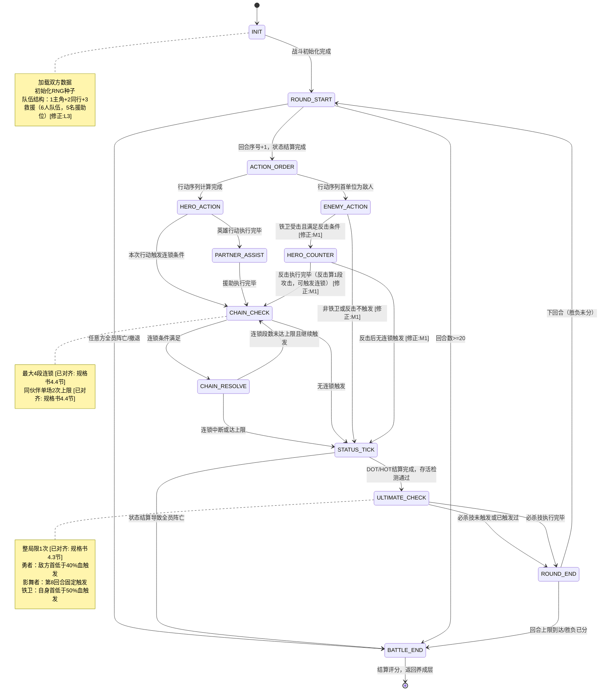

# 04 - 自动战斗引擎详细设计

> **文档状态**：已与基准规格书对齐 | Phase 1 MVP 详细设计  
> **适用范围**：3主角（勇者/影舞者/铁卫）+ 12伙伴 + 5精英敌人  
> **版本**：v1.1  
> **标注说明**：`[已对齐: 规格书X.X节]` 表示该数值/流程已与基准规格书确认对齐；`[配置驱动]` 表示通过配置表驱动，规格书未规定硬编码值

---

## 目录

1. [战斗状态机](#1-战斗状态机)
2. [行动顺序算法](#2-行动顺序算法)
3. [伤害计算管道](#3-伤害计算管道)
4. [伙伴援助触发判定流程](#4-伙伴援助触发判定流程)
5. [连锁触发控制](#5-连锁触发控制)
6. [三主角技能与必杀技](#6-三主角技能与必杀技)
7. [敌人AI模板](#7-敌人ai模板)
8. [播放模式与战斗类型](#8-播放模式与战斗类型)

---

## 1. 战斗状态机

### 1.1 战斗生命周期概览

一场战斗从初始化开始，经过若干回合循环，直到满足结束条件。



### 1.2 状态定义详表

| 状态ID | 中文名 | 进入条件 | 执行逻辑 | 退出条件 |
|--------|--------|----------|----------|----------|
| `INIT` | 战斗初始化 | 从养成层进入战斗节点 | ① 加载主角属性（五维属性 = 基础值 + 锻炼加成 + 伙伴支援 + 熟练度加成，无装备/等级系统）[修正:S1: 规格书4.7节明确主角无等级/XP系统，Phase 1无装备]<br>② 根据节点配置加载敌人模板<br>③ **队伍结构：1主角 + 2同行伙伴 + 3救援伙伴 = 6人队伍，5名可触发援助** [已对齐: 规格书4.3节][修正:L3]<br>④ 初始化RNG（使用节点ID+主角ID作为种子）<br>⑤ 创建空行动序列<br>⑥ 初始化连锁计数器=0<br>⑦ 初始化必杀技标记=false | 所有数据加载成功 |
| `ROUND_START` | 回合开始 | INIT完成 或 上回合结束 | ① 回合数+1<br>② 检测回合上限（**20回合**） [已对齐: 规格书4.3节]<br>③ 应用每回合自动效果（如混沌领主+5%属性）<br>④ 重置本回合连锁计数器=0<br>⑤ 重置本回合已援助伙伴记录 | 回合数<20且双方有人存活 |
| `ACTION_ORDER` | 行动排序 | 回合开始处理完成 | ① 收集所有存活单位的有效速度值（敏捷+随机波动） [已对齐: 规格书4.3节]<br>② 按有效速度降序排列<br>③ 同速时按"主角>伙伴>敌人"优先级，仍同则随机 | 行动序列非空 |
| `HERO_ACTION` | 英雄行动 | 轮到英雄单位的行动槽 | ① 根据英雄职业执行行动模板（勇者1段/影舞者2-4段/铁卫受击反击） [已对齐: 规格书4.7节]<br>② 执行目标选择逻辑<br>③ 进入伤害计算管道（第3章）<br>④ 应用伤害并显示日志 | 伤害计算与应用完成，目标存活检测完成 |
| `ENEMY_ACTION` | 敌人行动 | 轮到敌人单位的行动槽 | ① 根据敌人AI模板执行行动（第7章）<br>② 进入伤害计算管道<br>③ 应用伤害并显示日志 | 伤害计算与应用完成 |
| `HERO_COUNTER` | 英雄反击 | 铁卫主角受击后满足反击条件 | ① 检查铁卫是否为当前主角职业<br>② 判定铁壁反击触发概率（基础25%，不动如山期间100%）<br>③ 计算反击伤害 = 受到伤害 × 0.5<br>④ 应用反击伤害，敌方扣血<br>⑤ 10%概率使敌方眩晕1回合（不动如山期间25%）<br>⑥ 反击算1段攻击，可触发连锁 | 反击伤害计算与应用完成 |
| `PARTNER_ASSIST` | 伙伴援助 | 英雄行动执行后触发援助条件 | ① 遍历全部**5名援助伙伴**，检查援助触发条件 [已对齐: 规格书4.3节]<br>② 6种触发类型分别判定（第4章）<br>③ 执行通过判定的援助行动<br>④ 记录该伙伴本场援助次数（上限2次） [已对齐: 规格书4.4节] | 所有伙伴判定完毕 |
| `CHAIN_CHECK` | 连锁检查 | 英雄行动或援助行动完成后 | ① 检查当前连锁段数<**4**<br>② 检查行动是否满足连锁触发条件<br>③ 检查触发伙伴是否未达**2次**上限 [已对齐: 规格书4.4节]<br>④ 若满足，段数+1，进入CHAIN_RESOLVE | 连锁条件不满足或已达上限 |
| `CHAIN_RESOLVE` | 连锁执行 | 连锁检查通过 | ① 执行连锁伤害（伤害类型=CHAIN）<br>② 0.3-0.5秒动画展示 [已对齐: 规格书4.4节]<br>③ CHAIN计数器+高亮特效 [已对齐: 规格书4.4节]<br>④ 返回CHAIN_CHECK继续检查 | 连锁伤害应用完成 |
| `STATUS_TICK` | 状态结算 | 当前单位行动+连锁全部完成 | ① 结算所有单位的DOT（持续伤害）<br>② 结算所有单位的HOT（持续恢复）<br>③ 检查Buff/Debuff回合数-1，到期清除<br>④ 检测双方存活状态 | 所有状态效果结算完成 |
| `ULTIMATE_CHECK` | 必杀技检查 | 状态结算后，进入回合结束前的检查窗口 | ① 检查必杀技标记=false<br>② 按职业判定触发条件（第6章） [已对齐: 规格书4.7节]<br>③ 若触发，执行必杀技流程，标记=true<br>④ 必杀技执行后检查敌方存活 | 必杀技未触发/已触发过/执行完毕 |
| `ROUND_END` | 回合结束 | 所有单位行动完毕 | ① 检测双方存活状态<br>② 若一方全灭，标记胜负<br>③ 若回合达**20**上限，按血量比例判定胜负 [已对齐: 规格书4.3节] | 胜负已分或继续下回合 |
| `BATTLE_END` | 战斗结束 | 胜负条件满足 | ① 确定胜败结果<br>② 计算基础评分<br>③ 记录战斗日志摘要<br>④ 返回养成层 | 结算数据持久化完成 |

### 1.3 状态转移表

| 当前状态 | 触发事件 | 下一状态 | 转移条件说明 |
|----------|----------|----------|--------------|
| INIT | init_complete | ROUND_START | 数据加载无错误 |
| ROUND_START | both_alive | ACTION_ORDER | 回合数<20，双方至少1人存活 [已对齐: 规格书4.3节] |
| ROUND_START | one_side_dead | BATTLE_END | 任意方全员HP<=0 |
| ROUND_START | round_limit | BATTLE_END | 回合数==20 [已对齐: 规格书4.3节] |
| ACTION_ORDER | sequence_ready_hero | HERO_ACTION | 序列首单位为英雄 |
| ACTION_ORDER | sequence_ready_enemy | ENEMY_ACTION | 序列首单位为敌人（见第7章） |
| HERO_ACTION | action_done | PARTNER_ASSIST | 英雄行动正常完成 |
| HERO_ACTION | target_killed | PARTNER_ASSIST | 目标死亡，仍检查援助（援助可转向其他目标） |
| PARTNER_ASSIST | assist_done | CHAIN_CHECK | 援助执行完毕，进入连锁检查 |
| CHAIN_CHECK | chain_triggered | CHAIN_RESOLVE | 条件满足且段数<4 |
| CHAIN_RESOLVE | chain_resolved | CHAIN_CHECK | 连锁伤害执行后再次检查 |
| CHAIN_CHECK | no_chain | STATUS_TICK | 连锁条件不满足或段数==4 [已对齐: 规格书4.4节] |
| CHAIN_RESOLVE | chain_max | STATUS_TICK | 段数达到4，强制中断 [已对齐: 规格书4.4节] |
| ENEMY_ACTION | enemy_action_done | STATUS_TICK | 敌人行动完成，进入状态结算 |
| ENEMY_ACTION | counter_triggered | HERO_COUNTER | 铁卫受击且满足反击条件（25%概率，不动如山期间100%） [修正:M1] |
| HERO_COUNTER | counter_done | CHAIN_CHECK | 反击执行完毕，进入连锁检查（反击算1段攻击） [修正:M1] |
| HERO_COUNTER | counter_no_chain | STATUS_TICK | 反击执行完毕，不触发连锁，进入状态结算 [修正:M1] |
| STATUS_TICK | dot_killed | BATTLE_END | DOT导致全员阵亡 |
| STATUS_TICK | all_alive | ULTIMATE_CHECK | 状态结算后双方有人存活 |
| ULTIMATE_CHECK | ult_triggered | ROUND_END | 必杀技执行完毕 |
| ULTIMATE_CHECK | ult_not_ready | ROUND_END | 条件不足或已用过 [已对齐: 规格书4.7节] |
| ULTIMATE_CHECK | ult_killed_enemy | BATTLE_END | 必杀技击杀敌方全员 |
| ROUND_END | next_round | ROUND_START | 胜负未分，继续循环（最多20回合） |
| ROUND_END | victory | BATTLE_END | 敌方全灭 |
| ROUND_END | defeat | BATTLE_END | 己方全灭 |
| BATTLE_END | end | [*] | 结算完成，退出战斗 |

### 1.3+ 铁卫"铁壁反击"状态机说明 [修正:M1]

> 本节补充说明铁卫职业的被动反击技能在状态机中的触发位置与流转逻辑。

**触发位置**：铁壁反击在 `ENEMY_ACTION` 之后、`STATUS_TICK` 之前插入 `HERO_COUNTER` 状态执行。

**触发条件**：
1. 当前主角职业为**铁卫**（Iron Guard）
2. 敌方攻击命中铁卫（MISS时不触发）
3. 概率判定：基础触发概率 = **25%** + 精神每10点+2%，上限**40%** [已对齐: 规格书4.7节]
4. 若处于**不动如山**期间：触发概率强制为 **100%** [已对齐: 规格书4.7节]

**执行流程**：
```
ENEMY_ACTION（敌人攻击铁卫并命中）
  → BattleEngine检查反击触发条件
    → 条件满足 → HERO_COUNTER状态
      → 计算反击伤害 = 敌方造成的伤害 × 0.5
      → 敌方扣血
      → 10%概率眩晕敌方1回合（不动如山期间25%）
      → 反击算1段攻击 → 进入CHAIN_CHECK（可触发连锁）
    → 条件不满足 → 直接进入STATUS_TICK
```

**关键规则**：
- 铁壁反击属于**主角被动技能**，非伙伴援助，不消耗援助次数
- 反击伤害**算1段攻击**，可触发连锁（CHAIN_CHECK）
- 反击的连锁流转与普通英雄行动一致：CHAIN_CHECK → CHAIN_RESOLVE（可连锁时）或 STATUS_TICK（无连锁时）
- 眩晕效果在HERO_COUNTER状态内立即应用，敌方下回合行动时被跳过

**不动如山联动**：
当铁卫已触发必杀技"不动如山"（自身首低于50%血）后，3回合Buff期间：
- 反击触发概率 = 100%（必定反击）
- 眩晕概率 = 25%（原10%）
- 减伤40%（在伤害计算管道中应用）

### 1.4 状态机防死循环机制

| 防护机制 | 说明 |
|----------|------|
| 回合上限硬限制 | 战斗最大**20**回合，到达后强制进入BATTLE_END [已对齐: 规格书4.3节] |
| 连锁段数硬上限 | 连锁最大4段，CHAIN_RESOLVE执行后段数==4则强制退出到STATUS_TICK [已对齐: 规格书4.4节] |
| 伙伴援助次数上限 | 同伙伴单场2次 [已对齐: 规格书4.4节] |
| 必杀技次数上限 | 整场战斗仅1次 [已对齐: 规格书4.3节] |
| 单位存活过滤 | ACTION_ORDER仅包含存活单位，避免已死亡单位占用行动槽 |
| 状态结算强制推进 | STATUS_TICK后必须进入ULTIMATE_CHECK，不可回退 |

---

## 2. 行动顺序算法

### 2.1 计算公式

每回合开始时，为所有存活单位计算行动优先级：

```
有效速度 = (基础敏捷 + Buff加成) * 随机波动系数(0.9~1.1) [修正:S1]
```

**参数说明**：

| 参数 | 来源 | 说明 |
|------|------|------|
| 基础敏捷 | 角色配置表 `hero_stats` / `enemy_stats` | 实时属性（基础+锻炼+伙伴支援+熟练度，无等级加成）[修正:S1] |
| Buff加成 | 战斗运行时Buff列表 | 本回合生效的敏捷Buff/Debuff合计 |
| 随机波动系数 | RNG（范围**0.9~1.1**） [已对齐: 规格书4.3节] | 每回合独立抽取 |

> **注**：规格书4.3节仅定义"基于敏捷+随机波动"的行动顺序判定，未定义职业修正值。影舞者的高先手优势来自其初始敏捷16（三主角最高），而非额外修正。职业修正保持[配置驱动]。

### 2.2 同速处理规则

```
IF 两个单位取整后有效速度相等（int(effective_speed_a) == int(effective_speed_b)）：[修正:M3]
    第一优先级：主角 > 伙伴 > 敌人
    IF 同优先级（如两名伙伴）：
        第二优先级：比较基础敏捷，高者优先
        IF 基础敏捷也相同：
            第三优先级：随机抽选（使用本回合RNG种子）
```

### 2.3 伪代码（不可运行）

```pseudocode
# ============================================================
# [伪代码] 行动顺序计算 - 类GDScript语法，不可直接运行
# 调用时机：ROUND_START 状态内
# ============================================================

class ActionOrder:
    var turn_seed: int          # 本回合RNG种子
    var participants: Array     # 所有存活单位列表
    var action_sequence: Array  # 输出：排序后的行动序列

    func calculate_order(battle_state, round_number) -> Array:
        # 1. 生成本回合独立种子（保证可复现）
        turn_seed = hash(battle_state.init_seed + round_number)
        var rng = SeededRNG.new(turn_seed)

        # 2. 收集所有存活单位
        var units = collect_alive_units(battle_state)

        # 3. 为每个单位计算有效速度
        var scored_units: Array = []
        for unit in units:
            var entry = {
                "unit": unit,
                "effective_speed": calc_effective_speed(unit, rng),
                "base_agility": unit.stats.agility,
                "unit_type": get_unit_type(unit)  # HERO / PARTNER / ENEMY
            }
            scored_units.append(entry)

        # 4. 多关键字排序
        scored_units.sort_custom(func(a, b):
            # 主排序：有效速度降序
            if int(a.effective_speed) != int(b.effective_speed):  [修正:M3: 取整后比较]
                return a.effective_speed > b.effective_speed

            # 同速：类型优先级
            var type_priority = {"HERO": 3, "PARTNER": 2, "ENEMY": 1}
            if type_priority[a.unit_type] != type_priority[b.unit_type]:
                return type_priority[a.unit_type] > type_priority[b.unit_type]

            # 同类型：基础敏捷降序
            if a.base_agility != b.base_agility:
                return a.base_agility > b.base_agility

            # 完全相同：随机抽选（确定性）
            return rng.rand_bool()
        )

        # 5. 输出纯单位序列
        action_sequence = scored_units.map(func(e): return e.unit)
        return action_sequence

    func calc_effective_speed(unit, rng) -> float:
        var base = unit.stats.agility
        var buff_bonus = sum_buff_value(unit.buffs, STAT.AGILITY)
        var total = base + buff_bonus  [修正:S1: 无装备系统]

        # 随机波动 [已对齐: 规格书4.3节: 0.9-1.1]
        var fluctuation = rng.randf_range(0.9, 1.1)

        return total * fluctuation

    func collect_alive_units(battle_state) -> Array:
        var result = []
        result.append(battle_state.hero)
        # 伙伴不参与独立行动序列（仅作为援助触发） [已对齐: 规格书4.3节]
        # 敌人按模板行动
        result.append_all(battle_state.enemies.filter(func(e): return e.hp > 0))
        return result

    func get_unit_type(unit) -> String:
        if unit is Hero: return "HERO"
        elif unit is Enemy: return "ENEMY"
        return "UNKNOWN"
```

### 2.4 边界条件

| 边界条件 | 处理方案 |
|----------|----------|
| 仅1个存活单位 | 行动序列只有该单位，直接执行 |
| 所有单位速度为0 | 随机排序，保证总有行动顺序 |
| 己方全灭 | ROUND_START直接转BATTLE_END，不进入ACTION_ORDER |
| 敌方全灭 | 同上 |
| 速度Buff在回合中途变化 | 不影响本回合已生成的序列，次回合重新计算 |
| 单位在行动前死亡（如DOT） | 行动序列中跳过该单位，序列不重新生成 |

---

## 3. 伤害计算管道

### 3.1 完整计算链路

从"发起攻击"到"目标扣血"共经过以下阶段：

```
┌─────────────┐   ┌─────────────┐   ┌─────────────┐   ┌─────────────┐
│  阶段0：原始  │ → │  阶段1：属性  │ → │  阶段2：技能  │ → │  阶段3：随机  │
│  属性系数    │   │  系数应用    │   │  倍率应用    │   │  波动应用    │
└─────────────┘   └─────────────┘   └─────────────┘   └─────────────┘
                                                        │
┌─────────────┐   ┌─────────────┐   ┌─────────────┘   ┌─────────────┐
│  阶段6：最终  │ ← │  阶段5：防御  │ ← │  阶段4：命中  │ ← │             │
│  扣血       │   │  方减伤    │   │  与暴击判定  │   │             │
└─────────────┘   └─────────────┘   └─────────────┘   └─────────────┘
```

### 3.2 各阶段公式与参数来源

#### 阶段0~3：核心伤害公式 [已对齐: 规格书4.3节]

```
伤害 = 基础值 * 属性系数 * 技能倍率 * 随机波动(0.9-1.1)

属性系数计算：
  - 攻击方：力量 * 力量系数 + 技巧 * 技巧系数
  - 防御方：体魄 * 体魄系数（减伤）
  - 敏捷影响：先手概率、闪避概率、行动频率
  - 精神影响：抗性、低血时伤害加成
```

所有系数通过 `BattleFormulaConfig` 配置表驱动，便于平衡调整 [已对齐: 规格书4.3节]。

**阶段0-1：属性系数计算**

```
攻击方属性系数 = 攻击方力量 * power_coeff + 攻击方技巧 * tech_coeff
防御方减伤值 = 防御方体魄 * physique_def_coeff
```

| 参数 | 配置表来源 | 说明 |
|------|-----------|------|
| power_coeff | `BattleFormulaConfig.power_coeff` | 力量转攻击力系数 [配置驱动] |
| tech_coeff | `BattleFormulaConfig.tech_coeff` | 技巧转攻击力系数 [配置驱动] |
| physique_def_coeff | `BattleFormulaConfig.physique_def_coeff` | 体魄转防御力系数 [配置驱动] |

**阶段2：技能倍率**

| 攻击类型 | 技能倍率 | 来源 |
|----------|----------|------|
| 普通攻击 | 1.0（100%） | 基础 |
| 勇者普攻 | 1.0 + 追击斩判定 | 追击斩：60%攻击力 [已对齐: 规格书4.7节] |
| 影舞者疾风连击 | 0.35 * 段数（2-4段） | 每段35% [已对齐: 规格书4.7节] |
| 勇者终结一击 | 3.0（300%） | 无视30%防御 [已对齐: 规格书4.7节] |
| 影舞者风暴乱舞 | 0.4 * 6次 = 2.4（240%） | 每段40%，伙伴援助概率*1.5 [已对齐: 规格书4.7节] |
| 铁卫铁壁反击 | 受到伤害 * 0.5 | 反弹50%伤害 [已对齐: 规格书4.7节] |
| 铁卫不动如山期间 | 同上 | 反击100%触发 [已对齐: 规格书4.7节] |

**阶段3：随机波动** [已对齐: 规格书4.3节]

```
随机波动 = RNG.randf_range(0.9, 1.1)
阶段3伤害 = (攻击方属性系数 * 技能倍率 * 随机波动) - 防御方减伤值
```

#### 阶段4：命中与暴击判定

```
命中率 = 基础命中率 + (攻击方技巧 - 防御方敏捷) * 命中系数 + Buff修正
暴击率 = 基础暴击率 + 攻击方技巧 * 暴击系数 + Buff修正
```

| 参数 | 配置表来源 | 说明 |
|------|-----------|------|
| 基础命中率 | `combat_config.base_hit_rate` | 全局配置 [配置驱动: 建议95%] |
| 命中系数 | `combat_config.hit_coeff` | 技巧差转化为命中 [配置驱动] |
| 基础暴击率 | `combat_config.base_crit_rate` | 全局配置 [配置驱动: 建议5%] |
| 暴击系数 | `combat_config.crit_coeff` | 技巧转化为暴击率 [配置驱动] |
| 暴击伤害倍率 | `combat_config.crit_damage_mult` | 全局配置 [配置驱动: 建议150%] |

```
IF 命中判定失败（RNG > 命中率）：
    最终伤害 = 0
    标记 = MISS
ELSE IF 暴击判定成功（RNG < 暴击率）：
    阶段4伤害 = 阶段3伤害 * 暴击伤害倍率
    标记伤害为暴击（日志显示"暴击！"）
ELSE：
    阶段4伤害 = 阶段3伤害
```

**暗影刺客特殊闪避** [已对齐: 规格书5.2节]：

```
IF 攻击方为英雄 且 攻击类型为普攻 且 RNG < 0.30：
    最终伤害 = 0
    标记 = MISS（闪避）
    不触发追击斩/铁壁反击等"命中后"效果
```

#### 阶段5：防御方减伤

```
阶段5伤害 = max(阶段4伤害 - 防御方减伤值, 阶段4伤害 * 保底比例)

防御方减伤值 = 防御方体魄 * physique_def_coeff + Buff减伤
```

**保底机制**（防止伤害为0或负数）：
```
阶段5伤害 = max(阶段5伤害, 原始伤害 * 保底比例)
保底比例 = [配置驱动: 建议0.05]（即至少造成5%原始伤害）
```

#### 阶段6：最终扣血

```
最终伤害 = round(阶段5伤害)  # 四舍五入取整

IF 伤害类型不是MISS:
    防御方HP = max(防御方HP - 最终伤害, 0)
    记录伤害日志
    检查防御方是否HP==0（标记为阵亡）
ELSE:
    记录"闪避！"日志

返回 damage_packet（含最终伤害值）
```

### 3.3 伤害类型标记

| 类型标记 | 触发来源 | 颜色标识（日志/UI） |
|----------|----------|-------------------|
| `NORMAL` | 普通攻击 | 白色 |
| `SKILL` | 主动技能/必杀技 | 蓝色 |
| `COUNTER` | 铁壁反击 | 橙色 |
| `CHAIN` | 连锁攻击 | 紫色 |
| `ASSIST` | 伙伴援助 | 绿色 |
| `ULTIMATE` | 终结一击/风暴乱舞/不动如山 | 金色 |

### 3.4 伪代码（不可运行）

```pseudocode
# ============================================================
# [伪代码] 伤害计算管道 - 类GDScript语法，不可直接运行
# 调用：HERO_ACTION / CHAIN_RESOLVE / PARTNER_ASSIST / ENEMY_ACTION 中
# ============================================================

class DamagePipeline:
    var battle_rng: SeededRNG

    func compute_damage(attacker, defender, skill_id, damage_type) -> DamagePacket:
        var pkt = DamagePacket.new()
        pkt.attacker = attacker
        pkt.defender = defender
        pkt.type = damage_type
        pkt.skill_id = skill_id

        # -------- 阶段0-1：属性系数 --------
        var power = attacker.stats.strength
        var tech = attacker.stats.technique
        var power_coeff = Config.damage_formula.power_coeff  # [配置驱动]
        var tech_coeff = Config.damage_formula.tech_coeff    # [配置驱动]
        var attr_coeff = power * power_coeff + tech * tech_coeff

        # -------- 阶段2：技能倍率 --------
        var skill_mult = 1.0
        if skill_id:
            skill_mult = Config.skills.get(skill_id).damage_multiplier

        # -------- 阶段3：随机波动 [已对齐: 规格书4.3节] --------
        var fluctuation = battle_rng.randf_range(0.9, 1.1)

        # -------- 阶段4：防御方减伤 --------
        var physique_def = defender.stats.physique * Config.damage_formula.physique_def_coeff
        var buff_reduction = 0.0
        for buff in defender.buffs:
            if buff.stat == STAT.DAMAGE_TAKEN:
                buff_reduction += buff.value
        var total_defense = physique_def + buff_reduction

        # 基础伤害计算
        var raw_damage = attr_coeff * skill_mult * fluctuation
        var after_defense = raw_damage - total_defense

        # 保底
        var min_damage = raw_damage * Config.combat.min_damage_ratio
        after_defense = max(after_defense, min_damage)

        # -------- 阶段5：命中判定 --------
        var hit_roll = battle_rng.randf()
        var hit_rate = calc_hit_rate(attacker, defender)

        if hit_roll > hit_rate:
            pkt.value = 0
            pkt.is_miss = true
            pkt.is_crit = false
            return pkt

        # -------- 阶段6：暴击判定 --------
        var crit_roll = battle_rng.randf()
        var crit_rate = calc_crit_rate(attacker)

        if crit_roll < crit_rate:
            after_defense *= Config.combat.crit_damage_mult
            pkt.is_crit = true
        else:
            pkt.is_crit = false

        pkt.value = int(round(after_defense))
        pkt.is_miss = false

        # -------- 阶段7：最终扣血 --------
        if not pkt.is_miss:
            defender.hp = max(defender.hp - pkt.value, 0)
            if defender.hp <= 0:
                defender.is_alive = false

        return pkt

    func calc_hit_rate(attacker, defender) -> float:
        var base = Config.combat.base_hit_rate  # [配置驱动]
        var diff = attacker.stats.technique - defender.stats.agility
        var bonus = diff * Config.combat.hit_coeff  # [配置驱动]
        return clamp(base + bonus, 0.1, 1.0)  # 命中至少10%

    func calc_crit_rate(attacker) -> float:
        var base = Config.combat.base_crit_rate  # [配置驱动]
        var bonus = attacker.stats.technique * Config.combat.crit_coeff  # [配置驱动]
        return clamp(base + bonus, 0.0, Config.combat.max_crit_rate)  # [配置驱动上限]
```

### 3.5 伤害计算边界条件

| 边界条件 | 处理方案 |
|----------|----------|
| 攻击力为0 | 原始伤害=固定附加值（若有），否则=0 |
| 防御减伤>原始伤害 | 保底机制触发，至少造成min_damage_ratio比例的伤害 |
| 命中率为0 | 仍保留10%最低命中率（clamp限制） |
| 暴击率>100% | clamp限制到max_crit_rate |
| 攻击已死亡目标 | 目标选择阶段应过滤死亡单位，若发生则MISS处理 |
| 暗影刺客闪避主角普攻 | 30%概率闪避，被闪避不触发追击斩 [已对齐: 规格书5.2节] |
| 勇者终结一击无视防御 | 无视敌方30%防御力 [已对齐: 规格书4.7节] |


## 4. 伙伴援助触发判定流程

### 4.1 队伍结构与援助伙伴数量 [已对齐: 规格书4.3节/4.4节]

Phase 1队伍结构为 **1主角 + 2同行伙伴 + 3救援伙伴 = 6人队伍**，其中**5名伙伴均可触发援助** [修正:L3]。每回合流程第3步"检查伙伴援助触发条件"时，遍历全部5名援助伙伴，逐个检查其援助触发条件。

| 位置 | 数量 | 来源 | 作用 |
|:---|:---:|:---|:---|
| 主角 | 1 | 开局选择 | 核心战斗单位，五属性养成 |
| 同行伙伴 | 2 | 酒馆选择 | 全程陪伴，高锻炼出现概率 |
| 救援伙伴 | 3 | 第5/15/25回救援 | 中后期加入，扩展构筑 |

### 4.2 6种援助触发类型 [已对齐: 规格书4.4节]

| 类型ID | 中文名 | 说明 | 示例 |
|:---|:---|:---|:---|
| `FIXED_TURN` | 固定回合 | 指定回合必定触发 | 第3/6/9回合触发 |
| `CONDITIONAL` | 条件触发 | 满足条件时触发 | 生命低于50%时触发 |
| `PROBABILITY` | 概率触发 | 每回合概率检查 | 30%概率触发 |
| `PASSIVE` | 被动常驻 | 持续生效 | 精神抗性+20% |
| `CHAIN_TRIGGER` | 连锁触发 | 特定事件后触发 | 暴击后触发追击 |
| `ENEMY_TRIGGER` | 敌方触发 | 对方行动后触发 | 受击后反击 |

### 4.3 12名伙伴援助规格详表 [已对齐: 规格书4.5节]

#### 伙伴1：剑士

| 项目 | 规格 |
|:---|:---|
| 定位 | 力量型输出伙伴 |
| 擅长属性 | 力量 |
| 锻炼支援 | 锻炼力量时，额外+2力量（Lv1）→ +4（Lv3）→ +6（Lv5） |
| 战斗援助 | **攻击后概率触发**：主角攻击后，30%概率追加一次剑气斩（攻击力×0.5） |
| Lv3质变 | **双重剑气**：攻击后触发时，追加**2次**剑气斩（原1次） |
| 联动主角 | **勇者**：勇者的攻击后触发追击斩 + 剑士的攻击后触发 = 一剑三伤 |

#### 伙伴2：斥候

| 项目 | 规格 |
|:---|:---|
| 定位 | 敏捷型输出伙伴 |
| 擅长属性 | 敏捷 |
| 锻炼支援 | 锻炼敏捷时，额外+2敏捷（Lv1）→ +4（Lv3）→ +6（Lv5） |
| 战斗援助 | **暴击后触发**：主角暴击时，100%触发一次快速刺击（攻击力×0.6） |
| Lv3质变 | **鹰眼**：暴击后触发时，额外给主角+10%暴击率（2回合） |
| 联动主角 | **影舞者**：影舞者多段攻击=更多暴击机会=斥候频繁触发 |

#### 伙伴3：盾卫

| 项目 | 规格 |
|:---|:---|
| 定位 | 体魄型防御伙伴 |
| 擅长属性 | 体魄 |
| 锻炼支援 | 锻炼体魄时，额外+2体魄（Lv1）→ +4（Lv3）→ +6（Lv5） |
| 战斗援助 | **受击后触发**：主角受击后，25%概率触发护盾（吸收下次伤害的30%） |
| Lv3质变 | **守护之盾**：受击后触发时，护盾吸收量提升至50%，且持续2回合 |
| 联动主角 | **铁卫**：铁卫挨打多 = 盾卫频繁触发护盾 = 更站得住 |

#### 伙伴4：药师

| 项目 | 规格 |
|:---|:---|
| 定位 | 治疗型辅助伙伴 |
| 擅长属性 | 精神 |
| 锻炼支援 | 锻炼精神时，额外+2精神（Lv1）→ +4（Lv3）→ +6（Lv5） |
| 战斗援助 | **条件触发（主角生命<50%）**：自动使用药剂，回复主角最大生命×15% |
| Lv3质变 | **急救**：触发时额外清除1个DEBUFF，且回复量提升至20% |
| 联动主角 | **通用**：所有主角的生存保障，铁卫尤其需要（铁卫经常半血触发不动如山） |

#### 伙伴5：术士

| 项目 | 规格 |
|:---|:---|
| 定位 | 控场型伙伴 |
| 擅长属性 | 技巧 |
| 锻炼支援 | 锻炼技巧时，额外+2技巧（Lv1）→ +4（Lv3）→ +6（Lv5） |
| 战斗援助 | **概率触发（每回合）**：25%概率释放诅咒，敌方攻击-15%（2回合） |
| Lv3质变 | **衰弱诅咒**：诅咒效果增强，敌方攻击-25%且速度-10% |
| 联动主角 | **通用**：降低敌方输出=铁卫更肉，降低敌方速度=影舞者更多先手 |

#### 伙伴6：猎人

| 项目 | 规格 |
|:---|:---|
| 定位 | 斩杀型伙伴 |
| 擅长属性 | 技巧 |
| 锻炼支援 | 锻炼技巧时，额外+1技巧（Lv1）→ +3（Lv3）→ +5（Lv5），同时+1金币 |
| 战斗援助 | **条件触发（敌方生命<40%）**：主角攻击低血敌人时，猎人追加一次猎杀箭（攻击力×0.8） |
| Lv3质变 | **致命猎杀**：猎杀箭伤害提升至攻击力×1.2，且必中（无视闪避） |
| 联动主角 | **勇者**：勇者的终结一击在40%触发 + 猎人的猎杀箭在40%触发 = 双重斩杀 |

#### 伙伴7：刺客

| 项目 | 规格 |
|:---|:---|
| 定位 | 闪避型输出伙伴 |
| 擅长属性 | 敏捷 |
| 锻炼支援 | 锻炼敏捷时，额外+2敏捷（Lv1）→ +4（Lv3）→ +6（Lv5） |
| 战斗援助 | **闪避后触发**：主角闪避敌方攻击后，100%触发一次背刺（攻击力×0.7） |
| Lv3质变 | **影步**：闪避后触发时，主角下回合敏捷+15% |
| 联动主角 | **影舞者**：影舞者高敏捷=高闪避=刺客频繁触发背刺 |

#### 伙伴8：牧师

| 项目 | 规格 |
|:---|:---|
| 定位 | 护盾型辅助伙伴 |
| 擅长属性 | 精神 |
| 锻炼支援 | 锻炼精神时，额外+2精神（Lv1）→ +4（Lv3）→ +6（Lv5） |
| 战斗援助 | **被动常驻**：主角每回合开始时回复最大生命×5% |
| Lv3质变 | **神圣庇护**：回复量提升至8%，且回复时若主角满血则转化为护盾（可叠加至最大生命×20%） |
| 联动主角 | **铁卫**：铁卫站得越久=牧师回得越多=总回复量惊人 |

#### 伙伴9：狂战士

| 项目 | 规格 |
|:---|:---|
| 定位 | 爆发型输出伙伴 |
| 擅长属性 | 力量 |
| 锻炼支援 | 锻炼力量时，额外+2力量（Lv1）→ +4（Lv3）→ +6（Lv5），但锻炼时消耗1点生命 |
| 战斗援助 | **条件触发（主角生命<50%）**：主角低血时，狂战士进入狂暴，攻击+30%（2回合） |
| Lv3质变 | **狂血**：狂暴期间，主角攻击额外附带吸血效果（造成伤害的15%转化为生命） |
| 联动主角 | **通用**：低血增伤=勇者终结一击更强，吸血=铁卫更肉 |

#### 伙伴10：吟游诗人

| 项目 | 规格 |
|:---|:---|
| 定位 | 经济型辅助伙伴 |
| 擅长属性 | 精神 |
| 锻炼支援 | 锻炼任意属性时，额外+1金币（Lv1）→ +2（Lv3）→ +3（Lv5） |
| 战斗援助 | **被动常驻**：战斗胜利后获得的金币+20% |
| Lv3质变 | **财富之歌**：战斗胜利金币+35%，且每次战斗开始时主角获得10金币 |
| 联动主角 | **通用**：经济优势=更多商店升级=全局更强 |

#### 伙伴11：元素使

| 项目 | 规格 |
|:---|:---|
| 定位 | 稳定输出伙伴 |
| 擅长属性 | 技巧 |
| 锻炼支援 | 锻炼技巧时，额外+2技巧（Lv1）→ +4（Lv3）→ +6（Lv5） |
| 战斗援助 | **固定回合触发（第3/6/9回合）**：释放元素球，造成攻击力×1.0的伤害 |
| Lv3质变 | **元素风暴**：触发时改为造成攻击力×1.5伤害，且附加灼烧（每回合扣5%生命，2回合） |
| 联动主角 | **通用**：稳定输出=所有主角都适用 |

#### 伙伴12：守护兽

| 项目 | 规格 |
|:---|:---|
| 定位 | 生命型防御伙伴 |
| 擅长属性 | 体魄 |
| 锻炼支援 | 锻炼体魄时，额外+2体魄（Lv1）→ +4（Lv3）→ +6（Lv5） |
| 战斗援助 | **被动常驻**：主角最大生命+10% |
| Lv3质变 | **生命链接**：主角最大生命+15%，且主角受到的单次伤害上限为最大生命的25%（防止被秒杀） |
| 联动主角 | **铁卫**：铁卫核心需求=不被秒杀=生命链接完美契合 |

### 4.4 伙伴最优搭配 [已对齐: 规格书4.5节]

| 主角 | 最优伙伴组合 | 搭配理由 |
|:---|:---|:---|
| **勇者** | 剑士 + 猎人 + 狂战士 | 攻击后触发 + 低血斩杀 + 爆发，最大化一击伤害 |
| **影舞者** | 斥候 + 刺客 + 元素使 | 暴击触发 + 闪避触发 + 固定回合，多段攻击疯狂触发 |
| **铁卫** | 盾卫 + 牧师 + 守护兽 | 受击触发 + 被动护盾 + 被动加血，极致坦度+反击 |

### 4.5 伙伴援助触发优先级

**判定顺序**：
1. 按触发时机（而非类型优先级）依次检查：英雄攻击后 → 英雄受击后 → 回合开始时（被动/固定回合） → 暴击后 → 闪避后 → 条件满足时
2. 同一触发时机内，按伙伴配置顺序遍历所有可用伙伴
3. 同伙伴单场累计援助达到**2次**后，该伙伴从所有触发类型的候选列表中移除 [已对齐: 规格书4.4节]

### 4.6 条件触发的参数解析

```pseudocode
# ============================================================
# [伪代码] 条件触发参数评估 - 类GDScript语法，不可直接运行
# ============================================================

class ConditionEvaluator:
    # 条件模板解析
    func evaluate(condition_json, context) -> bool:
        var type = condition_json.type
        match type:
            "hp_percent_below":
                var target = get_target(condition_json.target, context)
                var threshold = condition_json.value  # 如 0.50 表示50%
                return (target.hp / target.max_hp) < threshold

            "hp_percent_above":
                var target = get_target(condition_json.target, context)
                var threshold = condition_json.value
                return (target.hp / target.max_hp) > threshold

            "target_alive":
                var target = get_target(condition_json.target, context)
                return target.is_alive and target.hp > 0

            "chain_count_below":
                return context.chain_counter < condition_json.value

            "partner_assist_count_below":
                var partner = context.partner
                return context.assist_log[partner.id] < condition_json.value  # 上限2次

            "turn_count_match":  # 固定回合触发
                return context.round_number in condition_json.turns  # 如 [3,6,9]

            "turn_count_above":
                return context.round_number > condition_json.value

            "is_crit":
                return context.damage_packet.is_crit == true

            "is_dodge":
                return context.damage_packet.is_miss == true and context.damage_packet.dodge == true

            "buff_present":
                var target = get_target(condition_json.target, context)
                return target.has_buff(condition_json.buff_id)

            "damage_type_is":
                return context.damage_packet.type == condition_json.damage_type

            "random_chance":
                # 概率触发在此处理
                var roll = context.rng.randf()
                return roll < condition_json.chance

            "and":
                for sub in condition_json.conditions:
                    if not evaluate(sub, context):
                        return false
                return true

            "or":
                for sub in condition_json.conditions:
                    if evaluate(sub, context):
                        return true
                return false

            _:
                push_error("未知条件类型: " + type)
                return false

    func get_target(target_ref, context) -> Unit:
        match target_ref:
            "hero": return context.hero
            "enemy_front": return context.get_frontmost_enemy()
            "enemy_all": return context.enemies  # 用于范围判定
            "partner_self": return context.partner
            "attacker": return context.damage_packet.attacker
            "defender": return context.damage_packet.defender
            _: return null
```

### 4.7 概率触发的随机种子管理

为保证战斗可复现（用于回放/重试），所有随机抽取使用确定性种子链：

```pseudocode
# ============================================================
# [伪代码] RNG种子管理 - 类GDScript语法，不可直接运行
# ============================================================

class SeededRNG:
    var seed: int
    var state: int
    var call_count: int = 0

    func _init(initial_seed: int):
        self.seed = initial_seed
        self.state = initial_seed

    func _advance():
        # 简单LCG，实际可用更优算法
        state = (state * 1103515245 + 12345) & 0x7fffffff
        call_count += 1

    func randf() -> float:
        _advance()
        return float(state) / 0x7fffffff

    func randf_range(min_val: float, max_val: float) -> float:
        return min_val + randf() * (max_val - min_val)

    func rand_bool() -> bool:
        return randf() < 0.5

# 种子分层结构：
# battle_seed = hash(hero_id + node_id + difficulty + run_seed)
#   ├─ turn_rng_seed   = hash(battle_seed + turn_number)     -> 行动排序
#   ├─ assist_rng_seed = hash(battle_seed + "assist" + turn_number) -> 伙伴援助判定
#   ├─ chain_rng_seed  = hash(battle_seed + "chain" + chain_total_count) -> 连锁判定
#   ├─ ult_rng_seed    = hash(battle_seed + "ult")            -> 必杀技相关
#   └─ crit_rng_seed   = hash(battle_seed + "crit" + attack_count) -> 命中暴击
```

### 4.8 伙伴援助执行流程

```pseudocode
# ============================================================
# [伪代码] 伙伴援助主流程 - 类GDScript语法，不可直接运行
# ============================================================

class PartnerAssistSystem:
    var battle_state
    var assist_rng: SeededRNG
    var assist_log: Dictionary  # partner_id -> int(已援助次数)

    func execute_assist_phase(trigger_context) -> Array:
        var executed_assists = []

        # 遍历全部5名援助伙伴 [已对齐: 规格书4.3节]
        for partner in battle_state.partners:
            # 检查单场次数上限 [已对齐: 规格书4.4节]
            var used_count = assist_log.get(partner.id, 0)
            if used_count >= 2:
                continue

            # 检查伙伴是否存活
            if not partner.is_alive:
                continue

            # 评估触发条件
            var condition = partner.get_assist_condition()
            var passed = ConditionEvaluator.evaluate(condition, trigger_context)

            if passed:
                # 执行援助行动
                var assist_action = create_assist_action(partner)
                var result = execute_assist_action(assist_action)
                executed_assists.append(result)

                # 记录次数
                assist_log[partner.id] = used_count + 1

                # 更新触发上下文
                trigger_context.last_assist_result = result

        return executed_assists

    func create_assist_action(partner) -> AssistAction:
        var action = AssistAction.new()
        action.partner = partner
        action.assist_type = partner.assist_type  # damage/heal/buff/shield
        action.skill_id = partner.assist_skill_id
        action.target = battle_state.hero  # 大部分援助目标是主角
        return action

    func execute_assist_action(action) -> AssistResult:
        match action.assist_type:
            "damage":
                var pkt = DamagePipeline.compute_damage(
                    action.partner, action.target, action.skill_id, DamageType.ASSIST
                )
                return AssistResult.new("damage", pkt)

            "heal":
                var heal_val = calc_heal_value(action.partner, action.skill_id)
                action.target.hp = min(action.target.hp + heal_val, action.target.max_hp)
                return AssistResult.new("heal", heal_val)

            "buff":
                apply_buff(action.target, action.buff_id, action.duration)
                return AssistResult.new("buff", action.buff_id)

            "shield":
                var shield_val = calc_shield_value(action.partner, action.skill_id)
                action.target.shields += shield_val
                return AssistResult.new("shield", shield_val)

            _:
                return AssistResult.new("unknown", null)
```

---

## 5. 连锁触发控制

### 5.1 连锁计数器管理

连锁系统存在两级计数：

| 计数器 | 作用域 | 初始值 | 重置时机 | 上限 |
|--------|--------|--------|----------|------|
| `battle_chain_total` | 整场战斗 | 0 | 永不重置 | 无（仅用于统计） |
| `turn_chain_count` | 当前回合 | 0 | 每回合ROUND_START | **4** [已对齐: 规格书4.4节] |
| `partner_chain_count[partner_id]` | 单伙伴单场 | 0 | 永不重置 | **2** [已对齐: 规格书4.4节] |

```
ROUND_START:
    turn_chain_count = 0
    # partner_chain_count 和 battle_chain_total 不清零

CHAIN_CHECK (任意行动后):
    IF turn_chain_count >= 4:
        -> 转 STATUS_TICK（本回合连锁已达上限）
    
    FOR each 可能触发连锁的伙伴:
        IF partner_chain_count[partner.id] >= 2:
            CONTINUE（该伙伴已达单场上限）
        
        IF 连锁条件满足:
            turn_chain_count += 1
            battle_chain_total += 1
            partner_chain_count[partner.id] += 1
            -> 进入 CHAIN_RESOLVE 执行该伙伴连锁攻击
            
            CHAIN_RESOLVE 完成后:
                -> 回到 CHAIN_CHECK（继续检查是否还能连锁）
```

### 5.2 4段上限的拦截逻辑 [已对齐: 规格书4.4节]

```pseudocode
# ============================================================
# [伪代码] 连锁上限拦截 - 类GDScript语法，不可直接运行
# ============================================================

class ChainSystem:
    var turn_chain_count: int = 0       # 本回合连锁段数
    var battle_chain_total: int = 0     # 整场连锁总数
    var partner_chain_count: Dictionary = {}  # partner_id -> count

    const CHAIN_PER_TURN_LIMIT = 4      # [已对齐: 规格书4.4节]
    const CHAIN_PER_PARTNER_LIMIT = 2   # [已对齐: 规格书4.4节]

    func can_trigger_chain(partner, context) -> bool:
        # 拦截1：本回合已达4段
        if turn_chain_count >= CHAIN_PER_TURN_LIMIT:
            return false

        # 拦截2：该伙伴本场已达2次
        var p_count = partner_chain_count.get(partner.id, 0)
        if p_count >= CHAIN_PER_PARTNER_LIMIT:
            return false

        # 拦截3：目标已死亡
        if not context.target or not context.target.is_alive:
            return false

        # 拦截4：触发方已死亡
        if not partner.is_alive:
            return false

        # 拦截5：检查该伙伴是否有连锁触发能力
        if not partner.has_trigger("CHAIN_TRIGGER"):
            return false

        return true

    func on_chain_triggered(partner) -> void:
        turn_chain_count += 1
        battle_chain_total += 1
        partner_chain_count[partner.id] = partner_chain_count.get(partner.id, 0) + 1

        # 连锁时调用伤害管道，传入CHAIN类型
        var pkt = DamagePipeline.compute_damage(
            partner, current_target, partner.chain_skill_id, DamageType.CHAIN
        )

        # 记录连锁日志
        log_chain_action(turn_chain_count, partner, pkt)

        # 连锁展示：CHAIN计数器+高亮特效 [已对齐: 规格书4.4节]
        play_chain_effect(turn_chain_count)

    func on_round_start() -> void:
        turn_chain_count = 0
        # partner_chain_count 和 battle_chain_total 保留

    func is_chain_at_limit() -> bool:
        return turn_chain_count >= CHAIN_PER_TURN_LIMIT

    func get_remaining_chains_this_turn() -> int:
        return CHAIN_PER_TURN_LIMIT - turn_chain_count

    func get_partner_remaining_chains(partner_id) -> int:
        return CHAIN_PER_PARTNER_LIMIT - partner_chain_count.get(partner_id, 0)
```

### 5.3 连锁伤害倍率规则 [配置驱动]

规格书4.4节定义了连锁的段数上限和展示规则，但未定义连锁伤害的倍率衰减/递增规则。以下提供三种配置方案，由策划通过 `chain_config` 配置表选择：

**方案A：递增型（鼓励连携）**

| 段数 | 倍率 | 说明 |
|------|------|------|
| 第1段 | 1.0x | 首段正常伤害 |
| 第2段 | 1.2x | 小幅加成 [配置驱动] |
| 第3段 | 1.5x | 显著加成 [配置驱动] |
| 第4段 | 2.0x | 终结爆发 [配置驱动] |

**方案B：递减型（防止滚雪球）**

| 段数 | 倍率 | 说明 |
|------|------|------|
| 第1段 | 1.0x | 首段正常伤害 |
| 第2段 | 0.7x | 衰减30% [配置驱动] |
| 第3段 | 0.5x | 衰减50% [配置驱动] |
| 第4段 | 0.3x | 大幅衰减 [配置驱动] |

**方案C：无衰减（规格书默认）**

| 段数 | 倍率 | 说明 |
|------|------|------|
| 第1-4段 | 1.0x | 每段正常伤害（规格书未定义倍率，默认无衰减） |

### 5.4 连锁展示规则 [已对齐: 规格书4.4节]

- 每段连锁间隔：**0.3-0.5秒** 动画展示
- 连锁展示：**CHAIN计数器** + **高亮特效**
- CHAIN数字在屏幕中央显示，随段数增加而变大变亮

### 5.5 连锁中断条件

连锁可能在以下情况中断（回到STATUS_TICK）：

| 中断条件 | 说明 |
|----------|------|
| 达到4段上限 | 自动中断 [已对齐: 规格书4.4节] |
| 连锁攻击MISS | 通常MISS不中断连锁（除非特定敌人机制） |
| 目标死亡且无其他目标 | 目标死亡后检查是否有其他存活敌人，无则中断 |
| 连锁触发伙伴死亡 | 该伙伴在连锁前因DOT等死亡，跳过该次连锁 |
| 所有可连锁伙伴达2次上限 | 本局后续不再有连锁 [已对齐: 规格书4.4节] |

### 5.6 连锁系统边界条件

| 边界条件 | 处理方案 |
|----------|----------|
| 第4段连锁后目标死亡 | 连锁正常结算，回合继续到STATUS_TICK |
| 连锁中触发伙伴达2次上限 | 该伙伴不再参与后续连锁判定 [已对齐: 规格书4.4节] |
| 连锁中英雄死亡 | 连锁继续执行（伙伴独立行动），回合结束后检查胜负 |
| 所有伙伴达2次上限 | 本局后续不再有连锁 [已对齐: 规格书4.4节] |
| 仅有1名可连锁伙伴 | 该伙伴最多触发2次连锁，之后本局无连锁 |
| 敌人闪避连锁攻击 | 继续下一段连锁 |


## 6. 三主角技能与必杀技

> 本章所有数值已精确对齐规格书4.7节

### 三主角统一设计原则 [已对齐: 规格书4.7节]

| 原则 | 说明 |
|:---|:---|
| **初始值差异** | 三主角仅在初始五维属性上有差异，各自突出一个主属性 |
| **无成长差异** | 属性成长完全由**锻炼次数**和**伙伴支援**决定，三主角成长空间完全相同 |
| **机制差异** | 三主角的核心差异在于**技能触发时机**和**攻击段数设计** |
| **段数体系** | 勇者（1段大数字）→ 影舞者（2-4段连击）→ 铁卫（受击反击1段） |

**三主角核心差异一览** [已对齐: 规格书4.7节]：

| 维度 | 勇者 | 影舞者 | 铁卫 |
|:---|:---|:---|:---|
| **最高初始属性** | 力量 16 | 敏捷 16 | 体魄 16 |
| **攻击段数** | 1段（一击） | 2-4段（连击） | 0-1段（受击反击） |
| **技能触发时机** | 攻击后 | 每击自动 | 受击后 |
| **必杀触发** | 敌方40%血 | 第8回合 | 自己50%血 |
| **build核心** | 力量→大数字 | 敏捷→多段→触发伙伴 | 体魄→站住→伙伴输出 |

---

### 6.1 勇者（Brave）- 力量型物理输出

**初始属性** [已对齐: 规格书4.7节]：

| 属性 | 初始值 | 说明 |
|:---|:---:|:---|
| 体魄 | 12 | 标准生命值 |
| **力量** | **16** | 核心输出属性，三主角中最高 |
| 敏捷 | 10 | 标准先手 |
| **技巧** | **12** | 副属性，影响追击触发概率 |
| 精神 | 8 | 偏低，非核心 |

#### 常规技能：追击斩 [已对齐: 规格书4.7节]

| 项目 | 规格 |
|:---|:---|
| 触发类型 | 概率触发（主角每次普通攻击后） |
| 基础触发概率 | **30%** |
| 技巧加成 | 技巧每+10点，概率+2%，上限**50%** |
| 效果 | 追加一次 **60% 攻击力** 的额外斩击 |
| 伤害公式 | 力量 × 0.6 × 随机波动(0.9-1.1) |
| 连锁标签 | 追击（可触发连锁触发型的伙伴援助） |
| 每场上限 | 无 |
| 视觉表现 | 主角攻击后迅速再挥一剑，第二段伤害数字略小 |

```pseudocode
# ============================================================
# [伪代码] 勇者追击斩 - 类GDScript语法，不可直接运行
# ============================================================

class BravePursuitSlash:
    func on_hero_attack_complete(hero, battle_state, damage_packet) -> void:
        # 只有普通攻击命中后才检查
        if damage_packet.is_miss:
            return

        # 计算触发概率
        var base_chance = 0.30  # 基础30% [已对齐: 规格书4.7节]
        var tech_bonus = int(hero.stats.technique / 10) * 0.02  # 每10点技巧+2%
        var total_chance = min(base_chance + tech_bonus, 0.50)  # 上限50% [已对齐: 规格书4.7节]

        # 概率判定
        if battle_rng.randf() < total_chance:
            # 触发追击斩
            var target = damage_packet.defender
            var pursuit_damage = hero.stats.strength * 0.60  # 60%攻击力 [已对齐: 规格书4.7节]
            pursuit_damage *= battle_rng.randf_range(0.9, 1.1)  # 随机波动

            var pkt = DamagePacket.new()
            pkt.attacker = hero
            pkt.defender = target
            pkt.value = int(round(pursuit_damage))
            pkt.type = DamageType.SKILL
            pkt.is_pursuit = true

            target.hp = max(target.hp - pkt.value, 0)
            log_skill_trigger("追击斩", hero, target, pkt.value)

            # 追击可触发连锁
            ChainSystem.check_chain_trigger(pkt, hero)
```

#### 必杀技：终结一击 [已对齐: 规格书4.7节]

| 项目 | 规格 |
|:---|:---|
| 触发类型 | 条件触发（敌方生命值**首次**低于**40%**时） |
| 触发时机 | 主角行动回合内，满足条件立即触发 |
| 效果 | 造成 **300% 攻击力** 的巨额伤害 |
| 伤害公式 | 力量 × 3.0 × 随机波动(0.9-1.1) |
| 特殊规则 | **无视敌方30%防御力**（确保斩杀感） |
| 整场限制 | **限 1 次** |
| 视觉表现 | 勇者跃起 → 剑聚光 → 巨大斩击 → 大数字 + 屏幕震动 |
| 设计意图 | 斩杀爽感，"敌人快死了，一剑带走" |

**与猎人伙伴的联动**：
- 勇者终结一击在敌方40%血触发 → 猎人猎杀箭也在敌方40%血触发 → 双重斩杀 [已对齐: 规格书4.7节]
- 勇者高力量 → 更快将敌方压至40% → 更早触发终结一击

```pseudocode
# ============================================================
# [伪代码] 勇者终结一击 - 类GDScript语法，不可直接运行
# ============================================================

class BraveUltimate:
    var triggered: bool = false  # 限1次标记
    var has_met_threshold: Dictionary = {}  # enemy_id -> bool（记录每个敌方是否已经低于过40%）

    func check_condition(hero, battle_state) -> bool:
        if triggered:
            return false  # 已使用过

        # 检查是否有敌方首次低于40%
        for enemy in battle_state.enemies:
            if not enemy.is_alive:
                continue
            var hp_ratio = enemy.hp / enemy.max_hp
            if hp_ratio < 0.40 and not has_met_threshold.get(enemy.id, false):
                return true  # 找到首次低于40%的敌方
        return false

    func execute(hero, battle_state) -> void:
        triggered = true  # 标记已使用 [已对齐: 规格书4.7节: 限1次]

        # 找到首个首次低于40%的敌方
        var target = null
        for enemy in battle_state.enemies:
            if not enemy.is_alive:
                continue
            var hp_ratio = enemy.hp / enemy.max_hp
            if hp_ratio < 0.40 and not has_met_threshold.get(enemy.id, false):
                has_met_threshold[enemy.id] = true
                target = enemy
                break

        if target == null:
            return

        # 计算伤害：300%攻击力，无视30%防御 [已对齐: 规格书4.7节]
        var raw_damage = hero.stats.strength * 3.0
        raw_damage *= battle_rng.randf_range(0.9, 1.1)

        # 无视30%防御
        var effective_defense = target.stats.physique * Config.damage_formula.physique_def_coeff * 0.70
        var final_damage = raw_damage - effective_defense
        final_damage = max(final_damage, raw_damage * Config.combat.min_damage_ratio)

        var pkt = DamagePacket.new()
        pkt.attacker = hero
        pkt.defender = target
        pkt.value = int(round(final_damage))
        pkt.type = DamageType.ULTIMATE
        pkt.is_ultimate = true

        target.hp = max(target.hp - pkt.value, 0)
        if target.hp <= 0:
            target.is_alive = false

        log_ultimate_trigger("终结一击", hero, target, pkt.value)
        play_ultimate_animation("brave_ultimate", hero, target)

    func on_enemy_hp_changed(enemy, new_hp_ratio) -> void:
        # 标记该敌方是否已经低于过40%
        if new_hp_ratio < 0.40:
            if enemy.id not in has_met_threshold:
                has_met_threshold[enemy.id] = false  # 将在execute中设为true
```

---

### 6.2 影舞者（Shadow Dancer）- 敏捷型快攻连击

**初始属性** [已对齐: 规格书4.7节]：

| 属性 | 初始值 | 说明 |
|:---|:---:|:---|
| 体魄 | 10 | 偏低，脆皮 |
| 力量 | 10 | 标准，副属性 |
| **敏捷** | **16** | 核心属性，三主角中最高 |
| 技巧 | 10 | 标准 |
| 精神 | 12 | 略高，保证一定生存 |

#### 常规技能：疾风连击 [已对齐: 规格书4.7节]

| 项目 | 规格 |
|:---|:---|
| 触发类型 | 被动常驻（每次普通攻击自动生效） |
| 效果 | 每次普攻分裂为 **2-4 段** 小伤害（每段 = 攻击力 × 0.35） |
| 段数计算 | 基础 **2 段** + 敏捷每+15点多1段，上限 **4 段** |
| 总伤害对比 | 4段 × 35% = 140% 攻击力（略高于勇者普攻100%） |
| 关键设计 | **每段伤害独立判定**伙伴援助触发条件 |
| 视觉表现 | 主角快速连续出剑，每段一个较小的伤害数字飘出 |
| 设计意图 | **多段 = 多触发机会**——伙伴看到4次攻击，可能触发4次援助 |

**段数计算示例** [已对齐: 规格书4.7节]：

| 敏捷值 | 段数 | 计算 |
|:---:|:---:|:---|
| 16（初始） | 2段 | 基础2段 |
| 31 | 3段 | 2 + (31-16)/15 = 2+1 = 3 |
| 46 | 4段 | 2 + (46-16)/15 = 2+2 = 4（上限） |

```pseudocode
# ============================================================
# [伪代码] 影舞者疾风连击 - 类GDScript语法，不可直接运行
# ============================================================

class ShadowDancerSwiftStrike:
    func get_hit_count(hero) -> int:
        var base_hits = 2  # 基础2段 [已对齐: 规格书4.7节]
        var bonus_hits = int((hero.stats.agility - 16) / 15)  # 敏捷每+15点+1段
        return min(base_hits + bonus_hits, 4)  # 上限4段 [已对齐: 规格书4.7节]

    func on_hero_attack(hero, target, battle_state) -> void:
        var hit_count = get_hit_count(hero)

        for i in range(hit_count):
            # 每段 = 攻击力 × 0.35 [已对齐: 规格书4.7节]
            var segment_damage = hero.stats.strength * 0.35
            segment_damage *= battle_rng.randf_range(0.9, 1.1)

            var pkt = DamagePacket.new()
            pkt.attacker = hero
            pkt.defender = target
            pkt.value = int(round(segment_damage))
            pkt.type = DamageType.NORMAL
            pkt.hit_segment = i + 1
            pkt.total_segments = hit_count

            target.hp = max(target.hp - pkt.value, 0)
            log_hit("疾风连击第{0}/{1}段".format([i+1, hit_count]), hero, target, pkt.value)

            # 每段独立判定伙伴援助触发 [已对齐: 规格书4.7节]
            PartnerAssistSystem.check_assist_trigger("AFTER_HERO_ATTACK", pkt)

            if not target.is_alive:
                break  # 目标死亡，停止后续段数
```

#### 必杀技：风暴乱舞 [已对齐: 规格书4.7节]

| 项目 | 规格 |
|:---|:---|
| 触发类型 | 固定回合触发（第 **8** 回合**必定**触发） |
| 效果 | 立即进行 **6 次** 快速斩击，每段 = 攻击力 × 0.4 |
| 总伤害 | 6 × 40% = **240%** 攻击力 |
| 特殊规则 | **本次必杀技期间，伙伴援助触发概率 × 1.5 倍** |
| 整场限制 | **限 1 次** |
| 视觉表现 | 主角化为残影，屏幕中剑光四射，伤害数字密集弹出 |
| 设计意图 | "让伙伴动起来"的终极展示——6次攻击 + 概率×1.5 = 伙伴援助疯狂连发 |

**风暴乱舞的联动爽感** [已对齐: 规格书4.7节]：

```
假设带了 2 名"攻击后30%概率触发"的伙伴：

影舞者普攻（4段）：
  -> 4次攻击 * 30% * 2名伙伴 = 平均 2.4 次伙伴援助触发

影舞者风暴乱舞（6段 * 1.5倍概率）：
  -> 6次攻击 * 45% * 2名伙伴 = 平均 5.4 次伙伴援助触发

一场风暴乱舞中，伙伴可能连续触发 5+ 次援助 -> 满屏伤害数字
-> "伙伴跟我一起战斗"的团队感达到顶峰
```

```pseudocode
# ============================================================
# [伪代码] 影舞者风暴乱舞 - 类GDScript语法，不可直接运行
# ============================================================

class ShadowDancerUltimate:
    var triggered: bool = false  # 限1次标记

    func check_condition(battle_state) -> bool:
        if triggered:
            return false  # 已使用过
        return battle_state.round_number == 8  # 第8回合必定触发 [已对齐: 规格书4.7节]

    func execute(hero, battle_state) -> void:
        triggered = true  # 标记已使用 [已对齐: 规格书4.7节: 限1次]

        var target = select_target(battle_state.enemies)  # 选择目标
        var hit_count = 6  # 6次斩击 [已对齐: 规格书4.7节]

        # 开启伙伴援助概率1.5倍 [已对齐: 规格书4.7节]
        battle_state.assist_prob_multiplier = 1.5

        for i in range(hit_count):
            if not target or not target.is_alive:
                target = select_target(battle_state.enemies)
                if not target or not target.is_alive:
                    break

            # 每段 = 攻击力 * 0.4 [已对齐: 规格书4.7节]
            var segment_damage = hero.stats.strength * 0.40
            segment_damage *= battle_rng.randf_range(0.9, 1.1)

            var pkt = DamagePacket.new()
            pkt.attacker = hero
            pkt.defender = target
            pkt.value = int(round(segment_damage))
            pkt.type = DamageType.ULTIMATE
            pkt.hit_segment = i + 1
            pkt.total_segments = hit_count

            target.hp = max(target.hp - pkt.value, 0)
            log_ultimate_hit("风暴乱舞第{0}/{1}段".format([i+1, hit_count]), hero, target, pkt.value)

            # 每段独立判定伙伴援助触发（概率已*1.5）
            PartnerAssistSystem.check_assist_trigger("AFTER_HERO_ATTACK", pkt)

            if not target.is_alive:
                target = select_target(battle_state.enemies)

        # 恢复伙伴援助概率
        battle_state.assist_prob_multiplier = 1.0

        play_ultimate_animation("shadow_dancer_ultimate", hero)

    func select_target(enemies) -> Unit:
        # 优先选择HP比例最低的敌人
        var alive = enemies.filter(func(e): return e.is_alive)
        if alive.size() == 0:
            return null
        alive.sort_custom(func(a, b): return (a.hp/a.max_hp) < (b.hp/b.max_hp))
        return alive[0]
```

---

### 6.3 铁卫（Iron Guard）- 体魄型防守反击

**初始属性** [已对齐: 规格书4.7节]：

| 属性 | 初始值 | 说明 |
|:---|:---:|:---|
| **体魄** | **16** | 核心属性，三主角中最高 |
| 力量 | 8 | 偏低，非核心输出 |
| 敏捷 | 10 | 偏低，后手居多 |
| 技巧 | 10 | 标准 |
| **精神** | **14** | 副属性，影响反击概率和抗性 |

#### 常规技能：铁壁反击 [已对齐: 规格书4.7节]

| 项目 | 规格 |
|:---|:---|
| 触发类型 | 概率触发（主角每次受击后） |
| 基础触发概率 | **25%** |
| 精神加成 | 精神每+10点，概率+2%，上限**40%** |
| 效果 | **反弹**受到伤害的 **50%** 给攻击者 |
| 特殊效果 | 反击有 **10% 概率** 使敌方 **眩晕 1 回合**（跳过行动） |
| 伤害公式 | 敌方本次造成伤害 × 0.5 |
| 连锁标签 | 反击（**算作1段攻击**，可触发连锁触发型的伙伴援助） |
| 每场上限 | 无 |
| 视觉表现 | 受击时盾牌闪烁金光，反击光芒射向敌方，敌方头顶短暂眩晕星号 |

```pseudocode
# ============================================================
# [伪代码] 铁卫铁壁反击 - 类GDScript语法，不可直接运行
# ============================================================

class IronGuardCounter:
    func on_hero_hit(hero, attacker, incoming_damage, battle_state) -> void:
        # 计算反击触发概率
        var base_chance = 0.25  # 基础25% [已对齐: 规格书4.7节]
        var spirit_bonus = int(hero.stats.spirit / 10) * 0.02  # 每10点精神+2%
        var total_chance = min(base_chance + spirit_bonus, 0.40)  # 上限40% [已对齐: 规格书4.7节]

        if battle_rng.randf() < total_chance:
            # 触发铁壁反击：反弹50%伤害 [已对齐: 规格书4.7节]
            var counter_damage = incoming_damage * 0.50

            var pkt = DamagePacket.new()
            pkt.attacker = hero
            pkt.defender = attacker
            pkt.value = int(round(counter_damage))
            pkt.type = DamageType.COUNTER

            attacker.hp = max(attacker.hp - pkt.value, 0)
            log_counter_trigger("铁壁反击", hero, attacker, pkt.value)

            # 反击算作1段攻击，可触发连锁 [已对齐: 规格书4.7节]
            ChainSystem.check_chain_trigger(pkt, hero)

            # 眩晕判定：10%概率 [已对齐: 规格书4.7节]
            if battle_rng.randf() < 0.10:
                apply_buff(attacker, "stun", 1)  # 眩晕1回合
                log_debuff_apply("眩晕", attacker, 1)

    func get_counter_chance(hero) -> float:
        var base = 0.25
        var bonus = int(hero.stats.spirit / 10) * 0.02
        return min(base + bonus, 0.40)  # [已对齐: 规格书4.7节]

    func get_stun_chance() -> float:
        return 0.10  # [已对齐: 规格书4.7节]
```

#### 必杀技：不动如山 [已对齐: 规格书4.7节]

| 项目 | 规格 |
|:---|:---|
| 触发类型 | 条件触发（主角生命**首次**低于 **50%** 时） |
| 触发时机 | 受击后生命降至50%以下时立即触发 |
| 效果 | 开启持续 **3 回合** 的防御姿态 |
| 减伤 | 期间受到的伤害 **-40%** |
| 反击强化 | 期间每次受击 **必定 100% 触发** 铁壁反击（原25%→100%） |
| 击晕强化 | 期间反击击晕概率从 10% 提升至 **25%** |
| 整场限制 | **限 1 次** |
| 视觉表现 | 全身笼罩金色护盾，脚下出现阵法特效，持续3回合，每次反击时盾牌爆发出强光 |
| 设计意图 | "绝境反击"——半血以下进入绝对防御状态，挨打必反击，概率击晕控场 |

**不动如山的联动爽感** [已对齐: 规格书4.7节]：

```
敌方攻击铁卫（3回合buff期间）：
  -> 伤害-40%（铁卫只受60%伤害）
  -> 必定触发铁壁反击（100%反弹50%伤害）
  -> 25%概率击晕敌方（敌方跳过下回合）

一场典型的不动如山体验：
  敌方回合1：攻击 -> 被减伤 -> 被反击反弹 -> 运气不好被击晕
  敌方回合2：跳过（眩晕）
  敌方回合3：攻击 -> 被减伤 -> 被反击反弹
  
3回合内敌方实际只出手了2次，且每次都被反伤
-> 铁卫几乎无伤，敌方被自己打残
-> "你打不动我"的爽感
```

```pseudocode
# ============================================================
# [伪代码] 铁卫不动如山 - 类GDScript语法，不可直接运行
# ============================================================

class IronGuardUltimate:
    var triggered: bool = false  # 限1次标记
    var is_active: bool = false  # 是否处于不动如山状态
    var remaining_turns: int = 0

    func check_condition(hero) -> bool:
        if triggered:
            return false  # 已使用过
        # 生命首次低于50%时触发 [已对齐: 规格书4.7节]
        var hp_ratio = hero.hp / hero.max_hp
        return hp_ratio < 0.50

    func execute(hero, battle_state) -> void:
        triggered = true  # 标记已使用 [已对齐: 规格书4.7节: 限1次]
        is_active = true
        remaining_turns = 3  # 持续3回合 [已对齐: 规格书4.7节]

        # 应用不动如山Buff
        var buff = Buff.new()
        buff.id = "iron_guard_ultimate"
        buff.name = "不动如山"
        buff.duration = 3
        buff.damage_reduction = 0.40  # 减伤40% [已对齐: 规格书4.7节]
        buff.counter_chance_override = 1.0  # 反击100%触发 [已对齐: 规格书4.7节]
        buff.stun_chance = 0.25  # 眩晕概率25% [已对齐: 规格书4.7节]
        hero.add_buff(buff)

        log_ultimate_trigger("不动如山", hero, null, 0)
        play_ultimate_animation("iron_guard_ultimate", hero)

    func on_round_end() -> void:
        if is_active:
            remaining_turns -= 1
            if remaining_turns <= 0:
                deactivate()

    func deactivate() -> void:
        is_active = false
        log_buff_expire("不动如山")

    func get_modified_counter_chance(base_chance, hero) -> float:
        if is_active:
            return 1.0  # 100% [已对齐: 规格书4.7节]
        return base_chance

    func get_modified_stun_chance(base_stun_chance) -> float:
        if is_active:
            return 0.25  # 25% [已对齐: 规格书4.7节]
        return base_stun_chance

    func get_damage_reduction() -> float:
        if is_active:
            return 0.40  # 40% [已对齐: 规格书4.7节]
        return 0.0
```

### 6.4 必杀技边界条件

| 边界条件 | 勇者-终结一击 | 影舞者-风暴乱舞 | 铁卫-不动如山 |
|----------|:---|:---|:---|
| 条件满足但已使用过 | 不触发（限1次） | 不触发（限1次） | 不触发（限1次） |
| 触发时敌方全灭 | 动画播放后进入BATTLE_END | 同上 | 同上 |
| 触发时英雄已死亡 | 不可能（死亡不进ULTIMATE_CHECK） | 同上 | 同上 |
| 影舞者连击中目标全灭 | N/A（必杀不依赖普攻） | 剩余次数尝试切换目标 | N/A |
| 铁卫不动期间被眩晕 | N/A | N/A | 眩晕跳过行动，但Buff仍持续减伤和反击 |
| 必杀技持续多回合时战斗结束 | Buff随战斗结束清除 | 同上 | Buff随战斗结束清除 |
| SL/重试后必杀状态 | 从快照恢复标记位 | 同上 | 同上 |


## 7. 敌人AI模板

### 7.1 5种精英敌人概览 [已对齐: 规格书5.2节]

规格书5.2节定义了5种精英敌人，按难度递进设计。MVP版本以数值检测为主，机制极简。

| 敌人ID | 名称 | 难度层 | 适用回合 | 核心机制 | 检测属性 |
|--------|------|:---:|:---:|:---|:---|
| `elite_01` | 重甲守卫 | 1 | 第3-8回合 | 坚甲：伤害-25% | 力量 |
| `elite_02` | 暗影刺客 | 2 | 第8-15回合 | 闪避：30%概率闪避普攻 | 技巧/敏捷 |
| `elite_03` | 元素法师 | 3 | 第12-18回合 | 蓄力爆发：第3回合力量*2.5伤害 | 爆发/生存 |
| `elite_04` | 狂战士 | 4 | 第15-22回合 | 狂暴（仅1次）：生命首次低于30%攻击*1.5 | 控血/timing |
| `elite_05` | 混沌领主 | 5 | 第18-25回合 | 成长进化：每回合全属性+5%（最多+45%） | 构筑强度 |

**5种敌人递进关系** [已对齐: 规格书5.2节]：

```
重甲守卫："只需要力量高"（单一检测）
    ↓
暗影刺客："技巧也要有一点"（双属性）
    ↓
元素法师："爆发力很关键"（输出节奏）
    ↓
狂战士："timing 有讲究"（必杀技时机）
    ↓
混沌领主："整体强度够不够"（综合构筑）
```

### 7.2 敌人通用行动决策

所有敌人共用基础决策框架，各模板覆盖特定方法：

```pseudocode
# ============================================================
# [伪代码] 敌人AI决策框架 - 类GDScript语法，不可直接运行
# ============================================================

class EnemyAI:
    var enemy
    var battle_state

    # 主决策入口
    func decide_action() -> EnemyAction:
        # 1. 检查是否有强制行动（如蓄力后必须释放）
        var forced = check_forced_action()
        if forced != null:
            return forced

        # 2. 检查特殊机制触发
        var special = check_special_mechanic()
        if special != null:
            return special

        # 3. 血量阶段判定
        var hp_ratio = enemy.hp / enemy.max_hp

        if hp_ratio < 0.30:
            # 濒死：拼命攻击
            return select_panic_action()
        elif hp_ratio < 0.50:
            # 受伤：倾向防御/恢复
            return select_wounded_action()
        else:
            # 正常：按模板偏好选择
            return select_normal_action()

    func select_target(action_type) -> Unit:
        # 默认攻击主角
        return battle_state.hero

    func execute_action(action) -> void:
        match action.type:
            "attack":
                var pkt = DamagePipeline.compute_damage(
                    enemy, action.target, action.skill_id, DamageType.NORMAL
                )
            "skill":
                var pkt = DamagePipeline.compute_damage(
                    enemy, action.target, action.skill_id, DamageType.SKILL
                )
            "charge":
                apply_buff(enemy, "charging", action.charge_duration)
                enemy.charged_action = action.charged_skill
            "defend":
                apply_buff(enemy, "defending", 1)
                enemy.defense_boost = Config.enemy.ai.defend_bonus
            _:
                push_error("未知敌人类型: " + action.type)
```

---

### 7.3 敌人1：重甲守卫（Armored Guard）- 难度层1 [已对齐: 规格书5.2节]

| 项目 | 规格 |
|:---|:---|
| 外观 | 全身板甲持盾的骑士 |
| 适用回合 | 第 3-8 回合 |
| 核心威胁 | **高体魄带来的高血量 + 高防御** |
| 属性模板 | 体魄 = 主角力量 × **2.0**（高血量），力量 = 主角力量 × **0.5**（低攻击），其余 = 主角 × **0.6** |
| 特殊机制 | **坚甲**：受到的伤害 **-25%**（常驻减伤） |
| 勇者联动 | 终结一击的无视防御恰好克制坚甲 |
| 设计意图 | 力量检测——力量够不够打破它的防御？ |

```pseudocode
class ArmoredGuardAI:
    extends EnemyAI

    func _init():
        # 属性模板 [已对齐: 规格书5.2节]
        enemy.stats.physique = hero.stats.strength * 2.0
        enemy.stats.strength = hero.stats.strength * 0.5
        enemy.stats.agility = hero.stats.agility * 0.6
        enemy.stats.technique = hero.stats.technique * 0.6
        enemy.stats.spirit = hero.stats.spirit * 0.6

        # 特殊机制：坚甲 [已对齐: 规格书5.2节]
        enemy.damage_reduction = 0.25  # 常驻减伤25%

    func apply_damage_reduction(damage) -> float:
        # 坚甲减伤 [已对齐: 规格书5.2节]
        return damage * (1.0 - enemy.damage_reduction)

    func select_normal_action() -> EnemyAction:
        # 重甲守卫：普通攻击为主，偶尔防御
        if battle_rng.randf() < 0.3:
            return EnemyAction.new("defend", enemy, null)
        return EnemyAction.new("attack", select_target("hero"), null)

    func on_damage_received(damage, attacker) -> float:
        # 应用坚甲减伤
        return apply_damage_reduction(damage)
```

---

### 7.4 敌人2：暗影刺客（Shadow Assassin）- 难度层2 [已对齐: 规格书5.2节]

| 项目 | 规格 |
|:---|:---|
| 外观 | 黑袍双匕首的刺客 |
| 适用回合 | 第 8-15 回合 |
| 核心威胁 | **高敏捷带来的高闪避 + 高技巧带来的高暴击** |
| 属性模板 | 敏捷 = 主角敏捷 × **1.5**，技巧 = 主角技巧 × **1.2**，体魄 = 主角力量 × **0.8**，力量 = 主角 × **0.7** |
| 特殊机制 | **闪避**：**30%** 概率闪避主角普攻（被闪避不触发追击斩） |
| 设计意图 | 技巧/敏捷检测——攻击能不能命中？ |

```pseudocode
class ShadowAssassinAI:
    extends EnemyAI

    func _init():
        # 属性模板 [已对齐: 规格书5.2节]
        enemy.stats.agility = hero.stats.agility * 1.5
        enemy.stats.technique = hero.stats.technique * 1.2
        enemy.stats.physique = hero.stats.strength * 0.8
        enemy.stats.strength = hero.stats.strength * 0.7

    func on_being_attacked(attacker, damage_packet) -> bool:
        # 闪避判定：30%概率闪避主角普攻 [已对齐: 规格书5.2节]
        if damage_packet.type == DamageType.NORMAL and attacker is Hero:
            if battle_rng.randf() < 0.30:
                log("暗影刺客闪避了攻击！")
                return true  # 闪避成功
        return false  # 未闪避，正常受击

    func on_evade_success(attacker) -> void:
        # 闪避后不触发追击斩 [已对齐: 规格书5.2节]
        # 勇者追击斩依赖普攻命中，闪避后不触发
        pass

    func select_normal_action() -> EnemyAction:
        # 暗影刺客：优先攻击主角
        return EnemyAction.new("attack", battle_state.hero, null)

    func get_crit_rate_bonus() -> float:
        # 高技巧带来高暴击（通过技巧属性自然体现）
        return 0.0  # 不额外加暴击，依赖高技巧属性
```

---

### 7.5 敌人3：元素法师（Elemental Mage）- 难度层3 [已对齐: 规格书5.2节]

| 项目 | 规格 |
|:---|:---|
| 外观 | 持法杖周身环绕能量的法师 |
| 适用回合 | 第 12-18 回合 |
| 核心威胁 | **低血量但超高爆发（3回合蓄力）** |
| 属性模板 | 体魄 = 主角力量 × **0.6**（低血量），力量 = 主角力量 × **1.2**（高法攻），精神 = 主角 × **1.3** |
| 特殊机制 | **蓄力爆发**：第 **3** 回合造成力量 × **2.5** 的爆发伤害（前2回合普攻） |
| 对策 | 3回合内打出足够输出秒杀，或堆高体魄硬吃爆发 |
| 设计意图 | 爆发/生存检测——输出够不够快，或体魄够不够厚？ |

```pseudocode
class ElementalMageAI:
    extends EnemyAI

    var charge_turns: int = 0  # 蓄力回合计数
    var is_charged: bool = false

    func _init():
        # 属性模板 [已对齐: 规格书5.2节]
        enemy.stats.physique = hero.stats.strength * 0.6
        enemy.stats.strength = hero.stats.strength * 1.2
        enemy.stats.spirit = hero.stats.spirit * 1.3
        enemy.stats.agility = hero.stats.agility * 0.8
        enemy.stats.technique = hero.stats.technique * 0.9

    func on_round_start():
        charge_turns += 1

    func decide_action() -> EnemyAction:
        # 检查是否有强制行动
        var forced = check_forced_action()
        if forced != null:
            return forced

        # 蓄力爆发逻辑 [已对齐: 规格书5.2节]
        if charge_turns == 2 and not is_charged:
            # 第2回合开始蓄力
            is_charged = true
            return EnemyAction.new("charge", enemy, null, "elemental_burst")
        elif is_charged and charge_turns >= 3:
            # 第3回合释放爆发
            is_charged = false
            var burst_action = EnemyAction.new("skill", battle_state.hero, "elemental_burst")
            burst_action.damage_multiplier = 2.5  # 力量*2.5 [已对齐: 规格书5.2节]
            charge_turns = 0  # 重置计数
            return burst_action
        else:
            # 普攻
            return EnemyAction.new("attack", battle_state.hero, null)

    func execute_burst(target) -> void:
        # 蓄力爆发：力量 * 2.5 [已对齐: 规格书5.2节]
        var burst_damage = enemy.stats.strength * 2.5
        burst_damage *= battle_rng.randf_range(0.9, 1.1)

        var pkt = DamagePacket.new()
        pkt.attacker = enemy
        pkt.defender = target
        pkt.value = int(round(burst_damage))
        pkt.type = DamageType.SKILL
        pkt.is_burst = true

        target.hp = max(target.hp - pkt.value, 0)
        log_enemy_skill("蓄力爆发", enemy, target, pkt.value)

    func select_normal_action() -> EnemyAction:
        return decide_action()  # 蓄力逻辑在decide中
```

---

### 7.6 敌人4：狂战士（Berserker）- 难度层4 [已对齐: 规格书5.2节]

| 项目 | 规格 |
|:---|:---|
| 外观 | 赤裸上身、血红双眼、持巨斧的狂暴战士 |
| 适用回合 | 第 15-22 回合 |
| 核心威胁 | **残血时的单次狂暴爆发** |
| 属性模板 | 体魄 = 主角力量 × **1.3**，力量 = 主角 × **1.0**，精神 = 主角 × **1.1**，其余 = 主角 × **0.8** |
| 特殊机制 | **狂暴（仅触发1次）**：生命首次降至 **30%** 以下时，本回合攻击伤害 × **1.5** |
| 勇者联动 | 终结一击在 40%触发 -> 将狂战士从 40%打至更低 -> 可能直接跳过狂暴区间秒杀 |
| 设计意图 | 控血检测——敢不敢在它残血时硬拼？终结一击的 timing 很关键 |

```pseudocode
class BerserkerAI:
    extends EnemyAI

    var frenzy_triggered: bool = false  # 狂暴是否已触发（仅1次） [已对齐: 规格书5.2节]
    var in_frenzy: bool = false
    var frenzy_turns: int = 0
    const FRENZY_DURATION = 3  # 狂暴持续3回合

    func _init():
        # 属性模板 [已对齐: 规格书5.2节]
        enemy.stats.physique = hero.stats.strength * 1.3
        enemy.stats.strength = hero.stats.strength * 1.0
        enemy.stats.spirit = hero.stats.spirit * 1.1
        enemy.stats.agility = hero.stats.agility * 0.8
        enemy.stats.technique = hero.stats.technique * 0.8

    func on_hp_changed(old_hp, new_hp) -> void:
        var hp_ratio = new_hp / enemy.max_hp
        # 狂暴触发：生命首次降至30%以下（仅1次） [已对齐: 规格书5.2节]
        if not frenzy_triggered and hp_ratio < 0.30:
            trigger_frenzy()

    func trigger_frenzy() -> void:
        frenzy_triggered = true  # [已对齐: 规格书5.2节: 仅1次]
        in_frenzy = true
        frenzy_turns = FRENZY_DURATION
        enemy.attack_multiplier = 1.5  # 攻击*1.5 [已对齐: 规格书5.2节]
        log("狂战士狂暴了！攻击力大幅提升！")

    func on_round_start():
        if in_frenzy:
            frenzy_turns -= 1
            if frenzy_turns <= 0:
                in_frenzy = false
                enemy.attack_multiplier = 1.0
                log("狂战士的狂暴消退了...")

    func select_normal_action() -> EnemyAction:
        # 狂战士始终攻击
        return EnemyAction.new("attack", battle_state.hero, null)

    func get_attack_multiplier() -> float:
        if in_frenzy:
            return 1.5  # [已对齐: 规格书5.2节]
        return 1.0
```

---

### 7.7 敌人5：混沌领主（Chaos Lord）- 难度层5 [已对齐: 规格书5.2节]

| 项目 | 规格 |
|:---|:---|
| 外观 | 混沌能量环绕、身形扭曲的终极敌人 |
| 适用回合 | 第 18-25 回合 |
| 核心威胁 | **单命成长——越战越强** |
| 属性模板 | 初始五属性 = 主角 × **0.7**（低于主角） |
| 特殊机制 | **成长进化**：每经过 1 回合，全属性 +**5%**（战斗结束时最多 +**45%**，即9回合） |
| 设计意图 | 构筑强度检测——你的初期输出够不够秒杀它？拖越久它越强。考验"攻击力够不够高" |
| 与勇者对比 | 勇者力量高 -> 前5回合快速击杀；非力量型 -> 后期被反超 |

```pseudocode
class ChaosLordAI:
    extends EnemyAI

    var stat_multiplier: float = 1.0  # 初始100%
    const MAX_GROWTH = 1.45  # 最多+45% [已对齐: 规格书5.2节]
    const GROWTH_PER_TURN = 0.05  # 每回合+5% [已对齐: 规格书5.2节]

    func _init():
        # 属性模板 [已对齐: 规格书5.2节]
        enemy.stats.strength = hero.stats.strength * 0.7
        enemy.stats.agility = hero.stats.agility * 0.7
        enemy.stats.physique = hero.stats.physique * 0.7
        enemy.stats.technique = hero.stats.technique * 0.7
        enemy.stats.spirit = hero.stats.spirit * 0.7

    func on_round_start():
        # 成长进化 [已对齐: 规格书5.2节]
        if stat_multiplier < MAX_GROWTH:
            stat_multiplier += GROWTH_PER_TURN
            stat_multiplier = min(stat_multiplier, MAX_GROWTH)
            apply_stat_multiplier()
            log("混沌领主的力量增加了！（累计+{0}%）".format([int((stat_multiplier - 1.0) * 100)]))

    func apply_stat_multiplier():
        enemy.effective_stats.strength = enemy.base_stats.strength * stat_multiplier
        enemy.effective_stats.agility = enemy.base_stats.agility * stat_multiplier
        enemy.effective_stats.physique = enemy.base_stats.physique * stat_multiplier
        enemy.effective_stats.technique = enemy.base_stats.technique * stat_multiplier
        enemy.effective_stats.spirit = enemy.base_stats.spirit * stat_multiplier

    func get_current_growth_percent() -> int:
        return int((stat_multiplier - 1.0) * 100)

    func select_normal_action() -> EnemyAction:
        # 混沌领主：普通攻击
        return EnemyAction.new("attack", battle_state.hero, null)

    func get_stat_multiplier() -> float:
        return stat_multiplier
```

### 7.8 5种敌人属性模板速查表 [已对齐: 规格书5.2节]

| 属性 | 重甲守卫 | 暗影刺客 | 元素法师 | 狂战士 | 混沌领主 |
|:---|:---:|:---:|:---:|:---:|:---:|
| **体魄** | 主角力量×2.0 | 主角力量×0.8 | 主角力量×0.6 | 主角力量×1.3 | 主角体魄×0.7 |
| **力量** | 主角力量×0.5 | 主角力量×0.7 | 主角力量×1.2 | 主角力量×1.0 | 主角力量×0.7 |
| **敏捷** | 主角敏捷×0.6 | 主角敏捷×**1.5** | 主角敏捷×0.8 | 主角敏捷×0.8 | 主角敏捷×0.7 |
| **技巧** | 主角技巧×0.6 | 主角技巧×**1.2** | 主角技巧×0.9 | 主角技巧×0.8 | 主角技巧×0.7 |
| **精神** | 主角精神×0.6 | 主角精神×0.7 | 主角精神×**1.3** | 主角精神×**1.1** | 主角精神×0.7 |
| **特殊机制** | 坚甲：伤害-25% | 闪避：30%概率 | 蓄力爆发：第3回合力量×2.5 | 狂暴：低于30%攻击×1.5 | 每回合全属性+5% |
| **勇者联动** | 终结一击无视防御克制 | — | — | 终结一击timing关键 | 力量高=前5回合击杀 |

### 7.9 敌人AI边界条件

| 边界条件 | 处理方案 |
|----------|----------|
| 敌人行动时目标已死亡 | 重新选择目标（默认主角），若无目标则跳过行动 |
| 混沌领主属性增长导致数值溢出 | clamp到合理上限（最多+45%） [已对齐: 规格书5.2节] |
| 敌人被控制（眩晕/冰冻） | 跳过本回合行动，DOT等状态正常结算 |
| 敌人HP为0时触发回血 | 先检测存活，死亡单位不触发回血 |
| 狂战士狂暴期间被控制 | 狂暴状态不免疫控制，眩晕正常跳过行动 |
| 元素法师蓄力期间被击杀 | 蓄力中断，无后续爆发效果 |

---

## 8. 播放模式与战斗类型 [已对齐: 规格书4.3节]

### 8.1 播放模式分级

| 战斗类型 | 播放模式 | 预计时长 | 展示内容 |
|:---|:---|:---:|:---|
| **普通战斗** | 简化快进 | **2-3 秒** | 双方立绘 + 血条 + 每回合伤害数字 + 最终胜负 |
| **精英战** | 标准播放 | **15-25 秒** | 完整动画 + 伙伴援助 + 必杀技 + 连锁展示 |
| **PVP 检定** | 标准播放 | **15-25 秒** | 完整动画 + 伙伴援助 + 连锁展示 + 胜负判定 |
| **终局战** | 标准播放 + 日志 | **15-25 秒** | 完整动画 + 连锁展示 + 战后复盘统计 |

### 8.2 各播放模式差异实现

```pseudocode
class PlaybackController:
    var mode: String  # "fast_forward" / "standard" / "standard_with_log"

    func play_action(action) -> void:
        match mode:
            "fast_forward":
                # 普通战斗：2-3秒完成全部20回合 [已对齐: 规格书4.3节]
                play_action_instant(action)  # 无动画，立即结算
            "standard":
                # 精英战/PVP：标准动画 [已对齐: 规格书4.3节]
                play_action_animated(action, 0.3)  # 每行动0.3秒
                if action.type == "CHAIN":
                    wait(0.3)  # 连锁间隔0.3-0.5秒 [已对齐: 规格书4.4节]
            "standard_with_log":
                # 终局战：标准动画+完整日志 [已对齐: 规格书4.3节]
                play_action_animated(action, 0.3)
                log_detailed(action)  # 记录详细日志用于战后复盘
```

---

## 附录A：数据配置表索引

| 配置表名 | 用途 | 关键字段 |
|----------|------|----------|
| `hero_stats` | 主角基础属性 | class_id, strength, agility, physique, technique, spirit |
| `partner_stats` | 伙伴基础属性 | partner_id, assist_type, assist_condition, assist_effect |
| `enemy_stats` | 敌人基础属性 | enemy_id, template_id, stat_multipliers, ai_script |
| `skill_config` | 技能配置 | skill_id, damage_multiplier, target_type |
| `BattleFormulaConfig` | 全局伤害公式 | power_coeff, tech_coeff, physique_def_coeff, min_damage_ratio, random_fluctuation_min/max |
| `combat_config` | 战斗通用配置 | base_hit_rate, base_crit_rate, crit_damage_mult, hit_coeff, crit_coeff |
| `chain_config` | 连锁系统配置 | per_turn_limit(4), per_partner_limit(2), damage_multiplier_per_segment |
| `playback_config` | 播放模式配置 | mode, action_delay, chain_delay_min/max |

## 附录B：术语表

| 术语 | 英文 | 说明 |
|------|------|------|
| DOT | Damage Over Time | 持续伤害 |
| HOT | Heal Over Time | 持续恢复 |
| Buff | Buff | 增益状态 |
| Debuff | Debuff | 减益状态 |
| SL | Save/Load | 存档/读档 |
| RNG | Random Number Generator | 随机数生成器 |
| FSM | Finite State Machine | 有限状态机 |
| CHAIN | Chain | 连锁触发 |
| ULTIMATE | Ultimate | 必杀技 |

## 附录C：与规格书对齐检查清单

| 序号 | 内容 | 规格书章节 | 对齐状态 |
|:---:|:---|:---:|:---:|
| 1 | 战斗回合上限=20回合 | 4.3节 | ✅ 已对齐 |
③ **队伍结构：1主角 + 2同行伙伴 + 3救援伙伴 = 6人队伍，5名可触发援助** [已对齐: 规格书4.3节][修正:L3]
| 3 | 连锁最大链长=4段 | 4.4节 | ✅ 已对齐 |
| 4 | 连锁每伙伴每场上限=2次 | 4.4节 | ✅ 已对齐 |
| 5 | 连锁间隔=0.3-0.5秒+CHAIN计数器 | 4.4节 | ✅ 已对齐 |
| 6 | 必杀技每场限1次 | 4.3节 | ✅ 已对齐 |
| 7 | 随机波动范围=0.9-1.1 | 4.3节 | ✅ 已对齐 |
| 8 | 勇者-追击斩30%概率/60%伤害/上限50% | 4.7节 | ✅ 已对齐 |
| 9 | 勇者-终结一击40%血/300%/无视30%防御 | 4.7节 | ✅ 已对齐 |
| 10 | 影舞者-疾风连击2-4段/每段35%/敏捷每15+1段 | 4.7节 | ✅ 已对齐 |
| 11 | 影舞者-风暴乱舞第8回合/6次/40%/概率*1.5 | 4.7节 | ✅ 已对齐 |
| 12 | 铁卫-铁壁反击25%反弹50%/精神每10+2%/上限40% | 4.7节 | ✅ 已对齐 |
| 13 | 铁卫-铁壁反击10%眩晕1回合 | 4.7节 | ✅ 已对齐 |
| 14 | 铁卫-不动如山50%血/3回合/减伤40%/反击100%/眩晕25% | 4.7节 | ✅ 已对齐 |
| 15 | 12名伙伴援助规格（触发类型+Lv3质变） | 4.5节 | ✅ 已对齐 |
| 16 | 重甲守卫属性模板+坚甲25%减伤 | 5.2节 | ✅ 已对齐 |
| 17 | 暗影刺客属性模板+30%闪避 | 5.2节 | ✅ 已对齐 |
| 18 | 元素法师属性模板+蓄力爆发第3回合力量*2.5 | 5.2节 | ✅ 已对齐 |
| 19 | 狂战士属性模板+狂暴低于30%攻击*1.5（仅1次） | 5.2节 | ✅ 已对齐 |
| 20 | 混沌领主属性模板+每回合全属性+5%上限45% | 5.2节 | ✅ 已对齐 |
| 21 | 播放模式分级（普通2-3秒/精英15-25秒/PVP15-25秒/终局15-25秒） | 4.3节 | ✅ 已对齐 |
| 22 | 每回合8步流程 | 4.3节 | ✅ 已对齐 |
| 23 | 勇者初始属性：体魄12/力量16/敏捷10/技巧12/精神8 | 4.7节 | ✅ 已对齐 |
| 24 | 影舞者初始属性：体魄10/力量10/敏捷16/技巧10/精神12 | 4.7节 | ✅ 已对齐 |
| 25 | 铁卫初始属性：体魄16/力量8/敏捷10/技巧10/精神14 | 4.7节 | ✅ 已对齐 |

---

> **文档结束**  
> 本文档已与基准规格书v1.0对齐，所有标注 `[已对齐: 规格书X.X节]` 的数值均已确认。未标注的 `[配置驱动]` 项由 `BattleFormulaConfig` / `combat_config` / `chain_config` 等配置表驱动，需在平衡测试阶段填充具体数值。  
> 对齐完成日期：2026年

