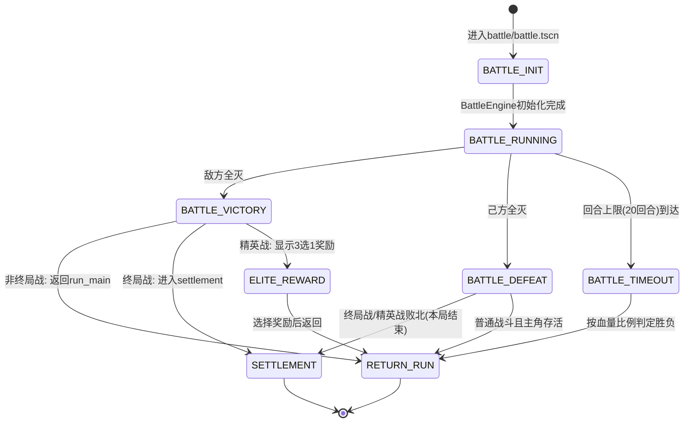

# UI流程与场景结构设计文档

> **文档编号**: 06
> **版本**: Phase 1 MVP（已对齐基准规格书 v1.0）
> **适用范围**: "赛马娘版Q宠大乐斗" Roguelike回合制养成游戏
> **基准分辨率**: 1280×720
> **帧率目标**: 30fps
> **设计约束**: 场景数≤10，纯色块+文字占位，无悬空信号

---

## 目录

1. [场景清单表](#1-场景清单表)
2. [UI状态流转图](#2-ui状态流转图)
3. [HUD设计](#3-hud设计)
4. [占位美术规范](#4-占位美术规范)
5. [战斗播放模式设计](#5-战斗播放模式设计)

---

## 1. 场景清单表

Phase 1共需 **9个.tscn场景**（fighter_archive查看为Phase 3功能，已移除），场景路径严格对齐规格书2.2节`scenes/`目录结构。
[已对齐: 规格书2.2节项目结构]

### 1.1 场景总览

| # | 场景路径 | 对应规格书目录 | 场景职责 | 场景类型 |
|---|---------|--------------|---------|---------|
| 1 | `scenes/main_menu/menu.tscn` | `main_menu/` | 主菜单：开始新局/继续游戏/斗士档案入口/设置 | 全屏 |
| 2 | `scenes/hero_select/hero_select.tscn` | `hero_select/` | 主角选择：3主角信息展示与选择确认 | 全屏 |
| 3 | `scenes/tavern/tavern.tscn` | `tavern/` | 酒馆集结：从6伙伴中选2名首发确认 | 全屏 |
| 4 | `scenes/run_main/run_main.tscn` | (跨目录协调*) | 养成循环主界面：30回合HUD+节点选择+事件日志 | 全屏(核心) |
| 5 | `scenes/training/training_popup.tscn` | `training/` | 锻炼弹窗：五维属性选择+锻炼结果确认 | 弹窗覆盖 |
| 6 | `scenes/shop/shop_popup.tscn` | `shop/` | 商店弹窗：商品列表+购买+离开 | 弹窗覆盖 |
| 7 | `scenes/rescue/rescue_popup.tscn` | `rescue/` | 救援弹窗：3选1新伙伴加入 | 弹窗覆盖 |
| 8 | `scenes/battle/battle.tscn` | `battle/` | 战斗主界面：所有战斗类型共用 | 全屏 |
| 9 | `scenes/settlement/settlement.tscn` | `settlement/` | 终局结算：战斗结果+档案生成+评分展示 | 全屏 |

> **\*关于`run_main/`目录说明**：[已对齐: 规格书4.2节]
> 规格书2.2节`scenes/`目录未单独列出`run_main/`，但4.2节定义了30回合养成循环流程。
> `run_main.tscn`是跨`training/`、`shop/`、`rescue/`、`battle/`等目录的**核心协调场景**，
> 负责回合推进、HUD统一显示、节点选择调度。文件放置于`scenes/run_main/`目录下。

---

### 1.2 场景1：主菜单 `scenes/main_menu/menu.tscn`

**场景职责**：游戏入口。提供开始新局、继续游戏、查看斗士档案、退出游戏功能。

**核心节点结构**：
```
MainMenu (Control, AnchorFullRect)
├── BgPanel (ColorRect, 全屏填充, 颜色#2C3E50[已对齐: 规格书10.X节占位规范])
├── TitleLabel (Label, 锚点TopCenter, 距顶部80px, 字体32px, 文字"赛马娘版Q宠大乐斗")
├── MenuButtons (VBoxContainer, 锚点Center, 间距20px)
│   ├── BtnNewGame (Button, 文字"开始新局", 最小尺寸200×50)
│   ├── BtnContinue (Button, 文字"继续游戏", 最小尺寸200×50)
│   └── BtnQuit (Button, 文字"退出游戏", 最小尺寸200×50)
└── VersionLabel (Label, 锚点BottomRight, 文字"v0.1.0", 字体14px, 颜色#AAAAAA)
```

**接收信号**（从EventBus订阅）：
| 信号 | 来源 | 处理 |
|------|------|------|
| `save_loaded` | SaveManager | 启用"继续游戏"按钮 |
| `save_not_found` | SaveManager | 禁用"继续游戏"按钮（置灰） |

**发出信号**（向EventBus发射）：
| 信号 | 目标模块 | 说明 |
|------|---------|------|
| `new_game_requested` | GameManager → HeroSelect | 请求进入主角选择 |
| `continue_game_requested` | GameManager → RunController | 请求加载存档进入养成 |

**切换逻辑**：
- `BtnNewGame.pressed` → 发射 `new_game_requested` → GameManager切换至 `hero_select.tscn`
- `BtnContinue.pressed` → 发射 `continue_game_requested` → 加载存档 → 切换至 `run_main.tscn`
- `BtnQuit.pressed` → `get_tree().quit()`

---

### 1.3 场景2：主角选择 `scenes/hero_select/hero_select.tscn`

**场景职责**：展示3名可选主角（勇者/影舞者/铁卫），允许玩家查看详情并确认选择。
[已对齐: 规格书4.7节三主角设计]

**核心节点结构**：
```
HeroSelect (Control, AnchorFullRect)
├── BgPanel (ColorRect, 全屏, #1A1A2E)
├── TitleLabel (Label, TopCenter, 距顶60px, 28px, "选择你的主角")
├── HeroCards (HBoxContainer, 锚点Center, 间距40px)
│   ├── HeroCard1 (VBoxContainer, 200×350)
│   │   ├── PortraitRect (ColorRect, 120×120, 居中, 颜色按职业区分)
│   │   ├── NameLabel (Label, 20px, "勇者", 居中)
│   │   ├── ClassDesc (Label, 14px, "力量型·一击必杀", 颜色#AAAAAA)
│   │   ├── StatsPreview (VBoxContainer)
│   │   │   ├── StatPhysique (Label, 14px, "体魄: 12")
│   │   │   ├── StatStrength (Label, 14px, "力量: 16 ★")
│   │   │   ├── StatAgility (Label, 14px, "敏捷: 10")
│   │   │   ├── StatTechnique (Label, 14px, "技巧: 12")
│   │   │   └── StatSpirit (Label, 14px, "精神: 8")
│   │   └── SelectBtn (Button, 160×40, "选择")
│   ├── HeroCard2 (VBoxContainer, 同上结构, 影舞者)
│   │   ├── PortraitRect (ColorRect, 120×120, #8E44AD)
│   │   ├── ClassDesc (Label, "敏捷型·多段连击")
│   │   └── StatsPreview (Label, "敏捷: 16 ★")
│   └── HeroCard3 (VBoxContainer, 同上结构, 铁卫)
│       ├── PortraitRect (ColorRect, 120×120, #2980B9)
│       ├── ClassDesc (Label, "体魄型·防守反击")
│       └── StatsPreview (Label, "体魄: 16 ★")
├── DetailPanel (PanelContainer, 锚点BottomCenter, 距底40px, 600×120)
│   └── DetailLabel (Label, 14px, 自动换行, 显示选中主角详细描述)
└── BackBtn (Button, 锚点TopLeft, 距左20px距顶20px, 80×36, "返回")
```

**职业颜色编码** [已对齐: 规格书4.7节]：
| 主角 | PortraitRect颜色 | 文字描述 |
|------|-----------------|---------|
| 勇者 | `#C0392B` (红) | 力量型，一击必杀 |
| 影舞者 | `#8E44AD` (紫) | 敏捷型，多段连击 |
| 铁卫 | `#2980B9` (蓝) | 体魄型，防守反击 |

**接收信号**：
| 信号 | 来源 | 处理 |
|------|------|------|
| `hero_data_loaded` | ConfigManager | 填充3张主角卡片数据 |

**发出信号**：
| 信号 | 目标 | 说明 |
|------|------|------|
| `hero_selected(hero_id)` | RunController, GameManager | 确认选择，记录hero_id，进入tavern |
| `back_to_menu_requested` | GameManager | 返回主菜单 |

---

### 1.4 场景3：酒馆 `scenes/tavern/tavern.tscn`

**场景职责**：展示6名可用伙伴，玩家选择2名首发伙伴组成初始队伍，确认后进入养成循环。
[已对齐: 规格书4.4节队伍结构1+2+3]

**核心节点结构**：
```
Tavern (Control, AnchorFullRect)
├── BgPanel (ColorRect, 全屏, #2C2419)
├── TitleLabel (Label, TopCenter, 60px, 28px, "酒馆集结 - 选择2名首发伙伴")
├── SubtitleLabel (Label, TopCenter, 100px, 16px, "已选择: 0/2", 颜色动态变化)
├── PartnerGrid (GridContainer, 3列2行, 锚点Center, 间距20px)
│   ├── PartnerSlot1~6 (VBoxContainer, 180×220 each)
│   │   ├── PortraitRect (ColorRect, 80×80, 居中)
│   │   ├── NameLabel (Label, 16px, 伙伴名称)
│   │   ├── RoleLabel (Label, 13px, 定位标签, 颜色#AAAAAA)
│   │   ├── LvLabel (Label, 13px, "Lv.1")
│   │   └── SelectCheck (CheckBox, 13px, "加入队伍")
│   └── ... (6个slot同结构)
├── ConfirmBtn (Button, 锚点BottomCenter, 距底60px, 200×50, "确认出发")
└── BackBtn (Button, TopLeft, 80×36, "返回")
```

**伙伴颜色编码** [已对齐: 规格书4.8节12伙伴设计]：
| 伙伴 | PortraitRect颜色 | 定位 |
|------|-----------------|------|
| 剑士 | `#E74C3C` | 输出型·力量 |
| 斥候 | `#2ECC71` | 输出型·敏捷 |
| 盾卫 | `#3498DB` | 防御型·体魄 |
| 药师 | `#F1C40F` | 辅助型·精神 |
| 术士 | `#9B59B6` | 控场型·技巧 |
| 猎人 | `#E67E22` | 斩杀型·技巧 |

**接收信号**：
| 信号 | 来源 | 处理 |
|------|------|------|
| `partner_pool_loaded` | ConfigManager | 填充6名伙伴卡片数据 |
| `hero_selected` (内部状态) | HeroSelect | 记录当前主角ID用于队伍组建 |

**发出信号**：
| 信号 | 目标 | 说明 |
|------|------|------|
| `team_confirmed(partner_ids)` | RunController, GameManager | 确认2名首发伙伴，进入run_main |
| `back_to_hero_select` | GameManager | 返回主角选择 |

**交互约束**：
- CheckBox选中数达到2时，其余CheckBox自动禁用
- 选中数<2时，ConfirmBtn禁用（modulate.alpha = 0.5）
- ConfirmBtn仅在选中数==2时可用

---

### 1.5 场景4：养成循环主界面 `scenes/run_main/run_main.tscn` ★核心场景

**场景职责**：30回合养成循环的核心管理界面。持续显示HUD数据，在NODE_SELECT阶段展示三选一节点面板，在NODE_EXECUTE阶段展示节点内容或子面板，含事件文本日志区。
[已对齐: 规格书4.2节30回合养成循环]

**核心节点结构**：
```
RunMain (Control, AnchorFullRect)
├── BgPanel (ColorRect, 全屏, #1E272E)
│
├── HUD (CanvasLayer, layer=1)
│   ├── TopBar (HBoxContainer, 锚点TopWide, 高度50, 背景#00000080)
│   │   ├── RoundLabel (Label, "第 1/30 回合", 20px, 左对齐)
│   │   ├── GoldLabel (Label, "金币: 0", 18px, 右对齐)
│   │   └── HPLabel (Label, "生命: 100/100", 18px, 右对齐)
│   │
│   ├── LeftPanel (VBoxContainer, 锚点Left, 宽220, 距顶60, 距底200)
│   │   ├── HeroStatsPanel (PanelContainer, 背景#00000060)
│   │   │   ├── HeroName (Label, 16px, "勇者 Lv.1")
│   │   │   └── StatBars (VBox)
│   │   │       ├── StatPhysique (Label, 14px, "体魄: 10")
│   │   │       ├── StatStrength (Label, 14px, "力量: 10")
│   │   │       ├── StatAgility (Label, 14px, "敏捷: 10")
│   │   │       ├── StatTechnique (Label, 14px, "技巧: 10")
│   │   │       └── StatSpirit (Label, 14px, "精神: 10")
│   │   │
│   │   ├── PartnerList (VBoxContainer)
│   │   │   ├── PartnerHeader (Label, 14px, "伙伴队伍:")
│   │   │   └── PartnerSlots (VBox, 5个slot)
│   │   │       ├── PartnerSlot1 (HBox, 14px, "剑士 Lv.1 [☆]")
│   │   │       └── ...
│   │   │
│   │   └── MasteryPanel (PanelContainer, 背景#00000040)
│   │       ├── MasteryHeader (Label, 13px, "属性熟练度")
│   │       └── MasteryLabels (VBox, 5行)
│   │           └── MasteryLabel (Label, 12px, "力量: 生疏")
│   │
│   └── LogPanel (PanelContainer, 锚点BottomWide, 高160, 背景#00000080)
│       ├── LogHeader (Label, "事件日志", 14px)
│       └── LogScroll (ScrollContainer)
│           └── LogContent (VBoxContainer, 每行一个Label)
│
├── NodeSelectPanel (PanelContainer, 锚点Center, 居中, 可见性动态)
│   ├── PromptLabel (Label, 20px, "选择本回合的行动:")
│   └── NodeOptions (HBoxContainer, 间距30px)
│       ├── OptionCard1 (VBoxContainer, 240×300)
│       │   ├── TypeIcon (ColorRect, 64×64, 居中)
│       │   ├── TypeLabel (Label, 18px, "锻炼")
│       │   ├── DescLabel (Label, 14px, "提升一项基础属性")
│       │   └── SelectBtn (Button, "选择")
│       ├── OptionCard2 (同上)
│       └── OptionCard3 (同上)
│
└── EventPopupAnchor (Control, 锚点Center)  # 子面板挂载点
    # training_popup.tscn / shop_popup.tscn / rescue_popup.tscn 在此处实例化
```

**接收信号**：
| 信号 | 来源 | 处理 |
|------|------|------|
| `run_started(run_config)` | RunController | 初始化HUD数据，显示回合1 |
| `round_changed(current, max)` | RunController | 更新RoundLabel（格式"第 X/30 回合"） |
| `node_options_presented(options)` | RunController | 显示NodeSelectPanel，填充3个选项卡片 |
| `node_entered(node_type, config)` | NodeResolver | 根据节点类型决定打开哪个弹窗或场景 |
| `stats_changed(unit_id, changes)` | CharacterManager | 刷新对应属性Label |
| `gold_changed(new_amount, delta)` | RewardSystem | 刷新GoldLabel，若delta>0显示+绿色文字 |
| `partner_unlocked(partner_id, lv)` | CharacterManager | 在PartnerList新增条目 |
| `partner_evolved(partner_id, new_lv)` | CharacterManager | 更新对应伙伴等级显示 |
| `mastery_changed(attr, stage)` | MasterySystem | 更新熟练度显示 [已对齐: 规格书4.5节] |
| `run_ended(ending_type, score)` | RunController | 终局触发，GameManager切换至settlement |
| `reward_granted(rewards)` | RewardSystem | 在LogPanel追加奖励文本 |

**发出信号**：
| 信号 | 目标 | 说明 |
|------|------|------|
| `node_selected(node_index)` | RunController | 玩家三选一，0/1/2 |
| `abandon_run_requested` | RunController | 玩家请求放弃本局[待确认] |

**节点类型颜色编码** [已对齐: 规格书5.1-5.4节节点类型]：
| 节点类型 | ColorRect颜色 | 文字 | 出现规则 |
|---------|--------------|------|---------|
| 锻炼(TRAIN) | `#27AE60` (绿) | "锻炼" | 普通节点，每回合随机出现 |
| 普通战斗(BATTLE) | `#C0392B` (红) | "战斗" | 普通节点，简化快进播放 |
| 精英战(ELITE) | `#E74C3C` (亮红) + `#F1C40F`边框 | "精英战" | 普通节点随机出现，前期低后期高 |
| 商店(SHOP) | `#F39C12` (金) | "商店" | 普通节点，每回合随机出现 |
| 救援(RESCUE) | `#3498DB` (蓝) | "救援" | **固定回合5/15/25** [已对齐: 规格书4.2节] |
| PVP检定(PVP) | `#9B59B6` (紫) | "PVP检定" | **固定回合10/20** [已对齐: 规格书4.2节] |
| 终局战(FINAL) | `#F1C40F` (金) | "终局之战" | **固定回合30** [已对齐: 规格书4.2节] |

**30回合固定节点分布** [已对齐: 规格书4.2节]：
```
回合   1-4:   随机节点(锻炼/战斗/精英/商店) 三选一 → 节点执行 → 回合推进
回合   [5]:   固定: 救援事件(3选1伙伴) → 伙伴入队 → 回合推进
回合   6-9:   随机节点 三选一 → 节点执行 → 回合推进
回合   [10]:  固定: PVP检定 → battle.tscn → 结果结算 → 回合推进
回合   11-14: 随机节点 三选一 → 节点执行 → 回合推进
回合   [15]:  固定: 救援事件(3选1伙伴) → 伙伴入队 → 回合推进
回合   16-19: 随机节点 三选一 → 节点执行 → 回合推进
回合   [20]:  固定: PVP检定 → battle.tscn → 结果结算 → 回合推进
回合   21-24: 随机节点 三选一 → 节点执行 → 回合推进
回合   [25]:  固定: 救援事件(3选1伙伴) → 伙伴入队 → 回合推进
回合   26-29: 随机节点 三选一 → 节点执行 → 回合推进
回合   [30]:  固定: 终局战 → battle.tscn → 终局结算 → settlement.tscn

图例: []=固定节点回合
```

**交互约束**：
- NodeSelectPanel仅在NODE_SELECT状态下可见
- 节点执行期间（战斗/商店交互中），NodeSelectPanel隐藏
- 玩家必须在3个选项中选择一个，无跳过选项[待确认]
- LogPanel保留最近30条日志，超过则移除旧条目

---

### 1.6 场景5：锻炼弹窗 `scenes/training/training_popup.tscn`

**场景职责**：在锻炼节点中，让玩家从五维属性中选择一项进行锻炼，展示锻炼结果（含熟练度阶段）。
[已对齐: 规格书4.5节属性熟练度系统]

**场景类型**：弹窗覆盖（作为RunMain子面板实例化）

**核心节点结构**：
```
TrainingPopup (PanelContainer, 锚点Center, 600×400, 背景#2C3E50)
├── Title (Label, TopCenter, 20px, "锻炼 - 选择属性")
├── AttrGrid (GridContainer, 5列1行, 居中, 间距20px)
│   ├── AttrPhysique (VBoxContainer, 100×160)
│   │   ├── ColorRect (64×64, #E74C3C)
│   │   ├── NameLabel (Label, 16px, "体魄")
│   │   ├── ValueLabel (Label, 14px, "当前: 10")
│   │   ├── StageLabel (Label, 12px, "[生疏]", 颜色#AAAAAA)
│   │   └── TrainBtn (Button, 80×32, "锻炼")
│   ├── AttrStrength (同上, #E67E22, "力量")
│   ├── AttrAgility (同上, #2ECC71, "敏捷")
│   ├── AttrTechnique (同上, #3498DB, "技巧")
│   └── AttrSpirit (同上, #9B59B6, "精神")
├── ResultPanel (VBoxContainer, 底部, 可见性=训练后显示)
│   ├── ResultLabel (Label, 16px, "力量 +5! (专精阶段 +5额外)", 颜色#2ECC71)
│   └── CloseBtn (Button, "确认", 关闭弹窗)
└── InfoLabel (Label, 底部, 12px, "专精阶段: 该项锻炼≥7次时获得+5额外加成", #AAAAAA)
```

**熟练度四阶段显示** [已对齐: 规格书4.5节]：
| 阶段 | 锻炼次数 | 加成 | 显示文本 |
|------|---------:|-----:|---------|
| 生疏 | 0 | +0 | "[生疏]" |
| 熟悉 | 1-3 | +2 | "[熟悉]" |
| 精通 | 4-6 | +4 | "[精通]" |
| 专精 | ≥7 | +5 | "[专精]" |

**接收信号**：
| 信号 | 来源 | 处理 |
|------|------|------|
| `train_data_loaded` | RunController | 填充当前五维属性值和熟练度阶段 |
| `train_result(result)` | RewardSystem | 显示锻炼结果，刷新属性值和熟练度阶段 |

**发出信号**：
| 信号 | 目标 | 说明 |
|------|------|------|
| `train_attr_selected(attr_id)` | RunController → RewardSystem | 请求锻炼指定属性 |
| `train_popup_closed` | UIManager | 通知关闭弹窗，推进回合 |

**交互流程**：
1. 弹窗打开 → 显示当前五维属性值和阶段
2. 玩家点击某个TrainBtn → 发射 `train_attr_selected`
3. 等待 `train_result` 信号 → 显示结果文本（含属性增加值和阶段加成）
4. 点击CloseBtn → 发射 `train_popup_closed` → UIManager关闭弹窗 → 回合推进

---

### 1.7 场景6：商店弹窗 `scenes/shop/shop_popup.tscn`

**场景职责**：商店交互。展示可购买项（主角升级/伙伴升级），处理金币检查和购买确认。
[已对齐: 规格书4.1节商店系统]

**场景类型**：弹窗覆盖（作为RunMain子面板实例化）

**核心节点结构**：
```
ShopPopup (PanelContainer, 锚点Center, 520×450, 背景#5C4018)
├── GoldHeader (HBoxContainer, TopWide, 高40)
│   ├── ShopTitle (Label, 20px, "商店", 左对齐)
│   └── GoldDisplay (Label, 18px, "金币: XXX", 右对齐, 颜色#F1C40F)
├── ShopItems (VBoxContainer, 间距10px, 距顶50)
│   ├── ShopItem1 (HBoxContainer, 400×60, 背景#00000040)
│   │   ├── ItemIcon (ColorRect, 40×40, 颜色区分主角/伙伴)
│   │   ├── ItemName (Label, 16px, "主角升级 Lv1→Lv2")
│   │   ├── ItemDesc (Label, 13px, "全属性+2", 颜色#AAAAAA)
│   │   ├── PriceLabel (Label, 16px, "100G", 颜色#F1C40F)
│   │   └── BuyBtn (Button, 80×32, "购买")
│   ├── ShopItem2 (伙伴A升级)
│   └── ShopItem3 (伙伴B升级)
├── MessageLabel (Label, 底部, 14px, 可见性=购买结果时显示)
└── LeaveBtn (Button, BottomCenter, 160×40, "离开商店")
```

**接收信号**：
| 信号 | 来源 | 处理 |
|------|------|------|
| `shop_entered(inventory)` | NodeResolver | 填充商品列表和价格（价格递增曲线） |
| `gold_changed(new_amount)` | RewardSystem | 刷新GoldDisplay |
| `purchase_result(success, msg)` | RewardSystem | 显示购买结果/错误提示 |

**发出信号**：
| 信号 | 目标 | 说明 |
|------|------|------|
| `shop_purchase(item_index)` | RewardSystem | 请求购买指定商品 |
| `shop_leave` | UIManager, RunController | 离开商店，关闭弹窗，回合推进 |

**交互约束**：
- 金币不足时BuyBtn禁用（modulate = #666666）
- 已达最高等级的商品BuyBtn禁用
- 购买成功后可继续购买其他商品[待确认：购买次数限制]
- 点击LeaveBtn关闭弹窗，回合结束

---

### 1.8 场景7：救援弹窗 `scenes/rescue/rescue_popup.tscn`

**场景职责**：第5/15/25回合固定触发。展示3名候选伙伴，玩家选择1名加入队伍。
[已对齐: 规格书4.2节固定节点+4.4节伙伴系统]

**场景类型**：弹窗覆盖（作为RunMain子面板实例化）

**核心节点结构**：
```
RescuePopup (PanelContainer, 锚点Center, 700×350, 背景#1A3A52)
├── Title (Label, 20px, "发现被困的伙伴! 选择一位加入队伍")
├── Subtitle (Label, 14px, "当前队伍: X/5人", #AAAAAA)
├── CandidateCards (HBoxContainer, 间距25px, 居中)
│   ├── Candidate1 (VBoxContainer, 200×260)
│   │   ├── PortraitRect (ColorRect, 80×80, 居中, 颜色按伙伴类型)
│   │   ├── NameLabel (Label, 18px, "剑士")
│   │   ├── RoleLabel (Label, 14px, "近战输出", #AAAAAA)
│   │   ├── LevelLabel (Label, 14px, "Lv.1")
│   │   ├── StatsPreview (Label, 13px, "力量:35 敏捷:25")
│   │   └── SelectBtn (Button, 160×40, "选择加入")
│   ├── Candidate2 (同上)
│   └── Candidate3 (同上)
└── InfoLabel (Label, 底部, 13px, "伙伴将在后续战斗中自动触发援助", #AAAAAA)
```

**接收信号**：
| 信号 | 来源 | 处理 |
|------|------|------|
| `rescue_encountered(candidates)` | NodeResolver | 填充3名候选伙伴数据（半随机生成） |

**发出信号**：
| 信号 | 目标 | 说明 |
|------|------|------|
| `rescue_partner_selected(candidate_index)` | RewardSystem, CharacterManager | 确认选择，伙伴入队 |

**交互约束**：
- 必须选择1名伙伴才能关闭弹窗（无"放弃"选项）[待确认]
- 选择后弹窗关闭，回合推进
- 队伍满5人时不再触发救援（规格书4.4节：队伍上限5名伙伴）

---

### 1.9 场景8：战斗主界面 `scenes/battle/battle.tscn`

**场景职责**：所有战斗类型的统一界面（普通战斗/精英战/PVP检定/终局战）。展示双方阵容、HP条、战斗日志、行动信息。通过**播放模式**区分不同战斗类型的体验速度。
[已对齐: 规格书4.3节播放模式分级+5.1-5.4节]

**核心节点结构**：
```
Battle (Control, AnchorFullRect)
├── BgPanel (ColorRect, 全屏, 颜色按战斗类型区分)
│
├── TopInfoBar (HBoxContainer, 锚点TopWide, 高40, 背景#00000080)
│   ├── BattleTypeLabel (Label, 18px, "普通战斗", 左对齐)
│   ├── ModeLabel (Label, 14px, "[简化快进]", 居中, 颜色#AAAAAA)  # 显示当前播放模式
│   └── RoundLabel (Label, 16px, "战斗回合: 1", 右对齐)
│
├── AllySide (VBoxContainer, 锚点LeftCenter, 距左40, 宽250)
│   ├── AllyTeamLabel (Label, 16px, "己方", 颜色#3498DB)
│   ├── HeroDisplay (VBoxContainer)
│   │   ├── HeroRow (HBoxContainer)
│   │   │   ├── PortraitRect (ColorRect, 48×48)
│   │   │   ├── NameLabel (Label, 15px, "勇者 Lv.3")
│   │   │   └── HPLabel (Label, 14px, "HP: 120/120")
│   │   └── HPBar (ProgressBar, 200×16, 最小值0, 最大值120)
│   └── PartnerList (VBox, 最多显示5个)
│       └── PartnerRow (HBox, 同Hero结构, 缩进20px)
│
├── EnemySide (VBoxContainer, 锚点RightCenter, 距右40, 宽250)
│   ├── EnemyTeamLabel (Label, 16px, "敌方", 颜色#E74C3C)
│   └── EnemyList (VBox)
│       └── EnemyRow (HBox, ColorRect 48×48 + NameLabel + HPLabel + HPBar)
│
├── CenterLog (PanelContainer, 锚点Center, 360×200, 背景#00000060)
│   └── BattleLogScroll (ScrollContainer)
│       └── BattleLogContent (VBoxContainer, 每行一个Label)
│
├── ActionPanel (HBoxContainer, 锚点BottomCenter, 距底30)
│   ├── ActionLabel (Label, 16px, "勇者 使用 普通攻击 → 史莱姆 造成 25点伤害")
│   └── ChainLabel (Label, 14px, "CHAIN x2!", 颜色#9B59B6)  # 连锁计数器
│
└── DamagePopupAnchor (Control, 锚点Center)  # 伤害数字挂载点
```

**背景颜色按战斗类型** [已对齐: 规格书5.1-5.4节]：
| 战斗类型 | BgPanel颜色 | 文字标签 | 播放模式 |
|---------|------------|---------|---------|
| 普通战斗 | `#2C3E50` (深蓝灰) | "普通战斗" | **简化快进** |
| 精英战 | `#5C1A1A` (暗红) | "精英战斗" | **标准播放** |
| PVP检定 | `#2D1B4E` (暗紫) | "PVP检定" | **标准播放** |
| 终局战 | `#1A0A2E` (深紫黑) + `#F1C40F`边框 | "终局之战" | **标准播放+日志** |

**HPBar颜色规则**：
| HP比例 | ProgressBar tint |
|--------|-----------------|
| >60% | `#2ECC71` (绿) |
| 30%~60% | `#F1C40F` (黄) |
| <30% | `#E74C3C` (红) |

**两种播放模式的界面表现差异** [已对齐: 规格书4.3节]：

| 界面元素 | 简化快进（普通战斗） | 标准播放（精英/PVP/终局） |
|---------|:------------------:|:-----------------------:|
| **预计时长** | 2-3秒 | 15-25秒 |
| **立绘显示** | 双方主立绘（静态ColorRect） | 双方立绘+伙伴立绘排列 |
| **血条动画** | 最终血量直接跳变 | 逐回合平滑减少 |
| **伤害数字** | 每回合总伤害数字（白色大字） | 每次攻击独立飘字+类型颜色 |
| **行动文本** | 仅显示最终胜负 | 每回合ActionLabel实时更新 |
| **伙伴援助** | 不显示 | 完整显示援助触发+特效 |
| **必杀技** | 不显示 | 完整动画+大数字+屏幕震动 |
| **连锁展示** | 仅最终CHAIN数 | CHAIN计数器实时+每段高亮 |
| **战斗日志** | 仅2行（开始+结束） | 完整20回合日志滚动 |
| **战后复盘** | 无 | 终局战显示战后统计面板 |

**接收信号**：
| 信号 | 来源 | 处理 |
|------|------|------|
| `battle_started(allies, enemies, mode)` | BattleEngine | 初始化双方阵容显示，根据mode设置播放模式 |
| `turn_started(unit_id, is_player)` | BattleEngine | 高亮当前行动单位，更新ActionLabel |
| `action_executed(action_data)` | BattleEngine | 在BattleLog追加条目，更新ActionLabel |
| `skill_triggered(skill_data)` | BattleEngine | 标准模式下显示技能名称和特效提示 |
| `partner_assist_triggered(assist_data)` | BattleEngine | 标准模式下显示伙伴援助信息 |
| `chain_triggered(chain_count, chain_data)` | BattleEngine | 显示CHAIN计数器和高亮 |
| `ultimate_triggered(ultimate_data)` | BattleEngine | 标准模式下显示必杀技大字+震动提示 |
| `unit_damaged(unit_id, amount, current_hp)` | BattleEngine | 更新对应HP条和HPLabel，显示伤害数字 |
| `unit_healed(unit_id, amount, current_hp)` | BattleEngine | 更新HP条，显示恢复数字（绿色） |
| `unit_died(unit_id)` | BattleEngine | 对应单位置灰（modulate = #444444），标记[阵亡] |
| `battle_ended(battle_result)` | BattleEngine | 显示战斗结果，延迟后自动返回 |
| `battle_review_ready(review_data)` | BattleEngine | 终局战显示战后复盘统计 [已对齐: 规格书4.3节] |

**发出信号**：
| 信号 | 目标 | 说明 |
|------|------|------|
| `battle_quit_requested` | BattleEngine, UIManager | 请求退出战斗[待确认] |

**战斗结束后的流转** [已对齐: 规格书4.2节单局状态机]：
- 普通战斗胜利 → 延迟2秒 → 自动返回 `run_main.tscn` → RunController收到 `node_resolved` → 回合推进
- 普通战斗失败（主角未阵亡）→ 延迟2秒 → 返回 `run_main.tscn`，HP扣减已在战斗内完成
- 精英战胜利 → 延迟2秒 → 显示奖励3选1面板 → 返回 `run_main.tscn` → 回合推进
- 精英战失败 → 延迟2秒 → `run_ended(defeat)` → 切换至 `settlement.tscn`（**本局结束**）[已对齐: 规格书5.2节]
- PVP检定结束 → 延迟2秒 → 显示PVP结果+惩罚提示 → 返回 `run_main.tscn` → 回合推进
- 终局战胜利/失败 → `run_ended` → 切换至 `settlement.tscn`

---

### 1.10 场景9：终局结算 `scenes/settlement/settlement.tscn`

**场景职责**：终局战结束后展示战斗结果、生成斗士档案、计算并显示评分（S/A/B/C/D）。
[已对齐: 规格书4.6节终局保存+6.3节评分计算]

**核心节点结构**：
```
Settlement (Control, AnchorFullRect)
├── BgPanel (ColorRect, 全屏, 颜色按胜负区分)
├── ResultHeader (VBoxContainer, 锚点TopCenter, 距顶60)
│   ├── ResultTitle (Label, 36px, "胜利!" / "失败...")
│   ├── ResultSubtitle (Label, 18px, "终局之战已结束")
│   └── ArchiveIDLabel (Label, 12px, "档案ID: xxxx", #AAAAAA)
├── ScorePanel (PanelContainer, 锚点Center偏上, 480×320, 背景#00000060)
│   ├── ScoreTitle (Label, 20px, "斗士档案")
│   ├── HeroSummary (Label, 16px, "勇者 Lv.5")
│   ├── PartnerSummary (VBox)
│   │   └── PartnerLine (Label, 14px, "剑士 Lv.3 | 药师 Lv.2 | ...")
│   ├── AttrSummary (Label, 14px, "五维总值: XXX")
│   ├── ScoreBreakdown (VBox)
│   │   ├── FinalBattleScore (Label, 14px, "终局战表现(40%): XX")
│   │   ├── GrowthScore (Label, 14px, "养成效率(20%): XX")
│   │   ├── PVPScore (Label, 14px, "PVP表现(20%): XX")
│   │   ├── PurityScore (Label, 14px, "流派纯度(10%): XX")
│   │   ├── ChainScore (Label, 14px, "连锁展示(10%): XX")
│   │   └── FinalScore (Label, 24px, "总分: XXXX", 颜色#F1C40F)
│   └── RatingLabel (Label, 32px, "评级: S", 颜色动态)
├── ActionButtons (HBoxContainer, 锚点BottomCenter, 距底80, 间距40)
│   ├── BtnAgain (Button, 180×50, "再来一局")
│   └── BtnMenu (Button, 180×50, "返回主菜单")
└── SaveStatusLabel (Label, BottomCenter, 距底30, 14px, "档案已保存", #2ECC71)
```

**评分权重显示** [已对齐: 规格书6.3节]：
| 评分项 | 权重 | 显示文本 |
|--------|------:|---------|
| 终局战表现分 | 40% | "终局战表现(40%): XX" |
| 养成效率分 | 20% | "养成效率(20%): XX" |
| PVP表现分 | 20% | "PVP表现(20%): XX" |
| 流派纯度分 | 10% | "流派纯度(10%): XX" |
| 连锁展示分 | 10% | "连锁展示(10%): XX" |

**评级颜色** [已对齐: 规格书6.3节]：
| 评级 | 总分范围 | 颜色 |
|------|---------:|------|
| S | ≥90 | `#F1C40F` (金) |
| A | 75-89 | `#2ECC71` (绿) |
| B | 60-74 | `#3498DB` (蓝) |
| C | 40-59 | `#E67E22` (橙) |
| D | <40 | `#E74C3C` (红) |

**背景颜色按结果**：
| 结果 | BgPanel颜色 |
|------|------------|
| 胜利 | `#1A3A1A` (暗绿) |
| 失败 | `#3A1A1A` (暗红) |

**接收信号**：
| 信号 | 来源 | 处理 |
|------|------|------|
| `run_ended(ending_type, score)` | RunController | 接收终局数据 |
| `archive_generated(archive_data)` | SaveManager | 填充档案显示数据，显示档案ID |
| `score_calculated(breakdown)` | ScoringSystem | 填充评分明细各项分数 |

**发出信号**：
| 信号 | 目标 | 说明 |
|------|------|------|
| `play_again_requested` | GameManager | 返回hero_select重新开始 |
| `return_to_menu_requested` | GameManager | 返回main_menu |

> **Phase 1档案展示说明** [修正:S2]：Phase 1终局结算后直接在本界面的ScorePanel中展示本局生成的斗士档案（快照展示），以ScoreTitle"斗士档案"作为标题，显示HeroSummary、PartnerSummary、AttrSummary等本局数据。不需要跳转到独立的档案查看界面。档案查看/排行榜是Phase 3功能，不在Phase 1实现。

---

### 1.12 信号汇总表（跨场景）

为确保无悬空信号，以下列出所有场景间的信号流向：

```
场景信号流向图：

scenes/main_menu/menu.tscn
    ├─new_game_requested──────→ GameManager ──→ hero_select.tscn
    ├─continue_game_requested──→ GameManager ──→ run_main.tscn

scenes/hero_select/hero_select.tscn
    ├─hero_selected───────────→ RunController ──→ tavern.tscn
    └─back_to_menu_requested───→ GameManager ──→ menu.tscn

scenes/tavern/tavern.tscn
    ├─team_confirmed──────────→ RunController ──→ run_main.tscn
    └─back_to_hero_select─────→ GameManager ──→ hero_select.tscn

scenes/run_main/run_main.tscn (核心枢纽)
    ├─node_selected───────────→ RunController ──→ NodeResolver
    ├─abandon_run_requested───→ RunController
    │
    │  接收信号驱动弹窗打开：
    ├─node_entered(TRAIN)─────→ 实例化 training/training_popup.tscn
    ├─node_entered(SHOP)──────→ 实例化 shop/shop_popup.tscn
    ├─node_entered(RESCUE)────→ 实例化 rescue/rescue_popup.tscn
    ├─node_entered(BATTLE)────→ GameManager ──→ battle/battle.tscn
    ├─node_entered(ELITE)─────→ GameManager ──→ battle/battle.tscn
    ├─node_entered(PVP)───────→ GameManager ──→ battle/battle.tscn
    └─node_entered(FINAL)─────→ GameManager ──→ battle/battle.tscn

scenes/training/training_popup.tscn
    ├─train_attr_selected─────→ RewardSystem
    └─train_popup_closed──────→ UIManager (关闭弹窗)

scenes/shop/shop_popup.tscn
    ├─shop_purchase───────────→ RewardSystem
    └─shop_leave──────────────→ UIManager (关闭弹窗)

scenes/rescue/rescue_popup.tscn
    └─rescue_partner_selected──→ RewardSystem + CharacterManager

scenes/battle/battle.tscn
    └─battle_quit_requested───→ BattleEngine [待确认]
    
    战斗结束自动返回：
    battle_ended(victory, normal)──→ GameManager ──→ run_main.tscn
    battle_ended(defeat, elite)────→ GameManager ──→ settlement.tscn
    battle_ended + run_ended ──────→ GameManager ──→ settlement.tscn

scenes/settlement/settlement.tscn
    ├─play_again_requested────→ GameManager ──→ hero_select.tscn
    └─return_to_menu_requested──→ GameManager ──→ menu.tscn

```

---

## 2. UI状态流转图

### 2.1 全局流程图（Mermaid）

```mermaid
graph TD
    START([游戏启动]) --> BOOT[系统初始化<br/>AutoLoad加载]
    BOOT --> MAIN[main_menu/menu.tscn<br/>主菜单]

    MAIN -- 点击"开始新局" --> HERO[hero_select/hero_select.tscn<br/>主角选择]
    MAIN -- 点击"继续游戏" --> LOAD[加载存档] --> RUN[run_main/run_main.tscn<br/>养成主界面]
    MAIN -- 点击"退出游戏" --> EXIT([游戏退出])

    HERO -- 选择主角确认 --> TAV[tavern/tavern.tscn<br/>酒馆集结]
    HERO -- 点击"返回" --> MAIN

    TAV -- 选择2伙伴+确认 --> INIT[初始化RunController<br/>生成第1回合选项] --> RUN
    TAV -- 点击"返回" --> HERO


    subgraph RUNLOOP [30回合养成循环 run_main/run_main.tscn]
        direction TB
        NODE_SEL[状态: NODE_SELECT<br/>显示三选一节点面板] -- 玩家选择节点 --> NODE_EX[状态: NODE_EXECUTE<br/>执行节点逻辑]
        NODE_EX -- 节点类型=锻炼 --> POP_TRAIN[training/training_popup.tscn<br/>锻炼弹窗]
        NODE_EX -- 节点类型=商店 --> POP_SHOP[shop/shop_popup.tscn<br/>商店弹窗]
        NODE_EX -- 节点类型=救援 --> POP_RSC[rescue/rescue_popup.tscn<br/>救援弹窗]
        NODE_EX -- 节点类型=战斗/精英/PVP/终局 --> BATT[battle/battle.tscn<br/>战斗界面]

        POP_TRAIN -- 锻炼完成 --> TURN_ADV
        POP_SHOP -- 离开商店 --> TURN_ADV
        POP_RSC -- 选择伙伴 --> TURN_ADV
        BATT -- 战斗结束 --> TURN_ADV

        TURN_ADV[状态: TURN_ADVANCE<br/>回合推进] -- turn<30 --> NODE_SEL
        TURN_ADV -- turn==30<br/>终局战结束 --> SETT
    end

    RUN -. 状态机RUNNING内部循环 .-> RUNLOOP
    RUN -- 放弃本局[待确认] --> SETT

    SETT[settlement/settlement.tscn<br/>终局结算] -- 点击"再来一局" --> HERO
    SETT -- 点击"返回主菜单" --> MAIN

    style MAIN fill:#e1f5e1,stroke:#333
    style RUN fill:#dae8fc,stroke:#333
    style BATT fill:#f5e1e1,stroke:#333
    style SETT fill:#fff2cc,stroke:#333
    style NODE_SEL fill:#dae8fc,stroke:#333
    style TURN_ADV fill:#dae8fc,stroke:#333
    style POP_TRAIN fill:#f0e1f5,stroke:#333
    style POP_SHOP fill:#f0e1f5,stroke:#333
    style POP_RSC fill:#f0e1f5,stroke:#333
```

### 2.2 战斗界面内状态流转



### 2.3 弹窗vs全屏切换对照表

| 界面 | 类型 | 父场景/挂载点 | 切换方式 | 关闭条件 |
|------|------|-------------|---------|---------|
| 锻炼界面 | 弹窗 | run_main.tscn/EventPopupAnchor | UIManager.instantiate | 点击"确认"按钮 |
| 商店弹窗 | 弹窗 | run_main.tscn/EventPopupAnchor | UIManager.instantiate | 点击"离开商店" |
| 救援弹窗 | 弹窗 | run_main.tscn/EventPopupAnchor | UIManager.instantiate | 选择伙伴后自动关闭 |
| 战斗界面 | 全屏切换 | 独立场景 | GameManager.change_scene | 战斗结束后自动返回 |
| 终局结算 | 全屏切换 | 独立场景 | GameManager.change_scene | 玩家点击按钮 |

### 2.4 30回合全景流程图

```
回合   1-4:   随机节点(锻炼/战斗/精英/商店) 三选一 → 节点执行 → 回合推进
回合   [5]:   固定: 救援事件(3选1伙伴) → 伙伴入队 → 回合推进
回合   6-9:   随机节点 三选一 → 节点执行 → 回合推进
回合   [10]:  固定: PVP检定 → battle/battle.tscn → 结果结算 → 回合推进
回合   11-14: 随机节点 三选一 → 节点执行 → 回合推进
回合   [15]:  固定: 救援事件(3选1伙伴) → 伙伴入队 → 回合推进
回合   16-19: 随机节点 三选一 → 节点执行 → 回合推进
回合   [20]:  固定: PVP检定 → battle/battle.tscn → 结果结算 → 回合推进
回合   21-24: 随机节点 三选一 → 节点执行 → 回合推进
回合   [25]:  固定: 救援事件(3选1伙伴) → 伙伴入队 → 回合推进
回合   26-29: 随机节点 三选一 → 节点执行 → 回合推进
回合   [30]:  固定: 终局战 → battle/battle.tscn → 终局结算 → settlement.tscn

图例: []=固定节点回合
```
[已对齐: 规格书4.2节30回合关键节点分布]

---

## 3. HUD设计

### 3.1 养成主界面(run_main.tscn)HUD元素总览

| HUD元素 | 节点类型 | 锚点位置 | 尺寸 | 更新频率 | 数据来源 |
|---------|---------|---------|------|---------|---------|
| 回合数 | Label | TopLeft (距左20, 距顶15) | 自适应 | 每回合 | RunController.current_turn |
| 金币 | Label | TopRight (距右20, 距顶15) | 自适应 | 实时 | RewardSystem.current_gold |
| 生命值 | Label | TopRight (距右20, 距顶40) | 自适应 | 战斗后 | CharacterManager.hero.hp |
| 主角名称+等级 | Label | LeftPanel顶部 | 自适应 | 升级后 | CharacterManager.hero |
| 五维属性 | 5×Label | LeftPanel中部 | 自适应 | 锻炼/升级后 | CharacterManager.hero.stats |
| 伙伴列表 | 5×Label | LeftPanel下部 | 自适应 | 救援/升级后 | CharacterManager.partners |
| 属性熟练度 | 5×Label | LeftPanel底部 | 自适应 | 锻炼后 | MasterySystem.mastery_stages |
| 事件日志 | ScrollContainer | BottomWide | 1280×160 | 实时追加 | 各系统事件文本 |

### 3.2 布局详细参数（1280×720基准）

```
┌──────────────────────────────────────────────────────────────┐ 0px
│  [第 X/30 回合]                    [金币: XXX]  [生命: XX]   │ 50px TopBar
├───────┬──────────────────────────────────────┬───────────────┤
│       │                                      │               │
│ 左面板 │           中央主区域                 │   (预留右侧)   │
│ 220px │           (节点选择/空白)             │   可选扩展    │
│       │                                      │               │
│ 主角  │                                      │               │
│ 属性  │          NodeSelectPanel             │               │
│ 面板  │          (弹窗居中显示)              │               │
│       │                                      │               │
│ 伙伴  │          或弹窗挂载点                │               │
│ 列表  │          EventPopupAnchor            │               │
│       │                                      │               │
│ 熟练度 │                                      │               │
│ 面板  │                                      │               │
├───────┴──────────────────────────────────────┴───────────────┤
│                    事件日志 LogPanel                          │ 560px
│                    (ScrollContainer, 高160)                   │ 720px
└──────────────────────────────────────────────────────────────┘
      0px                              1280px
```

### 3.3 左面板详细布局

```
左面板宽220px，距顶部60px（TopBar下方），距底部170px（LogPanel上方）

┌─────────────────────┐
│ 勇者 Lv.3 [主角名]   │  18px高
├─────────────────────┤
│ 体魄: 45            │  16px高/行
│ 力量: 52            │
│ 敏捷: 38            │
│ 技巧: 40            │
│ 精神: 35            │
├─────────────────────┤
│ 伙伴队伍:            │  16px高
│ ☆ 剑士 Lv.2        │  14px高/行
│ ☆ 药师 Lv.1        │
│ ○ 斥候 Lv.1 [第5回] │
│ ○ (空位)            │
│ ○ (空位)            │
├─────────────────────┤
│ 属性熟练度:          │  14px高
│ 力:专精 敏:精通      │  12px高/行
│ 体:熟悉 技:生疏      │
│ 精:熟悉              │
└─────────────────────┘

图例: ☆=首发伙伴, ○=救援伙伴, []=入队回合
      熟练度: 生疏/熟悉/精通/专精
```
[已对齐: 规格书4.5节属性熟练度四阶段]

### 3.4 数据更新策略

| 数据项 | 更新时机 | Phase 1策略 | 动画效果 |
|--------|---------|------------|---------|
| 回合数 | TURN_ADVANCE→NODE_SELECT | 直接替换文本 | 无 |
| 金币 | 战斗奖励/商店消费后 | 直接替换文本 | 若增加，显示"+XX"绿色浮动文字1秒 |
| 生命值 | 战斗结束后 | 直接替换文本 | 无（战斗内HP变化在battle显示） |
| 属性值 | 锻炼/升级后 | 直接替换文本 | 属性增加时Label颜色变绿1秒后恢复 |
| 熟练度 | 锻炼后 | 直接替换文本 | 阶段提升时显示"XX→精通"提示 |
| 伙伴列表 | 救援后 | 新增Label行 | 无 |
| 事件日志 | 各系统事件发生时 | 追加Label到VBox | 自动滚动到底部 |

---

## 4. 占位美术规范

### 4.1 资产分级与占位策略 [已对齐: 规格书10.1-10.2节]

| 级别 | 定义 | Phase 1处理方式 | 规格书对应 |
|------|------|----------------|-----------|
| **P0** | MVP必须有 | 纯色块(ColorRect)+文字标签占位 | 10.2节核心资产 |
| **P1** | 体验更好 | 不制作，用文字/颜色区分替代 | 10.2节扩展资产 |
| **P2** | 锦上添花 | 不制作，Phase 4补充 | 10.2节高级资产 |

### 4.2 P0资产占位规范 [已对齐: 规格书10.2节]

| P0资产 | 数量 | Phase 1占位方案 | 说明 |
|--------|:----:|----------------|------|
| 主角立绘（像素） | 3 | ColorRect 120×120，按职业颜色填充+角色名文字 | 勇者=#C0392B, 影舞者=#8E44AD, 铁卫=#2980B9 |
| 伙伴头像 | 12 | ColorRect 80×80，按伙伴颜色填充+伙伴名文字 | 12名伙伴各分配唯一颜色 |
| 敌人像素画 | 5 | ColorRect 48×48，深红色填充+敌人名称首字 | 5种精英敌人各分配标签 |
| UI面板 | ~15 | PanelContainer+纯色背景或半透明黑色 | 各场景统一面板样式 |

### 4.3 P1/P2资产占位规范 [已对齐: 规格书10.2节]

| P1资产 | 数量 | Phase 1占位方案 |
|--------|:----:|----------------|
| 主角战斗动画（3套） | 3套 | 不使用动画，ColorRect静态显示+文字描述行动 |
| 场景背景（7个） | 7 | 纯色背景+场景类型文字标签 |
| 特效素材（~10种） | 10 | 不使用特效，用文字标签替代（如"CHAIN x2!"） |
| 音效（~20个） | 20 | 无音效 |

| P2资产 | 数量 | Phase 1占位方案 |
|--------|:----:|----------------|
| BGM（3-5首） | 3-5 | 无BGM |

### 4.4 ColorRect尺寸标准

| 元素用途 | 推荐尺寸 | 说明 |
|---------|---------|------|
| 主角/伙伴头像 | 64×64 ~ 120×120 | 方形纯色块，按角色颜色区分 |
| 节点类型图标 | 64×64 | NodeSelectPanel中的选项卡图标 |
| 敌人头像 | 48×48 | battle.tscn中敌方单位 |
| 商品图标 | 40×40 | shop_popup中商品项 |
| 属性图标 | 48×48 ~ 64×64 | training_popup中五维属性 |
| HP条(ProgressBar) | 180~200 × 14~16 | battle.tscn中 |
| 按钮最小尺寸 | 80×32 (S) / 160×40 (M) / 200×50 (L) | 按重要性分级 |
| 弹窗尺寸 | 400×300 ~ 700×400 | 按内容多少调整 |
| 全屏背景 | 1280×720 | AnchorFullRect |

### 4.5 Label字体规范

| 层级 | 字号 | 字体 | 颜色 | 用途 |
|------|------|------|------|------|
| 标题 | 28~36px | 系统默认 | #FFFFFF | 场景主标题、结算总分 |
| 副标题 | 20~24px | 系统默认 | #EEEEEE | 面板标题、回合数 |
| 正文 | 14~16px | 系统默认 | #CCCCCC | 属性值、描述文本 |
| 辅助 | 12~13px | 系统默认 | #AAAAAA | 标签、提示信息 |
| 强调 | 14~16px | 系统默认 | #F1C40F | 金币数值、重要提示 |
| 增益 | 14px | 系统默认 | #2ECC71 | 属性增加、恢复数值 |
| 减益 | 14px | 系统默认 | #E74C3C | 伤害数值、生命值低 |

### 4.6 布局锚点规则（1280×720）

所有UI场景的根节点使用 **Control** 类型，锚点设置为 **Full Rect**，确保自适应。

```gdscript
# 根节点统一设置（Godot 4.x）
anchor_right = 1.0
anchor_bottom = 1.0
grow_horizontal = 2  # GROW_DIRECTION_BOTH
grow_vertical = 2
offset_right = 0
offset_bottom = 0
```

| 锚点模式 | 适用场景 | 具体设置 |
|---------|---------|---------|
| Full Rect | 背景色块 | anchor=0,0,1,1 |
| Top Wide | TopBar | anchor=0,0,1,0 + 固定高度 |
| Bottom Wide | LogPanel | anchor=0,1,1,1 + 固定高度(从底部向上) |
| Left Wide | 左侧面板 | anchor=0,0,0,1 + 固定宽度 |
| Center | 弹窗/节点选择 | anchor=0.5,0.5,0.5,0.5 + offset居中 |
| Top Center | 标题 | anchor=0.5,0,0.5,0 + offset_top |
| Bottom Center | 底部按钮 | anchor=0.5,1,0.5,1 + offset_bottom |
| Top Left | 返回按钮 | anchor=0,0,0,0 + offset_left/top |

**居中偏移计算公式**：
```gdscript
# 将尺寸为 popup_size 的弹窗在 1280×720 中居中
offset_left = -popup_size.x / 2
offset_top = -popup_size.y / 2
offset_right = popup_size.x / 2
offset_bottom = popup_size.y / 2
```

### 4.7 颜色编码表

#### 4.7.1 系统级颜色

| 用途 | 色值 | 说明 |
|------|------|------|
| 全局背景(主菜单) | `#2C3E50` | 深蓝灰 |
| 全局背景(养成) | `#1E272E` | 极深蓝灰 |
| 全局背景(战斗) | `#2C3E50` | 蓝灰(普通) |
| 弹窗背景 | `#2C3E50` | 半透明+深色 |
| 面板背景(半透明) | `#00000080` ~ `#00000060` | ARGB半透明黑 |
| 按钮默认 | `#3498DB` | 蓝色 |
| 按钮悬停 | `#2980B9` | 深蓝 |
| 按钮禁用 | `#7F8C8D` | 灰色 |
| 按钮确认 | `#27AE60` | 绿色 |
| 按钮危险 | `#C0392B` | 红色 |

#### 4.7.2 游戏元素颜色

| 元素 | 色值 | 说明 |
|------|------|------|
| **勇者**头像 | `#C0392B` | 红色 |
| **影舞者**头像 | `#8E44AD` | 紫色 |
| **铁卫**头像 | `#2980B9` | 蓝色 |
| **剑士**伙伴 | `#E74C3C` | 亮红 |
| **斥候**伙伴 | `#2ECC71` | 翠绿 |
| **盾卫**伙伴 | `#3498DB` | 蓝 |
| **药师**伙伴 | `#F1C40F` | 金黄 |
| **术士**伙伴 | `#9B59B6` | 紫 |
| **猎人**伙伴 | `#E67E22` | 橙色 |
| 锻炼节点 | `#27AE60` | 绿色 |
| 战斗节点 | `#C0392B` | 红色 |
| 精英战节点 | `#E74C3C` | 亮红+金色边框 |
| 商店节点 | `#F39C12` | 金色 |
| 救援节点 | `#3498DB` | 蓝色 |
| PVP节点 | `#9B59B6` | 紫色 |
| 终局战节点 | `#F1C40F` | 金色 |
| 金币 | `#F1C40F` | 金黄 |
| HP高(>60%) | `#2ECC71` | 绿 |
| HP中(30~60%) | `#F1C40F` | 黄 |
| HP低(<30%) | `#E74C3C` | 红 |

#### 4.7.3 伤害类型颜色（战斗中）

| 伤害类型 | 色值 | 说明 |
|---------|------|------|
| NORMAL (普通) | `#FFFFFF` | 白色 |
| SKILL (技能) | `#3498DB` | 蓝色 |
| COUNTER (反击) | `#E67E22` | 橙色 |
| CHAIN (连锁) | `#9B59B6` | 紫色 |
| ASSIST (援助) | `#2ECC71` | 绿色 |
| MISS (闪避) | `#7F8C8D` | 灰色 |
| CRIT (暴击) | `#E74C3C` | 红色+文字放大 |
| HEAL (治疗) | `#2ECC71` | 绿色 |

### 4.8 面板层级顺序

```
CanvasLayer层级分配：
  Layer 0: 场景背景 (BgPanel)
  Layer 1: HUD元素 (TopBar, LeftPanel, LogPanel)
  Layer 2: 节点选择面板 (NodeSelectPanel)
  Layer 3: 弹窗层 (Train/Shop/Rescue popup)
  Layer 4: 提示/浮动文字 (伤害数字, +金币提示)
```

### 4.9 按钮尺寸分级

| 级别 | 最小尺寸 | 用途 |
|------|---------|------|
| S | 80×32 | 弹窗内操作按钮(购买/关闭) |
| M | 160×40 | 次要操作(离开商店/返回) |
| L | 200×50 | 主要操作(确认出发/选择主角) |

---

## 5. 战斗播放模式设计

### 5.1 播放模式总览 [已对齐: 规格书4.3节]

| 战斗类型 | 播放模式 | 预计时长 | 展示内容 |
|:---|:---|:---:|:---|
| **普通战斗** | 简化快进 | 2-3秒 | 双方立绘+血条+每回合伤害数字+最终胜负 |
| **精英战** | 标准播放 | 15-25秒 | 完整动画+伙伴援助+必杀技+连锁展示+3选1奖励 |
| **PVP检定** | 标准播放 | 15-25秒 | 完整动画+伙伴援助+连锁展示+胜负判定 |
| **终局战** | 标准播放+日志 | 15-25秒 | 完整动画+连锁展示+战后复盘统计 |

> **核心原则**：所有战斗类型共用一套BattleEngine逻辑，通过**播放模式**区分界面展示内容和动画速度。[已对齐: 规格书4.3节]

### 5.2 简化快进模式（普通战斗）

```
流程：
1. 进入battle.tscn，显示双方立绘和满血HP条
2. 战斗类型标签显示"普通战斗 [简化快进]"
3. BattleEngine以最高速度执行20回合逻辑
4. 界面更新：
   - 每回合仅显示累计伤害数字（白色大字，居中）
   - HP条在战斗结束时一次性跳变到最终值
   - 不显示逐回合行动、不显示伙伴援助、不显示必杀技
5. 2-3秒后显示最终胜负结果
6. 延迟0.5秒自动返回run_main.tscn
```

**界面元素可见性**：
| 元素 | 简化快进 | 说明 |
|------|:--------:|------|
| 双方立绘 | ✅ | 静态ColorRect |
| HP条 | ✅ | 仅显示初始和最终值 |
| 回合伤害数字 | ✅ | 每回合累计伤害大字 |
| 最终胜负 | ✅ | "胜利!/失败" |
| 逐回合行动 | ❌ | 不显示 |
| 伙伴援助 | ❌ | 不显示 |
| 必杀技动画 | ❌ | 不显示 |
| 连锁计数器 | ❌ | 仅战斗结束显示总CHAIN数 |
| 战斗日志 | ❌ | 仅显示开始和结束2行 |
| 战后复盘 | ❌ | 不显示 |

### 5.3 标准播放模式（精英战/PVP/终局战）

```
流程：
1. 进入battle.tscn，显示双方阵容（主角+5伙伴 vs 敌人）
2. 战斗类型标签显示对应类型"[标准播放]"
3. BattleEngine按回合顺序执行：
   a. 显示当前行动单位高亮
   b. 执行攻击/技能 → 显示伤害数字飘字（按伤害类型着色）
   c. 检查伙伴援助 → 如触发，显示援助信息+伤害
   d. 检查连锁 → 如触发，显示CHAIN计数器+高亮
   e. 检查必杀技 → 如触发，显示必杀技名称+大数字+震动提示
   f. 更新HP条（平滑动画）
   g. 追加战斗日志
4. 重复a-g直到战斗结束（一方全灭或20回合）
5. 显示战斗结果
6a. 精英战：显示3选1奖励面板 → 选择后返回
6b. PVP检定：显示胜负+惩罚提示 → 返回
6c. 终局战：显示战后复盘统计 → settlement.tscn
```

**界面元素可见性**：
| 元素 | 标准播放 | 说明 |
|------|:--------:|------|
| 双方立绘 | ✅ | 主角+伙伴完整阵容 |
| HP条 | ✅ | 逐回合平滑动画 |
| 逐回合行动 | ✅ | ActionLabel实时更新 |
| 伙伴援助 | ✅ | 显示援助名称+伤害+绿色标记 |
| 必杀技动画 | ✅ | 大字+屏幕震动提示 |
| 连锁计数器 | ✅ | CHAIN xN 实时显示+紫色高亮 |
| 战斗日志 | ✅ | 完整20回合日志滚动 |
| 伤害类型颜色 | ✅ | 按类型着色飘字 |
| 战后复盘 | 仅终局战 | 显示统计面板 [已对齐: 规格书4.3节] |

### 5.4 战后复盘面板（终局战专属）

在终局战的战斗结束后，结算前显示：
[已对齐: 规格书4.3节"标准播放+日志"]

```
BattleReviewPanel (PanelContainer, 居中, 500×300)
├── Title (Label, 20px, "战后复盘")
├── StatsGrid (GridContainer, 2列)
│   ├── TotalDamage (Label, "总伤害: XXX")
│   ├── MaxChain (Label, "最大CHAIN: X段")
│   ├── PartnerAssists (Label, "伙伴援助: X次")
│   ├── UltimateUsed (Label, "必杀技: 已使用/未使用")
│   ├── RoundsTaken (Label, "消耗回合: X/20")
│   └── RemainingHP (Label, "剩余生命: XX%")
└── CloseBtn (Button, "确认", 进入settlement)
```

---

## 6. [待确认] 清单

以下内容因基准规格书未提供或需进一步确认：

1. **主菜单背景色和标题文字** — 是否使用特定主题色 [已对齐: 规格书10.X节占位规范，使用纯色]
2. **主角和伙伴头像的具体颜色** — 当前使用区分色，最终需美术确认 [已对齐: 规格书10.2节P0资产]
3. **锻炼界面是否允许"跳过"** — 当前设计为必须选择一项锻炼
4. **商店购买次数限制** — 当前设计为可多次购买直到离开
5. **救援事件是否允许放弃** — 当前设计为必须选择1名伙伴
6. **战斗播放速度调节** — Phase 1是否需要在标准模式下提供加速按钮
7. **放弃本局功能** — 是否允许玩家在养成中放弃
8. **存档路径格式** — 影响档案界面的读取逻辑
9. **排行榜功能** — Phase 1是否包含，settlement中有预留
10. **所有颜色值** — 当前使用合理区分色，最终需美术确认
11. **字体选择** — 当前使用Godot系统默认字体

---

## 7. 文档总结

### 7.1 场景数量验证

| 场景路径 | 对应规格书目录 | 类型 | 计入 |
|---------|--------------|------|:----:|
| `scenes/main_menu/menu.tscn` | `main_menu/` | 全屏 | 1 |
| `scenes/hero_select/hero_select.tscn` | `hero_select/` | 全屏 | 2 |
| `scenes/tavern/tavern.tscn` | `tavern/` | 全屏 | 3 |
| `scenes/run_main/run_main.tscn` | (养成循环核心) | 全屏(核心) | 4 |
| `scenes/training/training_popup.tscn` | `training/` | 弹窗 | 5 |
| `scenes/shop/shop_popup.tscn` | `shop/` | 弹窗 | 6 |
| `scenes/rescue/rescue_popup.tscn` | `rescue/` | 弹窗 | 7 |
| `scenes/battle/battle.tscn` | `battle/` | 全屏 | 8 |
| `scenes/settlement/settlement.tscn` | `settlement/` | 全屏 | 9 |

**总计：9个场景，满足≤10约束。所有场景路径与规格书2.2节目录对齐。**

### 7.2 规格书对齐验证清单

| 规格书章节 | 对齐内容 | 状态 |
|-----------|---------|:----:|
| 2.2节 项目结构(scenes/) | 9个场景路径全部按目录格式组织 | ✅ |
| 4.2节 30回合养成循环 | 固定节点(5/10/15/20/25/30回)分布、回合流转 | ✅ |
| 4.3节 播放模式分级 | 简化快进(2-3s)vs标准播放(15-25s)界面区分 | ✅ |
| 4.4节 伙伴系统(1+2+3) | 酒馆选2、救援3次、队伍上限5人 | ✅ |
| 4.5节 属性熟练度 | 锻炼弹窗显示四阶段(生疏/熟悉/精通/专精) | ✅ |
| 4.6节 终局保存 | 结算界面显示斗士档案+档案ID | ✅ |
| 4.7节 三主角设计 | 主角选择显示五维初始值+职业描述 | ✅ |
| 4.8节 12伙伴设计 | 酒馆显示6名默认解锁伙伴的颜色和定位 | ✅ |
| 5.1-5.4节 战斗规格 | 普通战斗/精英战/PVP/终局战的流程和奖励 | ✅ |
| 6.3节 评分计算 | 结算界面显示5项加权评分+评级(S/A/B/C/D) | ✅ |
| 10.1节 资产分级 | P0/P1/P2三级资产定义 | ✅ |
| 10.2节 核心资产清单 | P0资产(3主角+12伙伴+5敌人+15UI)占位方案 | ✅ |

### 7.3 信号完整性验证

- ✅ 每个场景的输入信号均有明确的发出方
- ✅ 每个场景的输出信号均有明确的接收方
- ✅ 核心循环(run_main ↔ 弹窗 ↔ battle)信号闭环
- ✅ 终局流程(run_main → battle → settlement → main_menu/hero_select)信号闭环
- ✅ 战斗结束流转区分普通/精英/PVP/终局四种情况 [已对齐: 规格书5.1-5.4节]
- ✅ 养成循环固定节点信号（回合推进触发救援/PVP/终局） [已对齐: 规格书4.2节]

---

*本文档已对齐基准规格书《开发规格书_赛马娘版Q宠大乐斗.md》v1.0版本。所有修改均标注[已对齐: 规格书X.X节]。*
