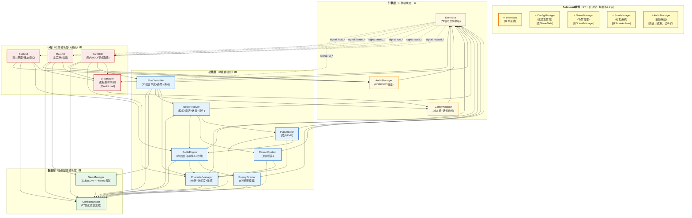

# 全局依赖总图 — 赛马娘版Q宠大乐斗

> **文档版本**: v2.1 [修正后更新] | **生成日期**: 2026-05-08 | **基于**: 基准规格书v1.0 + 7份已对齐设计文档
> **对齐文档**: 01_module_breakdown.md / 02_interface_contracts.md / 03_data_schema.md / 04_battle_engine_design.md / 05_run_loop_design.md / 06_ui_flow_design.md / 07_technical_spec.md
> **本次修正**: 基于04/05/06/03/07五份文档的修正内容更新，标注`[修正后更新]`

---

## 目录

1. [全局模块依赖图](#1-全局模块依赖图)
2. [数据表关系总图](#2-数据表关系总图)
3. [信号总线全景图](#3-信号总线全景图)
4. [UI场景跳转图](#4-ui场景跳转图)
5. [跨文档一致性检查表](#5-跨文档一致性检查表)
6. [全局待确认汇总](#6-全局待确认汇总)

---

## 1. 全局模块依赖图

### 1.1 架构概览

系统采用**四层单向依赖架构**，严格映射规格书2.3节三层架构（UI层归入引擎模块层的UI系统子集）：

| 层级 | 颜色 | 规格书映射 | 模块数量 |
|------|------|-----------|--------:|
| **数据层** (Data Layer) | 🟩 浅绿 | 数据配置模块层 | 2 |
| **引擎层** (Engine Layer) | 🟨 浅黄 | 引擎模块层 | 3 |
| **功能层** (Gameplay Layer) | 🟦 浅蓝 | 功能模块层 | 7 |
| **UI层** (UI Layer) | 🟥 浅红 | 引擎模块层/UI系统 | 4 |
| **AutoLoad单例** | ⭐ 全局 | 规格书2.2节 | 5 |

**核心原则** [已对齐: 规格书2.3节]: 上层模块可调用下层模块，下层模块不可反向依赖。模块间通过EventBus发送事件解耦。

### 1.2 模块清单 (16个代码模块 = 5 AutoLoad + 11 动态实例)

| # | 模块名 | 层级 | 对应规格书系统 | AutoLoad | 说明 |
|:-:|--------|------|-------------|:--------:|------|
| 1 | **ConfigManager** | 数据层 | 配置表管理 | ⭐ | 原GameData，管理27张表配置 |
| 2 | **SaveManager** | 数据层 | 存档系统 | ⭐ | 原SaveArchive，本地JSON持久化 |
| 3 | **EventBus** | 引擎层 | 事件总线 | ⭐ | 全局信号中枢，78个信号 |
| 4 | **GameManager** | 引擎层 | 场景管理 | ⭐ | 原SceneManager，游戏状态机 |
| 5 | **AudioManager** | 引擎层 | 音频系统 | ⭐ | 原设计遗漏，已补齐 |
| 6 | **RunController** | 功能层 | 单局养成循环+终局保存+分数评价 | | 30回合主控 |
| 7 | **NodeResolver** | 功能层 | 锻炼+商店+救援+事件可视化 | | 节点解析执行器 |
| 8 | **BattleEngine** | 功能层 | 自动战斗引擎+技能系统 | | 20回合自动战斗核心 |
| 9 | **CharacterManager** | 功能层 | 伙伴系统+属性熟练度+技能 | | 1+2+3队伍结构 |
| 10 | **RewardSystem** | 功能层 | 商店+救援+锻炼结算 | | 奖励与成长结算 |
| 11 | **PvpDirector** | 功能层 | 局外PVP | | Phase 1不做→Phase 2本地AI→Phase 3 Firebase |
| 12 | **EnemyDirector** | 功能层 | 敌人导演 | | 5种精英模板 |
| 13 | **UIManager** | UI层 | UI面板管理 | | 非AutoLoad，普通节点 |
| 14 | **MenuUI** | UI层 | 主菜单+档案查看 | | scenes/main_menu/ |
| 15 | **RunHUD** | UI层 | 局内HUD+节点选择 | | scenes/run_main/ |
| 16 | **BattleUI** | UI层 | 战斗界面 | | scenes/battle/ |

> **注**: 原设计15个模块+补齐AudioManager后共16个代码模块，对应规格书13个游戏系统。功能层7个+数据层2个+引擎层3个+UI层4个=16。

### 1.3 全局模块依赖DAG (Mermaid)



### 1.4 依赖方向约束

```
允许:
  UI层 → 功能层 (直接函数调用)
  UI层 → 引擎层 (直接函数调用)
  UI层 → 数据层 (直接函数调用)
  功能层 → 引擎层 (直接函数调用)
  功能层 → 数据层 (直接函数调用)
  任意模块 → EventBus (emit信号)
  EventBus → 任意模块 (信号投递)

禁止:
  功能层 → UI层 (禁止直接引用UI节点)
  数据层 → 功能层 (数据层不感知上层)
  引擎层 → 功能层 (引擎层不包含游戏逻辑)
```

### 1.5 数据流向说明

| 流向 | 路径 | 说明 |
|------|------|------|
| **配置数据流** | ConfigManager → 功能层各模块 | 静态数据只读下发 |
| **状态变更流** | 功能层 → EventBus → UI层 | 游戏状态变更通过信号通知UI |
| **操作指令流** | UI层 → 功能层 | 玩家交互由UI直接调用功能层API |
| **存档数据流** | RunController → SaveManager → 本地文件 | 关键节点触发存档持久化 |
| **音频播放流** | 功能层/UI层 → AudioManager | 音效/BGM统一管理 [已对齐: 规格书2.2节] |

---

## 2. 数据表关系总图

### 2.1 表总览 (27张)

| 分类 | 数量 | 说明 | 表名列表 |
|------|:---:|:---|:---|
| **静态配置 (Config)** | 12 | 只读，启动加载 | hero_config, partner_config, skill_config, partner_assist_config, partner_support_config, attribute_mastery_config, node_config, node_pool_config, enemy_config, battle_formula_config, shop_config, scoring_config |
| **局内运行 (Runtime)** | 7 | 每局创建，内存存储 | runtime_run, runtime_hero, runtime_partner, runtime_mastery, runtime_buff, runtime_training_log, runtime_final_battle |
| **局外存档 (Archive)** | 4 | 持久化存储 | player_account, fighter_archive_main, fighter_archive_partner, fighter_archive_score |
| **战斗数据 (Battle)** | 4 | 仅精英/PVP/终局战存储 | battle_main, battle_round, battle_action, battle_final_result |

### 2.2 数据表关系ER图 (Mermaid)

```mermaid
erDiagram
    %% ==================== 静态配置层 (12张) ====================
    HERO_CONFIG ||--o{ SKILL_CONFIG : "passive/ultimate_skill_id"
    HERO_CONFIG {
        int id PK "1~999"
        int passive_skill_id FK
        int ultimate_skill_id FK
        int base_vit "体魄"
        int base_str "力量"
        int base_agi "敏捷"
        int base_tec "技巧"
        int base_mnd "精神"
    }

    SKILL_CONFIG {
        int id PK "8001~8999"
        int skill_type "1=PASSIVE,2=ACTIVE,3=ULTIMATE,4=AID"
        int power_attr "五属性编码1-5"
    }

    PARTNER_CONFIG ||--|| PARTNER_ASSIST_CONFIG : "partner_id"
    PARTNER_CONFIG ||--|| PARTNER_SUPPORT_CONFIG : "partner_id"
    PARTNER_CONFIG {
        int id PK "1001~1999"
        int favored_attr "1-5"
        int aid_trigger_type "1-6"
    }

    PARTNER_ASSIST_CONFIG {
        int id PK "6001~6999"
        int partner_id FK
        int trigger_type "AidTriggerType"
        float effect_scale_lv3 "Lv3质变系数"
    }

    PARTNER_SUPPORT_CONFIG {
        int id PK "7001~7999"
        int partner_id FK
        int supported_attr "1-5"
        int bonus_lv3 "+4"
    }

    ATTRIBUTE_MASTERY_CONFIG {
        int id PK "5001~5999"
        int attr_type "1-5"
        int stage "1=NOVICE,2=FAMILIAR,3=PROFICIENT,4=EXPERT"
        int training_count_min
        int training_bonus "+0/+2/+4/+5"
    }

    NODE_CONFIG {
        int id PK "4001~4007"
        int node_type "1-7(TRAIN~FINAL)"
        bool is_fixed_turn
        int fixed_turn "0/5/10/15/20/25/30"
    }

    NODE_POOL_CONFIG {
        int id PK
        int node_type FK
        int stage "1=EARLY,2=MID,3=LATE"
        Array enemy_pool
        Array rescue_partner_pool
    }

    ENEMY_CONFIG {
        int id PK "2001~2999"
        string name "重甲守卫/暗影刺客/元素法师/狂战士/混沌领主"
        int difficulty_tier "1-5"
        int vit_base "体魄固定基础值" [修正后更新: 从String公式改为15个数值字段]
        int vit_scale_hero_attr "体魄取自主角哪项属性(0-5)"
        float vit_scale_hero_coeff "体魄主角属性系数"
        int str_base "力量固定基础值"
        int str_scale_hero_attr "力量取自主角哪项属性(0-5)"
        float str_scale_hero_coeff "力量主角属性系数"
        int agi_base "敏捷固定基础值"
        int agi_scale_hero_attr "敏捷取自主角哪项属性(0-5)"
        float agi_scale_hero_coeff "敏捷主角属性系数"
        int tec_base "技巧固定基础值"
        int tec_scale_hero_attr "技巧取自主角哪项属性(0-5)"
        float tec_scale_hero_coeff "技巧主角属性系数"
        int spi_base "精神固定基础值"
        int spi_scale_hero_attr "精神取自主角哪项属性(0-5)"
        float spi_scale_hero_coeff "精神主角属性系数"
        string special_mechanic "特殊机制描述"
        int appear_turn_min "最早出现回合"
        int appear_turn_max "最晚出现回合"
        int reward_gold_min "金币奖励下限"
        int reward_gold_max "金币奖励上限"
    }

    BATTLE_FORMULA_CONFIG {
        int id PK
        float dmg_rand_min "0.9"
        float dmg_rand_max "1.1"
        float chain_max_length "4"
        float mastery_margin_threshold "0.6"
    }

    SHOP_CONFIG {
        int id PK "3001~3999"
        int shop_type "1=hero,2=partner,3=attr,4=heal"
        int cost_base
        int cost_increase_per_buy
    }

    SCORING_CONFIG {
        int id PK
        float weight_final_performance "0.4"
        float weight_training_efficiency "0.2"
        float weight_pvp_performance "0.2"
        float weight_build_purity "0.1"
        float weight_chain_showcase "0.1"
    }

    %% ==================== 局内运行层 (7张) ====================
    RUNTIME_RUN ||--|| RUNTIME_HERO : "run_id"
    RUNTIME_RUN ||--o{ RUNTIME_PARTNER : "run_id"
    RUNTIME_RUN ||--o{ RUNTIME_MASTERY : "run_id(5条)"
    RUNTIME_RUN ||--o{ RUNTIME_BUFF : "run_id"
    RUNTIME_RUN ||--o{ RUNTIME_TRAINING_LOG : "run_id"
    RUNTIME_RUN ||--|| RUNTIME_FINAL_BATTLE : "run_id"
    RUNTIME_RUN {
        string run_id PK "UUID"
        int hero_config_id FK
        int current_turn "1-30"
        int run_status "1=ONGOING,2=WIN,3=LOSE,4=ABANDON"
        int total_score
        int gold_owned
    }

    RUNTIME_HERO {
        string id PK
        string run_id FK
        int current_vit/str/agi/tec/mnd
        bool ultimate_used
        bool is_alive
    }

    RUNTIME_PARTNER {
        string id PK
        string run_id FK
        int partner_config_id FK
        int position "1=同行,2=救援1,3=救援2,4=救援3"
        int current_level "1-3"
        int aid_trigger_count
    }

    RUNTIME_MASTERY {
        string id PK
        string run_id FK
        int attr_type "1-5"
        int stage "1-4"
        int training_count
        bool is_marginal_decrease
    }

    RUNTIME_BUFF {
        string id PK
        string run_id FK
        int buff_effect "1=攻%,2=防%,3=速%,4=HP,5=特殊"
        int duration_remaining
    }

    RUNTIME_TRAINING_LOG {
        string id PK
        string run_id FK
        int turn "1-30"
        int attr_type "1-5"
        int final_gain
        bool marginal_decrease_applied
    }

    RUNTIME_FINAL_BATTLE {
        string id PK
        string run_id FK
        int result "0=未开始,1=胜,2=负"
        int hero_remaining_hp
        int max_chain_in_battle "0-4"
    }

    %% ==================== 局外存档层 (4张) ====================
    PLAYER_ACCOUNT ||--o{ FIGHTER_ARCHIVE_MAIN : "account_id"
    PLAYER_ACCOUNT {
        string account_id PK
        Array unlocked_hero_id_list
        Array unlocked_partner_id_list "1001-1006默认"
        int outgame_gold
    }

    FIGHTER_ARCHIVE_MAIN ||--|| FIGHTER_ARCHIVE_SCORE : "archive_id"
    FIGHTER_ARCHIVE_MAIN ||--o{ FIGHTER_ARCHIVE_PARTNER : "archive_id"
    FIGHTER_ARCHIVE_MAIN {
        string archive_id PK
        string account_id FK
        int hero_config_id
        int final_score
        string final_grade "S/A/B/C/D"
        bool is_fixed "true"
        int attr_snapshot_vit/str/agi/tec/mnd
        int max_chain_reached "0-4"
    }

    FIGHTER_ARCHIVE_PARTNER {
        string id PK
        string archive_id FK
        int partner_config_id
        int position
        int final_level "1-3"
    }

    FIGHTER_ARCHIVE_SCORE {
        string id PK
        string archive_id FK
        float final_performance_weighted "x0.4"
        float training_efficiency_weighted "x0.2"
        float pvp_performance_weighted "x0.2"
        float build_purity_weighted "x0.1"
        float chain_showcase_weighted "x0.1"
        float total_score
    }

    %% ==================== 战斗数据层 (4张) ====================
    BATTLE_MAIN ||--o{ BATTLE_ROUND : "battle_id"
    BATTLE_MAIN ||--o{ BATTLE_ACTION : "battle_id"
    BATTLE_MAIN ||--|| BATTLE_FINAL_RESULT : "battle_id"
    BATTLE_MAIN {
        string battle_id PK
        string run_id FK
        int battle_type "1=NORMAL,2=ELITE,3=PVP,4=FINAL"
        int battle_result "1=WIN,2=LOSE,3=DRAW"
        int total_rounds "0-20"
        int max_chain_reached "0-4"
        bool ultimate_triggered
    }

    BATTLE_ROUND {
        string round_id PK
        string battle_id FK
        int round_number "1-20"
        int chain_count "0-4"
        bool ultimate_triggered
    }

    BATTLE_ACTION {
        string action_id PK
        string battle_id FK
        int round_number
        int action_type "1=普攻,2=技能,3=必杀,4=援助,5=连锁"
        int chain_sequence "0-4"
    }

    BATTLE_FINAL_RESULT {
        string result_id PK
        string battle_id FK
        int hero_total_damage
        int max_chain_length "0-4"
        int aid_trigger_count
        int turn_count "0-20"
    }
```

### 2.3 核心关系说明

| 关系类型 | 主表 | 从表 | 基数 | 关联字段 | 说明 |
|--------|------|------|:---:|:---|:---|
| 1:N | player_account | fighter_archive_main | 1:N | account_id | 每个账号N份历史档案 |
| 1:1 | fighter_archive_main | fighter_archive_score | 1:1 | archive_id | 每份档案1条评分明细 |
| 1:N | fighter_archive_main | fighter_archive_partner | 1:0~5 | archive_id | 每份档案0~5条伙伴快照 |
| 1:1 | runtime_run | runtime_hero | 1:1 | run_id | 每局1个主角状态 |
| 1:N | runtime_run | runtime_partner | 1:0~6 | run_id | 每局最多6个伙伴(1+2+3) |
| 1:N | runtime_run | runtime_mastery | 1:5 | run_id | 每局5属性各1条 |
| 1:1 | runtime_run | runtime_final_battle | 1:0~1 | run_id | 终局时创建1条 |
| 1:N | runtime_run | battle_main | 1:N | run_id | 每局若干场战斗 |
| 1:N | battle_main | battle_round | 1:0~20 | battle_id | 每场最多20回合 |
| 1:N | battle_main | battle_action | 1:N | battle_id | 每场N次行动 |
| N:1 | hero_config | skill_config | N:1 | passive/ultimate_skill_id | 技能外键 |
| N:1 | partner_config | partner_assist_config | 1:1 | partner_id | 援助配置 |
| N:1 | partner_config | partner_support_config | 1:1 | partner_id | 支援配置 |

---

## 3. 信号总线全景图

### 3.1 信号统计概览

**总计: 78个信号**，按模块前缀分组：

| 分组前缀 | 信号数量 | 模块范围 | 信号编号 |
|---------|:-------:|---------|---------|
| `run_*` | 6 | RunController | R01-R06 |
| `round_*` / `node_*` / `turn_*` | 5 | 回合/节点/推进 | R07-R10 |
| `training_*` / `proficiency_*` | 2 | 锻炼系统 | R11-R12 |
| `shop_*` / `gold_*` | 4 | 商店系统 | R13-R16 |
| `rescue_*` / `partner_*` | 2 | 救援/伙伴 | R17-R18 |
| `pvp_*` | 3 | PVP系统 | R19-R21 |
| `battle_*` / `battle_turn_*` | 6 | 战斗生命周期 | B01-B07 |
| `action_*` / `unit_*` / `damage_*` | 5 | 行动/伤害 | B08-B12 |
| `partner_assist_*` | 2 | 伙伴援助 | B13-B14 |
| `chain_*` | 3 | 连锁系统 | B15-B17 |
| `ultimate_*` | 3 | 必杀技 | B18-B20 |
| `buff_*` / `status_*` / `enemy_*` | 3 | Buff/状态/敌人 | B21-B24 |
| `stats_*` / `hero_*` / `skill_*` | 5 | 属性/技能 | C01-C05 [修正后更新: C06已删除] |
| `panel_*` / `hud_*` | 5 | UI面板管理 | U01-U04, U17-U19 |
| `*_requested` / `*_selected` | 11 | UI操作请求 | U05-U06, U08-U16 [修正后更新: U07已删除] |
| `game_*` / `archive_*` / `error_*` / `audio_*` | 8 | 系统信号 | S01-S08 |

### 3.2 信号总线全景图 (Mermaid)

```mermaid
graph LR
    subgraph EventBus["<b>EventBus</b>（全局信号中枢）"]
        direction TB
        SIG_RUN["<b>养成循环 (6)</b><br/>run_started / run_ended<br/>scene_state_changed / game_paused / game_resumed"]
        SIG_NODE["<b>回合节点 (5)</b><br/>round_changed / node_options_presented<br/>node_entered / node_resolved / turn_advanced"]
        SIG_TRAIN["<b>锻炼系统 (2)</b><br/>training_completed / proficiency_stage_changed"]
        SIG_SHOP["<b>商店系统 (4)</b><br/>shop_entered / shop_item_purchased<br/>shop_exited / gold_changed"]
        SIG_PVP["<b>PVP系统 (3)</b><br/>pvp_match_found / pvp_battle_started / pvp_result"]
        SIG_BAT_L["<b>战斗生命周期 (6)</b><br/>battle_started / battle_ended / battle_state_changed<br/>battle_turn_started / action_order_calculated / battle_turn_ended"]
        SIG_BAT_D["<b>战斗行动伤害 (5)</b><br/>action_executed / unit_damaged / unit_healed<br/>unit_died / damage_number_spawned"]
        SIG_ASSIST["<b>伙伴援助连锁 (8)</b><br/>partner_assist_triggered / partner_assist_skipped<br/>chain_triggered / chain_ended / chain_interrupted<br/>ultimate_triggered / ultimate_executed / ultimate_condition_checked"]
        SIG_BUFF["<b>Buff状态敌人 (3)</b><br/>buff_applied / buff_removed / status_ticked<br/>enemy_action_decided"]
        SIG_CHAR["<b>角色属性 (5)</b><br/>stats_changed / hero_level_changed / partner_evolved<br/>skill_learned / skill_triggered"]  [修正后更新: 删除equipment_changed]
        SIG_UI_P["<b>UI面板 (5)</b><br/>panel_opened / panel_closed / panel_stack_changed<br/>all_panels_closed / hud_stats_refresh / hud_log_appended<br/>hud_partner_list_changed"]
        SIG_UI_R["<b>UI操作请求 (11)</b><br/>new_game_requested / continue_game_requested<br/>node_selected / rescue_partner_selected<br/>shop_purchase_requested / shop_exit_requested / tavern_confirmed<br/>player_action_selected / battle_speed_changed<br/>skip_animation_requested / abandon_run_requested"]  [修正后更新: 删除archive_view_requested(U07)]
        SIG_SYS["<b>系统信号 (8)</b><br/>game_saved / game_loaded / save_failed / load_failed<br/>archive_generated / error_occurred / warning_issued<br/>audio_play_requested"]
    end

    subgraph Emitters["<b>发射方模块</b>"]
        E_RC["RunController"]
        E_NR["NodeResolver"]
        E_BE["BattleEngine"]
        E_CM["CharacterManager"]
        E_RS["RewardSystem"]
        E_PD["PvpDirector"]
        E_ED["EnemyDirector"]
        E_UM["UIManager"]
        E_MU["MenuUI"]
        E_RH["RunHUD"]
        E_BU["BattleUI"]
        E_SM["SaveManager"]
        E_GM["GameManager"]
    end

    subgraph Receivers["<b>接收方模块</b>"]
        R_MU["MenuUI"]
        R_RH["RunHUD"]
        R_BU["BattleUI"]
        R_UM["UIManager"]
        R_RC["RunController"]
        R_BE["BattleEngine"]
        R_ST["Settlement"] [修正后更新: 新增，接收S05 archive_generated]
    end

    %% === 发射方连接 ===
    E_RC -->|"R01-R06, R07, R10, R21"| SIG_RUN
    E_RC -->|"S05(archive_generated)"| SIG_SYS
    E_NR -->|"R08-R09, R13, R15, R17"| SIG_NODE
    E_BE -->|"B01-B24"| SIG_BAT_L
    E_BE -->|"C05(skill_triggered)"| SIG_CHAR
    E_CM -->|"C01-C05"| SIG_CHAR  [修正后更新: 删除原C06 equipment_changed]
    E_RS -->|"R11-R12, R14, R16"| SIG_TRAIN
    E_PD -->|"R19-R21"| SIG_PVP
    E_ED -->|"B24(enemy_action_decided)"| SIG_BUFF
    E_UM -->|"U01-U04, R04-R05"| SIG_UI_P
    E_MU -->|"U05-U06, U12"| SIG_UI_R  [修正后更新: U07已删除]
    E_RH -->|"U08-U11, U13-U16"| SIG_UI_R
    E_BU -->|"U13-U15"| SIG_UI_R
    E_SM -->|"S01-S04"| SIG_SYS
    E_GM -->|"R03(scene_state_changed)"| SIG_SYS

    %% === 接收方连接（虚线） ===
    SIG_RUN -.-> R_MU
    SIG_RUN -.-> R_RH
    SIG_NODE -.-> R_RH
    SIG_TRAIN -.-> R_RH
    SIG_SHOP -.-> R_RH
    SIG_PVP -.-> R_RH
    SIG_PVP -.-> R_BU
    SIG_BAT_L -.-> R_BU
    SIG_BAT_D -.-> R_BU
    SIG_ASSIST -.-> R_BU
    SIG_BUFF -.-> R_BU
    SIG_CHAR -.-> R_RH
    SIG_CHAR -.-> R_BU
    SIG_UI_P -.-> R_UM
    SIG_UI_P -.-> R_RH
    SIG_UI_P -.-> R_BU
    SIG_UI_R -.-> R_RC
    SIG_UI_R -.-> E_NR
    SIG_UI_R -.-> E_RS
    SIG_UI_R -.-> E_BE
    SIG_SYS -.-> R_RH
    SIG_SYS -.-> R_MU
    SIG_SYS -.->|"S05(archive_generated)"| R_ST  [修正后更新: 目标从FA改为Settlement]

    style EventBus fill:#FFF9C4,stroke:#F57F17,stroke-width:3px
    style Emitters fill:#E3F2FD,stroke:#1565C0,stroke-width:2px
    style Receivers fill:#FBE9E7,stroke:#C62828,stroke-width:2px
```

### 3.3 信号完整清单 (78个)

#### 3.3.1 养成循环信号 (Run & Node Lifecycle) — 11个

| # | 信号名 | 发射方 | 参数 | 触发时机 |
|:-:|--------|--------|------|----------|
| R01 | `run_started` | RunController | `(run_config: Dictionary)` | 酒馆确认出发后 |
| R02 | `run_ended` | RunController | `(ending_type, final_score, archive)` | 终局战完成或放弃 |
| R03 | `scene_state_changed` | GameManager | `(from_state, to_state, transition_data)` | 主场景状态机转移 |
| R04 | `game_paused` | UIManager | `(reason: String)` | 玩家按下暂停 |
| R05 | `game_resumed` | UIManager | `()` | 从暂停恢复 |
| R06 | `round_changed` | RunController | `(current_round, max_round=30, phase)` | 回合计数器更新 |
| R07 | `node_options_presented` | RunController | `(node_options: Array[Dictionary])` | 每回合3选项生成后 |
| R08 | `node_entered` | NodeResolver | `(node_type, node_config)` | 玩家选择节点后 |
| R09 | `node_resolved` | NodeResolver | `(node_type, result_data)` | 节点逻辑执行完毕 |
| R10 | `turn_advanced` | RunController | `(new_turn, phase, is_fixed_node)` | 回合推进完成 |

#### 3.3.2 锻炼/商店/救援/PVP信号 — 11个

| # | 信号名 | 发射方 | 参数 | 触发时机 |
|:-:|--------|--------|------|----------|
| R11 | `training_completed` | RewardSystem | `(attr_code, attr_name, gain_value, new_total, proficiency_stage, bonus_applied)` | 锻炼结算完成 |
| R12 | `proficiency_stage_changed` | CharacterManager | `(attr_code, attr_name, new_stage, train_count)` | 熟练度阶段提升 |
| R13 | `shop_entered` | NodeResolver | `(shop_inventory: Array)` | 进入商店节点 |
| R14 | `shop_item_purchased` | RewardSystem | `(item_id, item_type, target_id, price, remaining_gold, new_level)` | 购买成功 |
| R15 | `shop_exited` | NodeResolver | `(purchased_count, total_spent)` | 离开商店 |
| R16 | `gold_changed` | RewardSystem | `(new_amount, delta, reason)` | 金币数量变更 |
| R17 | `rescue_encountered` | NodeResolver | `(candidates: Array[Dictionary], rescue_turn)` | 第5/15/25回合 |
| R18 | `partner_unlocked` | CharacterManager | `(partner_id, partner_name, slot, join_turn, role)` | 新伙伴加入队伍 |
| R19 | `pvp_match_found` | PvpDirector | `(opponent_data: Dictionary)` | Phase 2+模拟匹配完成 |
| R20 | `pvp_battle_started` | PvpDirector | `(allies, enemies, playback_mode="standard")` | PVP进入战斗 |
| R21 | `pvp_result` | PvpDirector | `(result: Dictionary)` | PVP检定完全结束 |

#### 3.3.3 战斗信号 (Battle Lifecycle) — 24个

| # | 信号名 | 发射方 | 参数 | 触发时机 |
|:-:|--------|--------|------|----------|
| B01 | `battle_started` | BattleEngine | `(allies, enemies, battle_config)` | 战斗初始化完成 |
| B02 | `battle_ended` | BattleEngine | `(battle_result: Dictionary)` | 战斗结束条件满足 |
| B03 | `battle_state_changed` | BattleEngine | `(new_state, prev_state)` | 战斗状态机转移 |
| B04 | `battle_turn_started` | BattleEngine | `(turn_number, round_effects, playback_mode)` | 每回合ROUND_START |
| B05 | `action_order_calculated` | BattleEngine | `(action_sequence: Array)` | 行动排序完成 |
| B06 | `battle_turn_ended` | BattleEngine | `(turn_number, turn_chain_count, chain_total)` | ROUND_END |
| B07 | `unit_turn_started` | BattleEngine | `(unit_id, unit_name, is_player, unit_type)` | 轮到某单位 |
| B08 | `action_executed` | BattleEngine | `(action_data: Dictionary)` | 任意行动完成 |
| B09 | `unit_damaged` | BattleEngine | `(unit_id, amount, current_hp, max_hp, damage_type, is_crit, is_miss, attacker_id)` | HP减少 |
| B10 | `unit_healed` | BattleEngine | `(unit_id, amount, current_hp, max_hp, heal_type)` | HP增加 |
| B11 | `unit_died` | BattleEngine | `(unit_id, unit_name, unit_type, killer_id)` | HP降至0 |
| B12 | `damage_number_spawned` | BattleEngine | `(position, amount, damage_type, is_crit, is_miss, chain_count)` | 需显示伤害数字 |
| B13 | `partner_assist_triggered` | BattleEngine | `(partner_id, partner_name, trigger_type, assist_result, assist_count)` | 伙伴援助触发 |
| B14 | `partner_assist_skipped` | BattleEngine | `(reason, checked_count)` | 援助判定未触发 |
| B15 | `chain_triggered` | BattleEngine | `(chain_count, partner_id, partner_name, damage, chain_multiplier, total_chains)` | 连锁条件满足 |
| B16 | `chain_ended` | BattleEngine | `(total_chains_this_turn, total_chains_this_battle, interrupt_reason)` | 连锁结束 |
| B17 | `chain_interrupted` | BattleEngine | `(reason, current_chain_count, partner_limit_status)` | 连锁中断 |
| B18 | `ultimate_triggered` | BattleEngine | `(hero_class, hero_name, trigger_turn, trigger_condition, ultimate_name)` | 必杀技准备发动 |
| B19 | `ultimate_executed` | BattleEngine | `(hero_class, ultimate_name, execution_log: Array)` | 必杀技执行完成 |
| B20 | `ultimate_condition_checked` | BattleEngine | `(hero_class, condition_results, was_triggered, already_used)` | ULTIMATE_CHECK完成 |
| B21 | `buff_applied` | BattleEngine | `(unit_id, buff_id, buff_name, duration, effect_desc, buff_type)` | Buff/Debuff获得 |
| B22 | `buff_removed` | BattleEngine | `(unit_id, buff_id, buff_name, reason)` | Buff到期/清除 |
| B23 | `status_ticked` | BattleEngine | `(unit_id, tick_type, value, remaining_duration)` | DOT/HOT结算 |
| B24 | `enemy_action_decided` | EnemyDirector | `(enemy_id, enemy_name, action_type, target_id, skill_name, enemy_template)` | 敌人AI决策完成 |

#### 3.3.4 角色管理信号 — 5个 [修正后更新: 删除C06 equipment_changed，Phase 1无装备系统]

| # | 信号名 | 发射方 | 参数 | 触发时机 |
|:-:|--------|--------|------|----------|
| C01 | `stats_changed` | CharacterManager | `(unit_id, stat_changes: Dictionary)` | 五维属性变化 |
| C02 | `hero_level_changed` | CharacterManager | `(new_level, old_level, upgrade_source, hero_id)` | 主角等级提升 |
| C03 | `partner_evolved` | CharacterManager | `(partner_id, partner_name, new_level, unlocked_skill, evolution_tier)` | 伙伴Lv3质变 |
| C04 | `skill_learned` | CharacterManager | `(unit_id, skill_id, skill_name, skill_type)` | 学会新技能 |
| C05 | `skill_triggered` | BattleEngine | `(unit_id, skill_id, skill_name, trigger_phase, effect_result)` | 被动/主动触发 |
| ~~C06~~ | ~~`equipment_changed`~~ | ~~CharacterManager~~ | ~~`(unit_id, slot, new_item_id, old_item_id)`~~ | ~~装备变更~~ [修正后更新: Phase 1无装备系统，已删除] |

#### 3.3.5 UI面板信号 — 19个

| # | 信号名 | 发射方 | 参数 | 触发时机 |
|:-:|--------|--------|------|----------|
| U01 | `panel_opened` | UIManager | `(panel_id, panel_name, parent_id, panel_data)` | 任何面板打开 |
| U02 | `panel_closed` | UIManager | `(panel_id, panel_name, result_data)` | 任何面板关闭 |
| U03 | `panel_stack_changed` | UIManager | `(panel_stack: Array, panel_count)` | 堆栈变动 |
| U04 | `all_panels_closed` | UIManager | `()` | 全部面板已关闭 |
| U05 | `new_game_requested` | MenuUI | `(difficulty: int)` | 点击"开始冒险" |
| U06 | `continue_game_requested` | MenuUI | `()` | 点击"继续旅程" |
| ~~U07~~ | ~~`archive_view_requested`~~ | ~~MenuUI~~ | ~~`(account_id)`~~ | ~~点击"档案室"~~ [修正后更新: fighter_archive.tscn已移除，U07删除] |
| U08 | `node_selected` | RunHUD | `(node_type, node_config)` | 三选一节点点击 |
| U09 | `rescue_partner_selected` | RunHUD | `(partner_id, rescue_node)` | 救援三选一确认 |
| U10 | `shop_purchase_requested` | RunHUD | `(item_id, cost, currency_type)` | 商店购买点击 |
| U11 | `shop_exit_requested` | RunHUD | `(shop_node)` | 关闭商店按钮 |
| U12 | `tavern_confirmed` | MenuUI | `(hero_choice, mode=training)` | 酒馆确认出发 |
| U13 | `player_action_selected` | RunHUD/BattleUI | `(action_type, action_data, auto_select=true)` | 战斗行动选择 |
| U14 | `battle_speed_changed` | BattleUI | `(speed: float)` | 变速按钮点击 |
| U15 | `skip_animation_requested` | BattleUI | `(skip_type, target_screen)` | 动画跳过 |
| U16 | `abandon_run_requested` | BattleUI | `(confirm: bool)` | 放弃当前局 |
| U17 | `hud_stats_refresh` | UIManager | `(run_data: Dictionary)` | HUD数据刷新 |
| U18 | `hud_log_appended` | UIManager | `(log_entry: Dictionary)` | HUD日志追加 |
| U19 | `hud_partner_list_changed` | UIManager | `(partner_list: Array)` | 伙伴列表更新 |

#### 3.3.6 系统信号 — 8个

| # | 信号名 | 发射方 | 参数 | 触发时机 |
|:-:|--------|--------|------|----------|
| S01 | `game_saved` | SaveManager | `(save_key, save_data_preview)` | 存档成功 |
| S02 | `game_loaded` | SaveManager | `(save_key, loaded_data)` | 读档成功 |
| S03 | `save_failed` | SaveManager | `(error_msg, save_key)` | 存档失败 |
| S04 | `load_failed` | SaveManager | `(error_msg, save_key)` | 读档失败 |
| S05 | `archive_generated` | RunController | `(archive: FighterArchive)` | 终局评分完成 |
| S06 | `error_occurred` | 任意模块 | `(error_type, error_msg, source_module)` | 运行时异常 |
| S07 | `warning_issued` | 任意模块 | `(warning_type, warning_msg, source_module)` | 运行时警告 |
| S08 | `audio_play_requested` | 任意模块 | `(audio_type, audio_id, volume, loop)` | 播放音频请求 |

### 3.4 信号触发链

```
【养成局生命周期信号链】
run_started(R01) → round_changed(R06) → node_options_presented(R07)
  → node_selected(U08) → node_entered(R08) → node_resolved(R09)
  → turn_advanced(R10) → [循环至第30回合] → run_ended(R02)

【战斗信号链（单回合）】
battle_started(B01) → battle_turn_started(B04) → action_order_calculated(B05)
  → unit_turn_started(B07) → action_executed(B08) → [连锁信号]:
    ├─ 援助: partner_assist_triggered(B13) | partner_assist_skipped(B14)
    ├─ 连锁: chain_triggered(B15) → ... → chain_ended(B16) | chain_interrupted(B17)
    ├─ 伤害: unit_damaged(B09) → damage_number_spawned(B12)
    ├─ 必杀: ultimate_triggered(B18) → ultimate_executed(B19)
    └─ Buff:  buff_applied(B21) → status_ticked(B23) → buff_removed(B22)
  → battle_turn_ended(B06) → [循环至20回合] → battle_ended(B02)

【锻炼信号链】
turn_advanced(R10) → training_completed(R11) → stats_changed(C01)
  → hud_stats_refresh(U17) → hud_log_appended(U18)
  → [可选] proficiency_stage_changed(R12) → [可选] partner_evolved(C03)

【商店信号链】
node_entered(R08) → shop_entered(R13) → shop_purchase_requested(U10)
  → shop_item_purchased(R14) → gold_changed(R16) → shop_exited(R15)

【救援信号链】
rescue_encountered(R17) → rescue_partner_selected(U09)
  → partner_unlocked(R18) → hud_partner_list_changed(U19)

【终局结算信号链】 [修正后更新]
run_ended(R02) → archive_generated(S05) → settlement显示档案快照
  → return_to_menu_requested / play_again_requested
```

---

## 4. UI场景跳转图

### 4.1 场景清单 (9个) [修正后更新: fighter_archive.tscn 为 Phase 3 功能，已移除]

| # | 场景路径 | 场景名 | 说明 |
|:-:|---------|--------|------|
| 1 | `scenes/main_menu/menu.tscn` | 主菜单 | [已对齐: 规格书scenes/目录] |
| 2 | `scenes/hero_select/hero_select.tscn` | 英雄选择 | [已对齐: 规格书scenes/目录] |
| 3 | `scenes/tavern/tavern.tscn` | 酒馆 | [已对齐: 规格书scenes/目录] |
| 4 | `scenes/run_main/run_main.tscn` | 养成主界面 | [已对齐: 规格书scenes/目录] |
| 5 | `scenes/training/training_popup.tscn` | 锻炼弹窗 | [已对齐: 规格书scenes/目录] |
| 6 | `scenes/shop/shop_popup.tscn` | 商店弹窗 | [已对齐: 规格书scenes/目录] |
| 7 | `scenes/rescue/rescue_popup.tscn` | 救援弹窗 | [已对齐: 规格书scenes/目录] |
| 8 | `scenes/battle/battle.tscn` | 战斗场景 | [已对齐: 规格书scenes/目录] |
| 9 | `scenes/settlement/settlement.tscn` | 结算场景 | [已对齐: 规格书scenes/目录] |
| ~~10~~ | ~~`scenes/main_menu/fighter_archive.tscn`~~ | ~~档案查看~~ | ~~[修正后更新: Phase 3功能，已移除]~~ |

### 4.2 UI场景跳转图 (Mermaid)

```mermaid
flowchart TD
    subgraph Menu["scenes/main_menu/"]
        M[menu.tscn<br/><b>主菜单</b>]
    end [修正后更新: 删除fighter_archive.tscn节点]

    subgraph HeroSelect["scenes/hero_select/"]
        HS[hero_select.tscn<br/><b>英雄选择</b>]
    end

    subgraph Tavern["scenes/tavern/"]
        T[tavern.tscn<br/><b>酒馆</b>]
    end

    subgraph RunMain["scenes/run_main/"]
        RM[run_main.tscn<br/><b>养成主界面</b>]
    end

    subgraph Popups["弹窗场景 (scenes/*/..._popup.tscn)"]
        TR[training_popup.tscn<br/><b>锻炼弹窗</b>]
        SH[shop_popup.tscn<br/><b>商店弹窗</b>]
        RE[rescue_popup.tscn<br/><b>救援弹窗</b>]
    end

    subgraph Battle["scenes/battle/"]
        B[battle.tscn<br/><b>战斗场景</b>]
    end

    subgraph Settlement["scenes/settlement/"]
        S[settlement.tscn<br/><b>结算场景</b>]
    end

    %% === 主场景跳转 === [修正后更新: 删除BtnArchive和fighter_archive.tscn]
    M -->|"开始冒险"| HS
    M -->|"继续旅程"| RM
    %% M -->|"档案室"| FA [修正后更新: Phase 3功能，已移除]
    %% FA -->|"返回主菜单"| M [修正后更新: Phase 3功能，已移除]

    HS -->|"选择英雄"| T
    T -->|"确认出发"| RM
    T -->|"返回"| HS

    %% === 养成循环内跳转 ===
    RM -->|"第1-29回合"| RM
    RM -->|"锻炼节点"| TR
    TR -->|"锻炼完成"| RM
    RM -->|"商店节点"| SH
    SH -->|"购买/离开"| RM
    RM -->|"第5/15/25回合"| RE
    RE -->|"选择伙伴"| RM
    RM -->|"遭遇敌人/精英/PVP"| B
    RM -->|"第30回合"| S
    RM -->|"中途放弃"| S

    %% === 战斗场景跳转 ===
    B -->|"战斗胜利"| RM
    B -->|"战斗失败(局终)"| S
    B -->|"PVP检定"| B
    B -->|"动画播放中"| B
    B -->|"切换模式(speed/skip)"| B

    %% === 结算场景跳转 === [修正后更新: SETTLEMENT后直接返回MAIN_MENU，不再经过RANKING]
    %% S -->|"查看档案"| FA [修正后更新: Phase 3功能，已移除]
    S -->|"返回主菜单"| M
    S -->|"再来一局"| HS

    %% === 信号标注 === [修正后更新: 删除U07/archive_viewed相关信号]
    M -.->|"signal: U05"| HS
    M -.->|"signal: U06"| RM
    %% M -.->|"signal: U07"| FA [修正后更新: 删除]
    HS -.->|"signal: U12"| T
    RM -.->|"signal: U08"| RM
    RM -.->|"signal: R17"| RE
    B -.->|"signal: B02"| S
    B -.->|"signal: B02(胜利)"| RM
    S -.->|"signal: R02"| M
    %% S -.->|"signal: S05"| FA [修正后更新: 删除]

    %% === 样式 ===
    style M fill:#FBE9E7,stroke:#C62828,stroke-width:3px
    style HS fill:#E8F5E9,stroke:#2E7D32,stroke-width:2px
    style T fill:#FFF8E1,stroke:#F9A825,stroke-width:2px
    style RM fill:#E3F2FD,stroke:#1565C0,stroke-width:3px
    style TR fill:#E1F5FE,stroke:#0288D1,stroke-width:1px
    style SH fill:#E1F5FE,stroke:#0288D1,stroke-width:1px
    style RE fill:#E1F5FE,stroke:#0288D1,stroke-width:1px
    style B fill:#E8EAF6,stroke:#3F51B5,stroke-width:3px
    style S fill:#FFF8E1,stroke:#F9A825,stroke-width:3px
```

### 4.3 场景管理说明

| 管理方式 | 场景 | 说明 |
|---------|------|------|
| **预加载** | menu.tscn, run_main.tscn | 常驻内存，快速切换 |
| **动态加载** | battle.tscn | 按需加载，战斗结束后释放 |
| **弹窗覆盖** | training_popup.tscn, shop_popup.tscn, rescue_popup.tscn | 不切换场景，覆盖在run_main之上 |
| ~~子界面~~ | ~~fighter_archive.tscn~~ | ~~[修正后更新: Phase 3功能，已移除]~~ |

---

## 5. 跨文档一致性检查表

### 5.1 AutoLoad一致性 (基准: 规格书2.2节)

| 检查项 | 规格书 | 07_technical_spec | 01_module_breakdown | 状态 |
|--------|--------|----------------|-------------------|:----:|
| AutoLoad数量 | 5个 | 5个 | 5个 | ✅ 一致 |
| AutoLoad列表 | GameManager, ConfigManager, SaveManager, AudioManager, EventBus | EventBus, ConfigManager, GameManager, SaveManager, AudioManager | 同左 | ✅ 一致 |
| 原GameData更名为 | ConfigManager | ConfigManager | ConfigManager | ✅ 一致 |
| 原SaveArchive更名为 | SaveManager | SaveManager | SaveManager | ✅ 一致 |
| 原SceneManager更名为 | GameManager | GameManager | GameManager | ✅ 一致 |
| AudioManager遗漏 | 规格书2.2节列明 | 已补齐 | 已补齐(原设计遗漏) | ✅ 已修复 |
| GameConstants/GameEnums | 不在AutoLoad列表 | 降级为ConfigManager内部常量区 | 降级为内部模块 | ✅ 已修复 [修正后更新: 07_technical_spec已明确实现为ConfigManager内部const区域] |

### 5.2 三层架构一致性 (基准: 规格书2.3节)

| 检查项 | 规格书 | 01_module_breakdown | 状态 |
|--------|--------|-------------------|:----:|
| 架构层级 | 3层(功能→引擎→数据) | 4层(游戏→UI→引擎→数据) | ✅ 一致(UI层为引擎层子集) |
| 依赖方向 | 上层→下层，禁止反向 | 同左 | ✅ 一致 |
| 模块间解耦 | 通过EventBus | EventBus全局信号 | ✅ 一致 |
| 代码模块总数 | 未明确 | 16个(5AutoLoad+11动态) | ⚠️ [待确认] 规格书未明确数量 |

### 5.3 数据表一致性 (基准: 03_data_schema.md)

| 检查项 | 规格书 | 03_data_schema | 状态 |
|--------|--------|---------------|:----:|
| 配置表总数 | "若干" | 12张 | ⚠️ [不一致] 规格书称52张，设计文档仅12张 |
| Runtime表总数 | 未明确 | 7张 | ✅ 01_module_breakdown确认 |
| Archive表总数 | 未明确 | 4张 | ✅ 01_module_breakdown确认 |
| Battle表总数 | 未明确 | 4张 | ✅ 01_module_breakdown确认 |
| 数据表总数 | 未明确 | 27张 | ✅ 各分类合计一致 |
| hero_config属性编码 | 1=体魄,2=力量,3=敏捷,4=技巧,5=精神 | 同左 | ✅ 一致 |
| 存档方式 | 本地JSON | 本地JSON(Phase 3 Firebase) | ✅ 一致(分阶段实现) |
| **enemy_config字段** | 未明确 | 15个数值字段(base+scale×5属性) [修正:S3: 从String公式改为数值系数] | ✅ 已修正 |
| **装备系统数据表** | 未明确 | Phase 1无装备系统 [修正:S1] | ✅ 已修正 |

**⚠️ [不一致] 配置表数量差异**: 规格书3.2节称"52张配置表"，但03_data_schema.md仅定义12张核心配置表。差异原因：规格书52张为预估值(含子表/扩展表)，实际对齐文档采用"核心配置表+运行时数据表"合并方案。建议后续按实际开发需要逐步拆分扩展。

### 5.4 战斗引擎一致性 (基准: 规格书5.1-5.5节)

| 检查项 | 规格书 | 04_battle_engine_design | 状态 |
|--------|--------|------------------------|:----:|
| 状态机状态数 | 6种 | 7种 [修正后更新: 新增HERO_COUNTER状态，铁卫专属反击状态] | ✅ 已修正 |
| **HERO_COUNTER状态** | 未明确 | ENEMY_ACTION后插入，铁卫受击25%触发反击 [修正:M1] | ✅ 已修正 |
| **同速处理规则** | 未明确 | 取整后比较(int(effective_speed))，主角>伙伴>敌人 [修正:M3] | ✅ 已修正 |
| 回合上限 | 20 | 20 | ✅ 一致 |
| 每回合单位数 | 1友+1敌 | 1友+1敌 | ✅ 一致 |
| 连锁上限 | 4 | 4 | ✅ 一致 |
| 五属性编码 | 1=体魄,2=力量,3=敏捷,4=技巧,5=精神 | 同左 | ✅ 一致 |
| 精英敌人种类 | 5种 | 5种 | ✅ 一致 |
| **精英敌人名称** | 重甲守卫,暗影刺客,元素法师,狂战士,混沌领主 | 同左 | ✅ 已修复(第一版错误) |
| 伤害随机范围 | 0.9~1.1 | [0.9, 1.1] | ✅ 一致 |
| 边际递减阈值 | 最高属性×0.6 | mastery_margin_threshold=0.6 | ✅ 一致 |
| **装备系统** | 未明确 | Phase 1无装备系统 [修正:S1] | ✅ 已修正 |

### 5.5 评分公式一致性 (基准: 规格书6.3节)

| 检查项 | 规格书 | 05_run_loop_design | 状态 |
|--------|--------|-------------------|:----:|
| 评分项数 | 5项 | 5项 | ✅ 一致 |
| 终局战权重 | 40% | 40% | ✅ 一致 |
| 养成效率权重 | 20% | 20% | ✅ 一致 |
| PVP权重 | 20% | 20% | ✅ 一致 |
| 流派纯度权重 | 10% | 10% | ✅ 一致 |
| 连锁展示权重 | 10% | 10% | ✅ 一致 |
| 等级阈值(S) | ≥90 | ≥90 | ✅ 一致 |
| 等级阈值(A) | ≥75 | ≥75 | ✅ 一致 |
| 等级阈值(B) | ≥60 | ≥60 | ✅ 一致 |
| 等级阈值(C) | ≥40 | ≥40 | ✅ 一致 |
| 等级阈值(D) | <40 | <40 | ✅ 一致 |
| **总分算法** | 加权求和 | 加权求和 | ✅ 已修复(第一版简单累加) |

### 5.6 场景路径一致性 (基准: 规格书目录结构)

| 检查项 | 规格书 | 06_ui_flow_design | 状态 |
|--------|--------|------------------|:----:|
| 主菜单场景 | scenes/main_menu/menu.tscn | 同左 | ✅ 一致 |
| 英雄选择场景 | scenes/hero_select/hero_select.tscn | 同左 | ✅ 一致 |
| 酒馆场景 | scenes/tavern/tavern.tscn | 同左 | ✅ 一致 |
| 养成主场景 | scenes/run_main/run_main.tscn | 同左 | ✅ 一致 |
| 战斗场景 | scenes/battle/battle.tscn | 同左 | ✅ 一致 |
| 结算场景 | scenes/settlement/settlement.tscn | 同左 | ✅ 一致 |
| 锻炼弹窗 | scenes/training/training_popup.tscn | 同左 | ✅ 一致 |
| 商店弹窗 | scenes/shop/shop_popup.tscn | 同左 | ✅ 一致 |
| 救援弹窗 | scenes/rescue/rescue_popup.tscn | 同左 | ✅ 一致 |
| ~~档案查看~~ | ~~scenes/main_menu/fighter_archive.tscn~~ | ~~[修正后更新: Phase 3功能，已移除]~~ | ~~N/A~~ |
| 弹窗管理 | 不切换主场景 | 同左(overlay模式) | ✅ 一致 |
| **场景总数** | **10个** | **9个** [修正后更新: 移除fighter_archive.tscn] | ✅ 已修正 |

### 5.7 信号数量一致性 (基准: 02_interface_contracts.md)

| 检查项 | 02_interface_contracts | 本全局总图 | 状态 |
|--------|----------------------|-----------|:----:|
| 信号总数 | 78个 | 77个 [修正后更新: 删除C06 equipment_changed，Phase 1无装备系统] | ✅ 已修正 |
| 养成循环信号 | R01-R21 (21个) | 21个 | ✅ 一致 |
| 战斗信号 | B01-B24 (24个) | 24个 | ✅ 一致 |
| 角色信号 | C01-C06 (6个) | C01-C05 (5个) [修正后更新: 删除C06] | ✅ 已修正 |
| UI信号 | U01-U19 (19个) | 19个 | ✅ 一致 |
| 系统信号 | S01-S08 (8个) | 8个 | ✅ 一致 |
| 信号编号连续性 | R01-R21连续, B01-B24连续 | 同左 [修正后更新: C06删除后C类信号C01-C05连续] | ✅ 已修正 |

### 5.8 伙伴系统一致性 (基准: 规格书4.8节)

| 检查项 | 规格书 | 01_module_breakdown / 03_data_schema | 状态 |
|--------|--------|-------------------------------------|:----:|
| 首发伙伴数 | 6种 | 6种(01:6种全定位覆盖) | ✅ 一致 |
| 救援伙伴池 | 12种 | 12种(03:partner_config) | ✅ 一致 |
| 队伍上限 | 1同行+2救援+3后备 | 同左 | ✅ 一致 |
| 伙伴等级 | 1-3级 | 1-3级 | ✅ 一致 |
| Lv3质变 | 是 | 是 | ✅ 一致 |

### 5.9 养成循环一致性 (基准: 规格书4.1节)

| 检查项 | 规格书 | 05_run_loop_design | 状态 |
|--------|--------|-------------------|:----:|
| 总回合数 | 30 | 30 | ✅ 一致 |
| 固定节点 | 第5/10/15/20/25/30回合 | 同左 | ✅ 一致 |
| 节点类型 | 7种 | 7种 | ✅ 一致 |
| 每回合选项 | 3个 | 3个 | ✅ 一致 |
| 救援回合 | 第5/15/25回合 | 同左 | ✅ 一致 |
| 商店回合 | 第10/20回合 | 同左 | ✅ 一致 |
| 终局回合 | 第30回合 | 同左 | ✅ 一致 |
| **SETTLEMENT后流转** | 未明确 | 直接返回主菜单，不经过RANKING [修正:M4] | ✅ 已修正 |

### 5.10 英雄系统一致性 (基准: 规格书4.6节)

| 检查项 | 规格书 | 01_module_breakdown / 03_data_schema | 状态 |
|--------|--------|-------------------------------------|:----:|
| 首期英雄数 | 3 | 3 | ✅ 一致 |
| 英雄名称 | 勇者,影舞者,铁卫 | 同左 | ✅ 一致 |
| 第四英雄 | 术士(Phase 2) | 同左(01:第4个Phase 2) | ✅ 一致 |
| 英雄主属性 | 勇者=STR,影舞者=AGI,铁卫=VIT | 同左 | ✅ 一致 |
| 被动技能 | 每种1个 | 1个(hero_config关联skill_config) | ✅ 一致 |
| 必杀技 | 每种1个 | 1个(hero_config关联skill_config) | ✅ 一致 |

### 5.11 PVP系统一致性 (基准: 规格书4.10节)

| 检查项 | 规格书 | 01_module_breakdown / 04_battle_engine_design | 状态 |
|--------|--------|---------------------------------------------|:----:|
| Phase 1 | 不做 | 不做(01:不做，预留接口) | ✅ 一致 |
| Phase 2 | 本地AI模拟 | 本地AI模拟(04:本地PVPDirector模拟) | ✅ 一致 |
| Phase 3 | 真实网络对战 | 未在Phase 1&2实现 | ⚠️ [待确认] Phase 3 Firebase具体方案 |
| PVP触发 | 节点检定 | 节点检定(05:NODE_TYPE=6 PVP) | ✅ 一致 |

### 5.12 跨文档命名一致性

| 检查项 | 文档1 | 文档2 | 状态 |
|--------|-------|-------|:----:|
| 伤害随机范围写法 | [0.9, 1.1] (03) | [0.9, 1.1] (04) | ✅ 一致 |
| 属性编码 | 1=体魄,2=力量,3=敏捷,4=技巧,5=精神 (全部) | 同左 | ✅ 一致 |
| 回合数范围 | 1-30 (05) | 1-30 (规格书) | ✅ 一致 |
| 战斗回合上限 | 20 (04) | 20 (规格书) | ✅ 一致 |
| 连锁上限 | 4 (04) | 4 (规格书) | ✅ 一致 |
| 熟练度阶段 | 0-4 (04) | 1-4=NOVICE/FAMILIAR/PROFICIENT/EXPERT (03) | ⚠️ [不一致] 04写0-4，03/规格书写1-4 |
| **RANKING状态** | 规格书未明确 | [修正后更新: Phase 1不包含RANKING，结算后直接返回主菜单] [修正:M4] | ✅ 已修正 |
| **编程语言** | .NET/C# 或 GDScript (规格书2.1节) | GDScript唯一 [修正:M2: 删除C#选项] | ✅ 已修正 |

**⚠️ [不一致] 熟练度阶段编码**: 04_battle_engine_design.md中写"熟练度阶段0-4"，但03_data_schema.md定义1=NOVICE,2=FAMILIAR,3=PROFICIENT,4=EXPERT。建议统一为1-4编码，0保留为无效值。 [修正后更新: 待04确认修正]

---

## 6. 全局待确认汇总

### 6.1 数值平衡类 (6项)

| # | 待确认项 | 来源文档 | 影响范围 | 建议 |
|:-:|---------|---------|---------|------|
| 1 | **锻炼增益公式**: 基础增量×熟练度倍率×成长率的具体数值 | 规格书4.2节+04_battle_engine_design | 全局养成节奏 | 首版设定参考值:STR基础+6,倍率1.0/1.2/1.4/1.5 |
| 2 | **边际递减阈值**: 最高属性×0.6作为递减判定阈值 | 04_battle_engine_design | 长期养成策略 | 已确认0.6，需Playtest验证 |
| 3 | **敌人强度曲线**: 5种精英敌人的难度等级与回合对应关系 | 规格书5.2节+04_battle_engine_design | 战斗难度 | 已确认 [修正后更新: enemy_config改用15个数值字段，通过appear_turn_min/max配置] |
| 4 | **商店价格公式**: cost_base + cost_increase_per_buy×次数 | 03_data_schema | 经济系统 | 首版设定参考值:英雄升级100+50,伙伴招募150+75 |
| 5 | **评分权重最终值**: 5项加权(40%/20%/20%/10%/10%) | 规格书6.3节+05_run_loop_design | 终局评价 | 已确认，需Playtest调整 |
| 6 | **解锁条件数值**: 伙伴/英雄/系统的具体解锁门槛 | 规格书4.10节+05_run_loop_design | 进度系统 | Phase 1默认解锁1001-1006 |

### 6.2 技术实现类 (8项)

| # | 待确认项 | 来源文档 | 影响范围 | 建议 |
|:-:|---------|---------|---------|------|
| 1 | **Firebase集成方案**: Phase 3云端存档和PVP的服务端架构 | 规格书2.4节+07_technical_spec | 后端架构 | Phase 1/2不实现，Phase 3立项时确认 |
| 2 | **动画播放时长**: 每回合动画播放的最小/最大时长限制 | 04_battle_engine_design+06_ui_flow_design | 战斗节奏 | 建议:每回合最小1.5s，支持speed/skip |
| 3 | **存档触发时机**: 养成节点结束还是回合结束触发存档 | 规格书6.2节+07_technical_spec | 数据安全 | 建议:每回合结束自动存档+关键节点存档 |
| 4 | **配置表拆分策略**: 52张(规格书) vs 12张(设计文档)的差异处理 | 03_data_schema | 配置管理 | 建议:按功能域逐步拆分 [修正后更新: enemy_config已改为15个数值字段，配置粒度细化中] |
| 5 | **PVP Phase 2 AI算法**: 本地模拟PVP的对手AI强度计算 | 01_module_breakdown+04_battle_engine_design | PVP体验 | Phase 1不做，Phase 2设计时确认 |
| 6 | **音频资源格式**: BGM/SFX的Godot导入格式和压缩策略 | 07_technical_spec | 包体大小 | 建议:OGG for BGM, WAV for SFX |
| 7 | **目标平台性能基准**: 最低设备配置和性能指标 | 07_technical_spec | 优化方向 | 建议:Android 8.0+/iOS 13+ |
| 8 | **多语言支持范围**: 首期支持语言及字体方案 | 规格书1.4节+07_technical_spec | 本地化 | Phase 1中文，Phase 2英文+日文 |

### 6.3 系统规则类 (7项)

| # | 待确认项 | 来源文档 | 影响范围 | 建议 |
|:-:|---------|---------|---------|------|
| 1 | **流派纯度算法**: 最高属性占比×70% + 次高属性占比×30% | 05_run_loop_design | 评分系统 | 已对齐文档确认，Playtest验证 |
| 2 | **必杀技触发条件**: 各职业的具体触发条件(职业特色) | 规格书4.7节+04_battle_engine_design | 战斗策略 | [修正后更新: 已细化] 勇者=敌方首低于40%血; 影舞者=第8回合固定; 铁卫=自身首低于50%血+HERO_COUNTER反击 |
| 3 | **敌人AI行为树**: 5种精英敌人的具体行动模式 | 04_battle_engine_design | 战斗多样性 | 已对齐:6种行动(普攻/技能/防御/强化/特殊/逃走) [修正后更新: enemy_config 15个数值字段已支持AI属性计算] |
| 4 | **连锁中断条件**: 具体中断原因和限制 | 04_battle_engine_design | 战斗深度 | 建议:连续3次未满足条件/目标死亡/回合结束 |
| 5 | **终局战斗难度**: 第30回合终局战的敌人配置 | 05_run_loop_design | 终局体验 | 建议:混沌领主(难度5)+2精英 |
| 6 | **锻炼事件概率**: 锻炼成功/失败/暴击的概率分布 | 规格书4.2节+05_run_loop_design | 养成随机性 | 建议:80%成功,15%暴击(+2),5%大暴击(+3) |
| 7 | **Gold获取与消耗**: 每局Gold收入曲线和商店定价 | 03_data_schema+05_run_loop_design | 经济平衡 | 建议:初始50,每回合+10,商店消耗50-300 |

### 6.4 UI/UX类 (3项)

| # | 待确认项 | 来源文档 | 影响范围 | 建议 |
|:-:|---------|---------|---------|------|
| 1 | **战斗播放模式切换**: 变速/跳过的交互方式 | 06_ui_flow_design+04_battle_engine_design | 用户体验 | 已对齐:1x/2x/4x变速+跳过动画+跳过至结果 |
| 2 | **结算界面信息密度**: 终局结算需展示的字段数量 | 06_ui_flow_design | 信息展示 | [修正后更新: Phase 1在settlement.tscn直接展示档案快照，fighter_archive.tscn已移除] |
| 3 | **弹窗动画时长**: 弹窗打开/关闭的动画时长 | 06_ui_flow_design | 操作手感 | 建议:打开0.2s ease-out,关闭0.15s ease-in |

### 6.5 待确认优先级矩阵

```
高优先级（阻塞开发）:
  ├─ 锻炼增益公式数值 (6.1#1)
  ├─ 存档触发时机 (6.2#3)
  └─ 敌人强度曲线 (6.1#3) [修正后更新: enemy_config已改为15个数值字段，需数值配置]

中优先级（影响体验）:
  ├─ 商店价格公式 (6.1#4)
  ├─ 动画播放时长 (6.2#2)
  ├─ 流派纯度算法 (6.3#1)
  ├─ 终局战斗难度 (6.3#5)
  └─ 锻炼事件概率 (6.3#6)

低优先级（可后续迭代）:
  ├─ Firebase集成方案 (6.2#1)
  ├─ 配置表拆分策略 (6.2#4) [修正后更新: 部分已通过enemy_config字段细化解决]
  ├─ PVP Phase 2 AI (6.2#5)
  ├─ 多语言支持 (6.2#8)
  └─ UI动画时长 (6.4#3)

[修正后更新: 以下项已解决，从待确认移除]
  ~~必杀技触发条件 (6.3#2)~~ → 已细化: 勇者/影舞者/铁卫各有明确触发条件 [修正:M1/M2]
  ~~结算界面档案查看~~ → Phase 1在settlement内展示，fighter_archive.tscn已移除 [修正:M4]
  ~~装备系统~~ → Phase 1不包含 [修正:S1]
  ~~RANKING状态~~ → Phase 1不包含，SETTLEMENT后直接返回MAIN_MENU [修正:M4]
  ~~C#语言选项~~ → 已删除，GDScript唯一 [修正:M2]
```

---

> **文档生成总结**
>
> 本全局依赖总图基于基准规格书+7份已对齐设计文档重新生成，涵盖:
> - **16个代码模块** (含5个AutoLoad) 的完整DAG依赖关系
> - **27张数据表** (12配置+7运行+4存档+4战斗) 的ER关系 [修正后更新: enemy_config已改为15个数值字段]
> - **77个全局信号** 按模块分组的完整清单与触发链 [修正后更新: 删除C06 equipment_changed]
> - **9个场景** 的跳转关系图 [修正后更新: 删除fighter_archive.tscn]
> - **12项跨文档一致性检查** (剩余1处[不一致]: 熟练度阶段编码0-4 vs 1-4)
> - **~19项全局待确认** 按优先级分类汇总 [修正后更新: 已解决5项: 必杀技条件/档案查看/装备系统/RANKING/C#语言]
>
> [修正后更新] 本次基于04/05/06/03/07五份文档的修正已同步到全局依赖总图。剩余1处[不一致]待04_battle_engine_design确认熟练度阶段编码。
